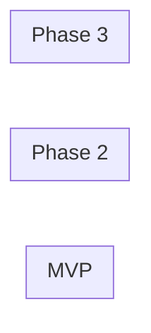

# Requirements Catalog

> Populated by: **Prompt P1.1** from [phase1-requirements.md](../08-ai/prompts/phase1-requirements.md)

---

## Functional Requirements

| ID | Feature | Description | Priority | Acceptance Criteria | Status |
|----|---------|-------------|----------|-------------------|--------|
| FR-001 | | | Must / Should / Could | | Draft |

---

## User Stories

### US-001: [Title]

**As a** [role]
**I want** [capability]
**So that** [benefit]

**Acceptance Criteria:**
- [ ] Given [context], when [action], then [outcome]

**Complexity:** S / M / L / XL
**Priority:** Must / Should / Could

---

## Feature Grouping

| Group | Features | Bounded Context | MVP? |
|-------|----------|-----------------|------|
| | | | Yes / No |

---

## Dependency Map

---

## Observations

- [ ] _AI-generated observations go here — review and validate with stakeholders_
