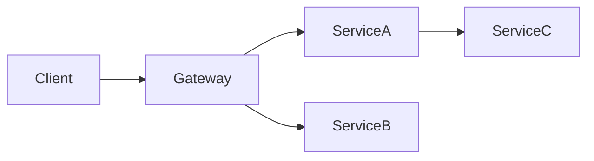

# API Contracts

> Populated by: **Prompt P2.3** from [phase2-architecture.md](../08-ai/prompts/phase2-architecture.md)

---

## API Summary

| API | Base Path | Protocol | Auth | Version Strategy |
|-----|-----------|----------|------|-----------------|
| | | REST / gRPC / GraphQL | | URL / Header / Query |

---

## API Design Standards

| Standard | Decision |
|----------|----------|
| Naming convention | kebab-case / camelCase |
| Versioning | URL prefix (v1/) / Header / Query |
| Pagination | Cursor-based / Offset-based |
| Error format | RFC 7807 Problem Details |
| Date format | ISO 8601 (UTC) |
| ID format | GUID / ULID / Snowflake |

---

## Endpoint Catalog

### [Service Name] API

| Method | Endpoint | Description | Request | Response | Auth |
|--------|----------|-------------|---------|----------|------|
| GET | /api/v1/resources | List resources | Query params | 200: PagedList | Required |
| GET | /api/v1/resources/{id} | Get resource | Path: id | 200: Resource | Required |
| POST | /api/v1/resources | Create resource | Body: CreateDto | 201: Resource | Required |
| PUT | /api/v1/resources/{id} | Update resource | Body: UpdateDto | 200: Resource | Required |
| DELETE | /api/v1/resources/{id} | Delete resource | Path: id | 204: No Content | Required |

---

## Request/Response Contracts

### CreateResourceRequest

```json
{
  "name": "string",
  "description": "string (optional)"
}
```

### ResourceResponse

```json
{
  "id": "guid",
  "name": "string",
  "description": "string",
  "createdAt": "datetime",
  "updatedAt": "datetime"
}
```

### Error Response (RFC 7807)

```json
{
  "type": "https://example.com/errors/validation",
  "title": "Validation Error",
  "status": 400,
  "detail": "One or more validation errors occurred.",
  "errors": {
    "name": ["Name is required."]
  }
}
```

---

## API Dependencies



---

## Observations

- [ ] _AI-generated observations go here — review and validate with the team_
