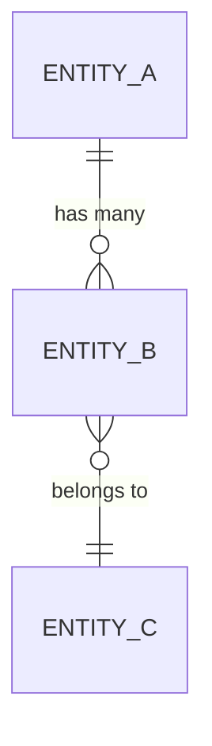

# Data Model

> Populated by: **Prompt P2.4** from [phase2-architecture.md](../08-ai/prompts/phase2-architecture.md)

---

## Data Store Summary

| Store | Technology | Purpose | Owner Service |
|-------|-----------|---------|---------------|
| | | | |

---

## Entity Relationship Diagram

---

## Entity Definitions

### [Entity Name]

| Column | Type | Nullable | Default | Description |
|--------|------|----------|---------|-------------|
| Id | uniqueidentifier | No | NEWID() | Primary key |
| CreatedAt | datetime2 | No | GETUTCDATE() | Creation timestamp |
| UpdatedAt | datetime2 | Yes | | Last update timestamp |

**Indexes:**
| Index | Columns | Type | Purpose |
|-------|---------|------|---------|
| PK_EntityName | Id | Clustered | Primary key |
| IX_EntityName_Name | Name | Nonclustered | Search |

**Constraints:**
- FK to [Related Entity] on [Column]
- UNIQUE on [Column]

---

## Data Access Patterns

| Pattern | Frequency | Latency Target | Caching Strategy |
|---------|-----------|----------------|-----------------|
| Get by ID | High | < 10ms | Cache-aside |
| List with filter | Medium | < 100ms | None |
| Full-text search | Low | < 500ms | None |

---

## Migration Strategy

| Approach | Decision |
|----------|----------|
| Migration tool | EF Core Migrations / DbUp / Flyway |
| Naming convention | Timestamp-based / Sequential |
| Seed data | Programmatic / SQL scripts |
| Environment handling | Per-environment scripts / Feature flags |

---

## Observations

- [ ] _AI-generated observations go here — review and validate_
