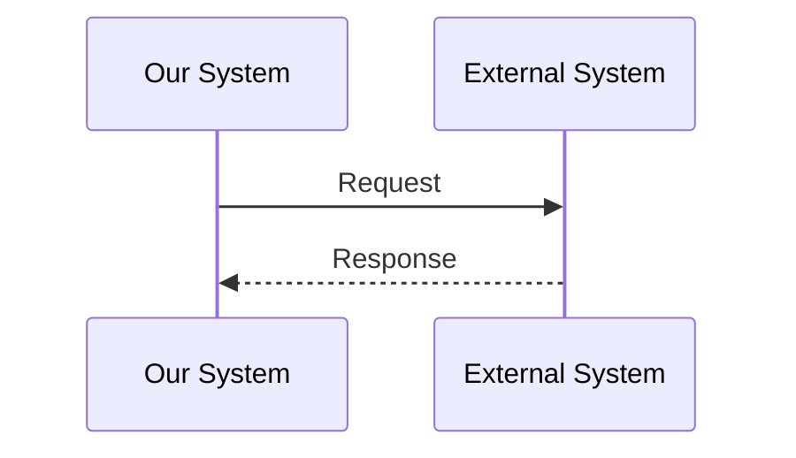

# Integration Design

> Populated by: **Prompt P2.6** from [phase2-architecture.md](../08-ai/prompts/phase2-architecture.md)

---

## Integration Summary

| System | Direction | Protocol | Auth | SLA | Priority |
|--------|-----------|----------|------|-----|----------|
| | Inbound / Outbound / Bidirectional | REST / gRPC / Message / File | | | Must / Should |

---

## Integration Details

### INT-001: [External System Name]

**Direction:** Inbound / Outbound / Bidirectional
**Protocol:** REST / gRPC / SOAP / Message Queue / File Transfer
**Authentication:** OAuth 2.0 / API Key / mTLS / None

**Data Flow:**

**Contract:**
| Field | Type | Required | Description |
|-------|------|----------|-------------|
| | | | |

**Error Handling:**
| Scenario | Strategy |
|----------|----------|
| Timeout | Retry with exponential backoff |
| 4xx errors | Log and fail |
| 5xx errors | Retry 3x, then circuit break |
| System unavailable | Queue for later processing |

**SLA:**
| Metric | Target |
|--------|--------|
| Availability | |
| Response time | |
| Throughput | |

---

## Resilience Patterns

| Pattern | Purpose | Configuration |
|---------|---------|---------------|
| Retry | Transient failures | 3 retries, exponential backoff |
| Circuit Breaker | Cascading failure prevention | Threshold: 5 failures / 30s |
| Bulkhead | Resource isolation | Separate thread pool per integration |
| Timeout | Prevent hanging calls | 30s default |
| Fallback | Graceful degradation | Cache / Default / Queue |

---

## Anti-Corruption Layer

| External System | ACL Strategy | Purpose |
|----------------|-------------|---------|
| | Adapter / Translator / Facade | Isolate external model from domain |

---

## Event-Based Integration

| Event | Producer | Consumer(s) | Delivery | Idempotency |
|-------|----------|-------------|----------|-------------|
| | | | At-least-once / Exactly-once | Dedup key |

---

## Observations

- [ ] _AI-generated observations go here — review and validate_
