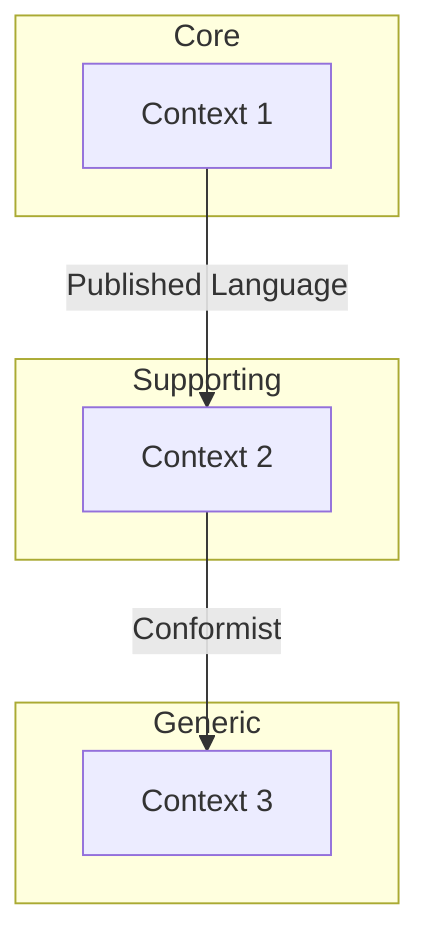

# Bounded Contexts

> Populated by: **Prompt P1.4** from [phase1-requirements.md](../08-ai/prompts/phase1-requirements.md)

---

## Context Map

---

## Bounded Context Summary

| Context | Type | Owner | Key Aggregates | Communication |
|---------|------|-------|----------------|---------------|
| | Core / Supporting / Generic | Team Name | | Sync / Async |

---

## Context Details

### BC-001: [Context Name]

**Type:** Core / Supporting / Generic
**Responsibility:** _What this context owns and manages_

**Aggregates:**
| Aggregate | Root Entity | Key Operations |
|-----------|-------------|---------------|
| | | |

**Ubiquitous Language:**
| Term | Definition | Notes |
|------|------------|-------|
| | | |

**Dependencies:**
| Depends On | Relationship | Communication |
|------------|-------------|---------------|
| | Upstream / Downstream / Partnership | Sync / Async |

**Integration Events (Published):**
| Event | Consumers | Payload |
|-------|-----------|---------|
| | | |

**Integration Events (Consumed):**
| Event | Producer | Handler |
|-------|----------|---------|
| | | |

---

## Context Relationships

| Upstream | Downstream | Pattern | Notes |
|----------|------------|---------|-------|
| | | ACL / OHS / Conformist / Partnership / Shared Kernel | |

---

## Context Classification

| Context | Strategic Importance | Build vs Buy | Investment Level |
|---------|--------------------:|-------------|-----------------|
| | Core / Supporting / Generic | Build / Buy / Open Source | High / Medium / Low |

---

## Related

- Project structure: [project-structure.md](../05-implementation/project-structure.md) — bounded contexts map to modules (Modular Monolith) or services (Microservices)
- Event storming: [event-storming.md](event-storming.md) — domain events flow across context boundaries
- Integration design: [integration-design.md](../03-design/integration-design.md) — context relationships (ACL, OHS) shape integration patterns

---

## Observations

- [ ] _AI-generated observations go here — review with domain experts_
