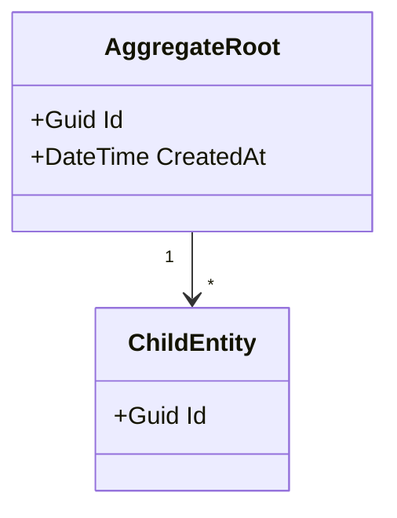

# Domain Model

> Populated by: **Prompt P1.3** from [phase1-requirements.md](../08-ai/prompts/phase1-requirements.md)

---

## Domain Concepts Summary

| Concept | Type | Bounded Context | Description |
|---------|------|-----------------|-------------|
| | Entity / Value Object / Aggregate Root / Domain Event | | |

---

## Aggregate Definitions

### [Aggregate Name]

**Bounded Context:** [Context Name]
**Root Entity:** [Entity Name]

**Entities:**
| Entity | Role | Key Properties |
|--------|------|----------------|
| | Root / Child | |

**Value Objects:**
| Value Object | Used By | Properties |
|-------------|---------|------------|
| | | |

**Domain Events:**
| Event | Trigger | Payload |
|-------|---------|---------|
| | | |

**Business Rules:**
| Rule ID | Description | Confidence |
|---------|-------------|------------|
| BR-001 | | HIGH / MEDIUM |

**Invariants:**
- _Business rules that must always be true for this aggregate_

---

## Entity Relationship Diagram

---

## Domain Services

| Service | Purpose | Input | Output |
|---------|---------|-------|--------|
| | | | |

---

## Domain Events Catalog

| Event | Producer | Consumers | Payload | Idempotent |
|-------|----------|-----------|---------|------------|
| | | | | Yes / No |

---

## Observations

- [ ] _AI-generated observations go here — review with domain experts_
