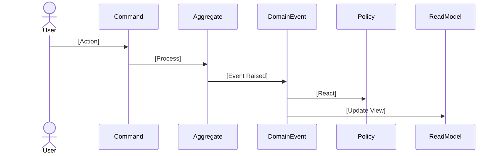

# Event Storming

> Populated by: **Prompt P1.6** from [phase1-requirements.md](../08-ai/prompts/phase1-requirements.md)

---

## Event Flow Summary

| Domain Event | Command | Actor | Aggregate | Bounded Context |
|-------------|---------|-------|-----------|-----------------|
| | | | | |

---

## Event Storming Board

---

## Commands

| Command | Actor | Aggregate | Preconditions | Events Produced |
|---------|-------|-----------|---------------|-----------------|
| | | | | |

---

## Domain Events

| Event | Source Aggregate | Payload | Consumers |
|-------|-----------------|---------|-----------|
| | | | |

---

## Policies (Reactions)

| Policy | Triggered By | Action | Produces |
|--------|-------------|--------|----------|
| | [Event Name] | | [Command / Event] |

---

## Read Models

| Read Model | Updated By | Queried By | Purpose |
|-----------|-----------|------------|---------|
| | [Event(s)] | [Use Case(s)] | |

---

## Hotspots

| Hotspot | Description | Resolution |
|---------|-------------|------------|
| | _Ambiguity or conflict identified during event storming_ | Resolved / Pending |

---

## Aggregate Boundaries (derived)

| Aggregate | Commands | Events | Context |
|-----------|----------|--------|---------|
| | | | |

---

## Related

- Integration design: [integration-design.md](../03-design/integration-design.md) — domain events identified here drive integration event contracts
- Bounded contexts: [bounded-contexts.md](bounded-contexts.md) — event flows reveal context boundaries
- Observability: [observability-design.md](../06-quality/observability-design.md) — event-driven workflows require async observability patterns

---

## Observations

- [ ] _AI-generated observations go here — review with domain experts_
