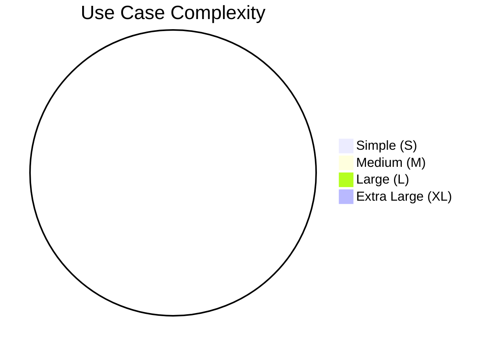

# Use Case Catalog

> Populated by: **Prompt P1.5** from [phase1-requirements.md](../08-ai/prompts/phase1-requirements.md)

---

## Use Case Summary

| UC ID | Name | Actor(s) | Bounded Context | Priority | Complexity |
|-------|------|----------|-----------------|----------|------------|
| UC-001 | | | | Must / Should / Could | S / M / L / XL |

---

## Use Case Details

### UC-001: [Use Case Name]

**Actor(s):** [Primary Actor]
**Bounded Context:** [Context Name]
**Priority:** Must / Should / Could
**Complexity:** S / M / L / XL

**Preconditions:**
- _What must be true before this use case can execute_

**Main Flow:**
1. Actor [action]
2. System [response]
3. Actor [action]
4. System [response]

**Alternative Flows:**
- **[Alt Name]**: If [condition], then [flow]

**Error Flows:**
- **[Error Name]**: If [condition], then [handling]

**Postconditions:**
- _What must be true after successful execution_

**Business Rules:**
| Rule | Description | Confidence |
|------|-------------|------------|
| BR-001 | | HIGH / MEDIUM |

**Domain Events Triggered:**
| Event | Condition |
|-------|-----------|
| | |

---

## Use Case → Bounded Context Mapping

| Use Case | Primary Context | Secondary Contexts |
|----------|----------------|-------------------|
| UC-001 | | |

---

## Complexity Distribution

---

## Prioritization

| Priority | Count | Estimated Effort |
|----------|-------|-----------------|
| Must | 0 | |
| Should | 0 | |
| Could | 0 | |

---

## Related

- API contracts: [api-contracts.md](../03-design/api-contracts.md) — use cases map to API endpoints
- Acceptance criteria: [acceptance-criteria.md](../01-requirements/acceptance-criteria.md) — each use case should have corresponding acceptance criteria

---

## Observations

- [ ] _AI-generated observations go here — review with stakeholders_
