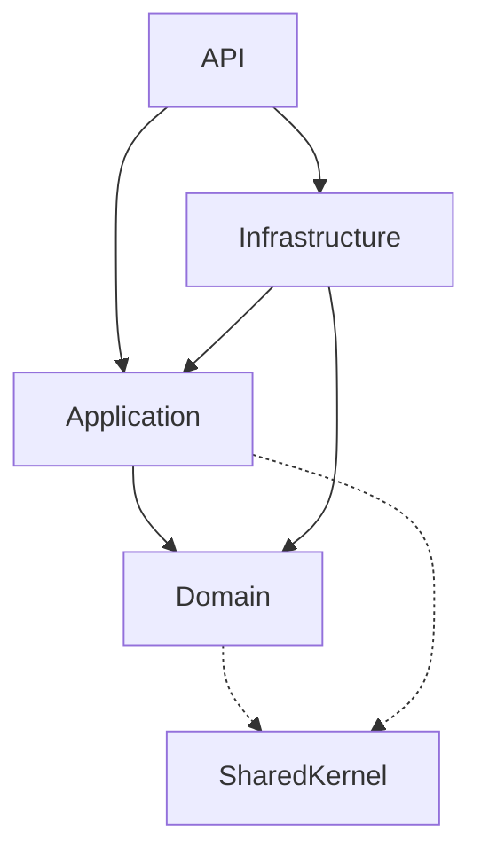

# Project Structure

> Populated by: **Prompt P3.1** from [phase3-implementation.md](../08-ai/prompts/phase3-implementation.md)

---

## Solution Layout

```
Solution.sln
│
├── src/
│   ├── [Project].Domain/              ← Entities, Value Objects, Domain Events, Interfaces
│   ├── [Project].Application/         ← Use Cases, Commands, Queries, DTOs, Validators
│   ├── [Project].Infrastructure/      ← EF Core, External Services, Messaging
│   ├── [Project].API/                 ← Controllers, Middleware, Program.cs
│   └── [Project].SharedKernel/        ← Cross-cutting: Result types, Base classes
│
├── tests/
│   ├── [Project].UnitTests/           ← Domain + Application layer tests
│   ├── [Project].IntegrationTests/    ← Infrastructure + API tests
│   └── [Project].ArchTests/           ← Architecture rule enforcement
│
├── tools/
│   └── [Project].DbMigrator/          ← Database migration runner
│
└── docs/
    └── architecture/                   ← ADRs, diagrams
```

---

## Layer Dependencies



**Rules:**
- Domain has ZERO external dependencies (no framework references)
- Application depends on Domain only (+ abstractions)
- Infrastructure implements interfaces defined in Application/Domain
- API references all layers (composition root)

---

## Component Breakdown

| Project | Layer | Responsibilities |
|---------|-------|-----------------|
| Domain | Core | Entities, Value Objects, Domain Events, Repository interfaces, Domain Services |
| Application | Core | Commands, Queries, Handlers, DTOs, Validators, Application Services |
| Infrastructure | Outer | EF Core DbContext, Repository implementations, External service clients, Message handlers |
| API | Outer | Controllers, Middleware, DI configuration, Health checks |
| SharedKernel | Cross-cutting | Base entity, Result type, Pagination, Guard clauses |

---

## Naming Conventions

| Element | Convention | Example |
|---------|-----------|---------|
| Solution | PascalCase | OrderManagement.sln |
| Project | [Solution].[Layer] | OrderManagement.Domain |
| Namespace | Match folder structure | OrderManagement.Domain.Orders |
| Class | PascalCase, noun | OrderService |
| Interface | I-prefix | IOrderRepository |
| Command | Verb + noun + "Command" | CreateOrderCommand |
| Query | Noun + "Query" | OrderDetailsQuery |
| Handler | Command/Query + "Handler" | CreateOrderCommandHandler |
| Event | Past-tense verb | OrderCreatedEvent |

---

## Observations

- [ ] _Adjust structure based on project type (simple API may not need all layers)_
