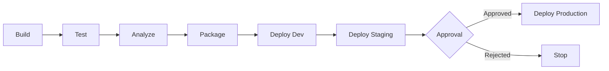

# CI/CD Pipeline

> Populated by: **Prompt P3.6** from [phase3-implementation.md](../08-ai/prompts/phase3-implementation.md)

---

## Pipeline Summary

| Aspect | Decision |
|--------|----------|
| Platform | GitHub Actions / Azure DevOps / GitLab CI |
| Trigger | Push to main, PR creation |
| Artifact | Docker image / NuGet package / Zip deploy |
| Registry | ACR / ECR / GitHub Packages |

---

## Pipeline Stages

---

## Stage Details

### Build

| Step | Command | Timeout |
|------|---------|---------|
| Restore | `dotnet restore` | 5 min |
| Build | `dotnet build --no-restore -c Release` | 5 min |
| Publish | `dotnet publish -c Release -o ./publish` | 3 min |

### Test

| Step | Command | Gate |
|------|---------|------|
| Unit tests | `dotnet test --filter Category=Unit` | All pass |
| Integration tests | `dotnet test --filter Category=Integration` | All pass |
| Architecture tests | `dotnet test --filter Category=Architecture` | All pass |
| Coverage report | `dotnet test --collect:"XPlat Code Coverage"` | > 80% |

### Analyze

| Step | Tool | Gate |
|------|------|------|
| Static analysis | SonarCloud / Roslyn | No critical findings |
| Security scan | Snyk / Trivy / SecurityCodeScan | No critical CVEs |
| License check | dotnet-delice / FOSSA | No GPL violations |

### Package

| Step | Output |
|------|--------|
| Docker build | `docker build -t {registry}/{image}:{tag}` |
| Push to registry | `docker push {registry}/{image}:{tag}` |
| Tag strategy | `{branch}-{commit-sha}` for dev, `v{semver}` for release |

### Deploy

| Environment | Trigger | Approval | Smoke Test |
|-------------|---------|----------|------------|
| Dev | Auto on merge to main | None | Health check |
| Staging | Auto on release branch | None | Full smoke suite |
| Production | Manual trigger | Required (1 approver) | Full smoke suite + canary |

---

## Branch Strategy

| Branch | Purpose | Deploy To | Protection |
|--------|---------|-----------|------------|
| main | Integration | Dev | PR required, CI must pass |
| release/* | Release candidate | Staging → Production | PR required, approval |
| feature/* | Feature development | None (PR to main) | None |
| hotfix/* | Emergency fixes | Staging → Production | Fast-track approval |

---

## Secrets Management

| Secret | Storage | Injected Via |
|--------|---------|-------------|
| Database connection | Key Vault / Secrets Manager | Environment variable |
| API keys | Key Vault / Secrets Manager | Environment variable |
| Docker registry | Pipeline secrets | Service connection |
| Cloud credentials | Managed Identity / OIDC | Federated identity |

---

## Notifications

| Event | Channel | Recipients |
|-------|---------|------------|
| Build failure | Slack / Teams | Development team |
| Deployment success | Slack / Teams | Development team |
| Production deployment | Email + Slack | Stakeholders |
| Security finding | Slack / PagerDuty | Security team |

---

## Observations

- [ ] _Adjust pipeline complexity based on team size and deployment frequency_
