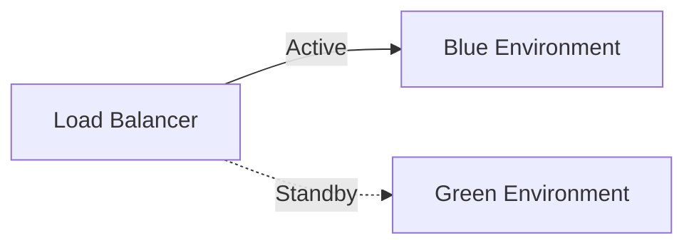
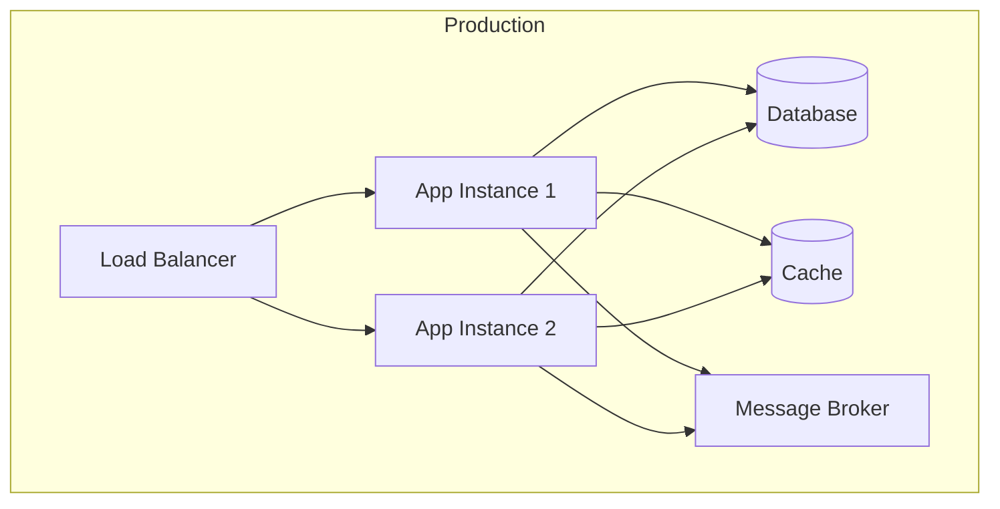
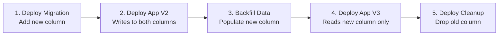

# Deployment Strategy

> Populated by: **Prompt P3.5** from [phase3-implementation.md](../08-ai/prompts/phase3-implementation.md)

---

## Deployment Summary

| Aspect | Decision |
|--------|----------|
| Target environment | Azure / AWS / On-Prem / Hybrid |
| Container strategy | Docker / None |
| Orchestration | Kubernetes / Azure Container Apps / App Services / None |
| Deployment pattern | Blue-Green / Canary / Rolling / Recreate |
| Infrastructure as Code | Bicep / Terraform / Pulumi |

---

## Environment Strategy

| Environment | Purpose | Deployment | Data |
|-------------|---------|------------|------|
| Local | Developer workstation | Docker Compose | Seeded |
| Dev | Integration testing | Automatic on merge | Synthetic |
| Staging | Pre-production validation | Automatic on release branch | Anonymized production |
| Production | Live traffic | Manual approval gate | Real |

---

## Deployment Pattern

### Blue-Green (if selected)



**Cutover process:**
1. Deploy to standby environment
2. Run smoke tests
3. Switch traffic
4. Monitor for 15 minutes
5. If issues → rollback by switching traffic back

### Canary (if selected)

| Phase | Traffic % | Duration | Success Criteria |
|-------|-----------|----------|-----------------|
| 1 | 5% | 15 min | Error rate < 0.1% |
| 2 | 25% | 30 min | P95 latency < baseline × 1.1 |
| 3 | 50% | 1 hour | No alerts triggered |
| 4 | 100% | — | Full rollout |

---

## Rollback Strategy

| Trigger | Action | RTO |
|---------|--------|-----|
| Error rate spike | Automatic rollback | < 5 min |
| Health check failure | Automatic rollback | < 2 min |
| Manual decision | Switch to previous version | < 10 min |
| Database issue | Forward-fix (no automatic rollback) | Varies |

---

## Infrastructure Topology



---

## Scaling Rules

| Component | Min | Max | Scale Trigger |
|-----------|-----|-----|---------------|
| API instances | 2 | 10 | CPU > 70% or RPS > threshold |
| Worker instances | 1 | 5 | Queue depth > threshold |
| Database | | | Manual / Auto-scale tier |

---

## Database Migration Strategy

> Zero-downtime schema changes require forward-compatible migrations that work with both old and new application versions simultaneously.

### Migration Rules

| Rule | Description | Example |
|------|-------------|--------|
| Additive only | Never rename or delete columns in the same release | Add `new_column`, deprecate `old_column` next release |
| Backward compatible | Old app version must work with new schema | Add nullable columns, don't drop constraints |
| Forward compatible | New app version must work with old schema | Handle missing columns gracefully |
| Separate deploy | Schema migration deploys independently from app code | Run migration → deploy app → clean up |

### Migration Execution Pattern



### Blue-Green Database Strategy

| Phase | Database State | Blue (Current) | Green (New) |
|-------|---------------|----------------|-------------|
| Pre-migration | Schema V1 | Active on V1 | Standby |
| Migration | Schema V2 (backward compatible) | Still runs on V2 | Deploy new app |
| Cutover | Schema V2 | Standby | Active |
| Cleanup | Schema V3 (remove deprecated) | — | Active on V3 |

### Tooling

| Tool | When to Use |
|------|------------|
| EF Core Migrations | Standard .NET projects, code-first |
| DbUp | Script-based, full control over SQL |
| Flyway | Multi-platform, versioned SQL scripts |
| Liquibase | Enterprise, XML/YAML/JSON changelogs |

---

## Rollback Playbook

> Step-by-step procedures for common deployment failure scenarios.

### Scenario 1: Application Rollback (No Schema Change)

1. Trigger: Error rate > 5% or health check failure
2. Action: Revert to previous container image / deployment slot
3. Verify: Health checks pass, error rate normalizes
4. Duration: < 5 minutes (automated) / < 10 minutes (manual)

```
# Kubernetes
kubectl rollout undo deployment/<service-name>

# Azure App Service
az webapp deployment slot swap --slot staging --target-slot production --action reset

# Docker Compose
docker compose up -d --force-recreate <service> --image <previous-tag>
```

### Scenario 2: Application + Schema Change Rollback

1. Trigger: Data corruption or application errors post-migration
2. Action: Roll back app first (schema is backward-compatible by design)
3. Verify: Old app version works with new schema
4. If schema rollback needed: Run reverse migration script
5. Duration: 10–30 minutes

> **Key rule**: Never deploy a non-backward-compatible schema change. If rollback of schema is needed, the forward migration must have been additive-only.

### Scenario 3: Infrastructure Failure

1. Trigger: Cloud resource unavailable, network failure
2. Action: Failover to DR region (if multi-region) or scale alternate resources
3. Verify: Traffic routed to healthy instances
4. Duration: Depends on DR strategy (see [infrastructure-as-code.md](infrastructure-as-code.md))

### Rollback Decision Matrix

| Failure Type | Auto-Rollback? | Who Decides | Max RTO |
|-------------|---------------|-------------|----------|
| Error rate spike | Yes | Automated alert | 5 min |
| Health check fail | Yes | Kubernetes / LB | 2 min |
| Performance degradation | No | On-call engineer | 15 min |
| Data inconsistency | No | Tech lead + DBA | 30 min |
| Security vulnerability | No | Security team | Varies |

---

## Related

- NFR targets: [nfr-catalog.md](../01-requirements/nfr-catalog.md) — availability and RTO requirements drive deployment strategy
- Infrastructure: [infrastructure-as-code.md](infrastructure-as-code.md)
- CI/CD: [cicd-pipeline.md](cicd-pipeline.md)

---

## Observations

- [ ] _Adjust deployment complexity based on project scale — simple projects may use App Services with slots_
