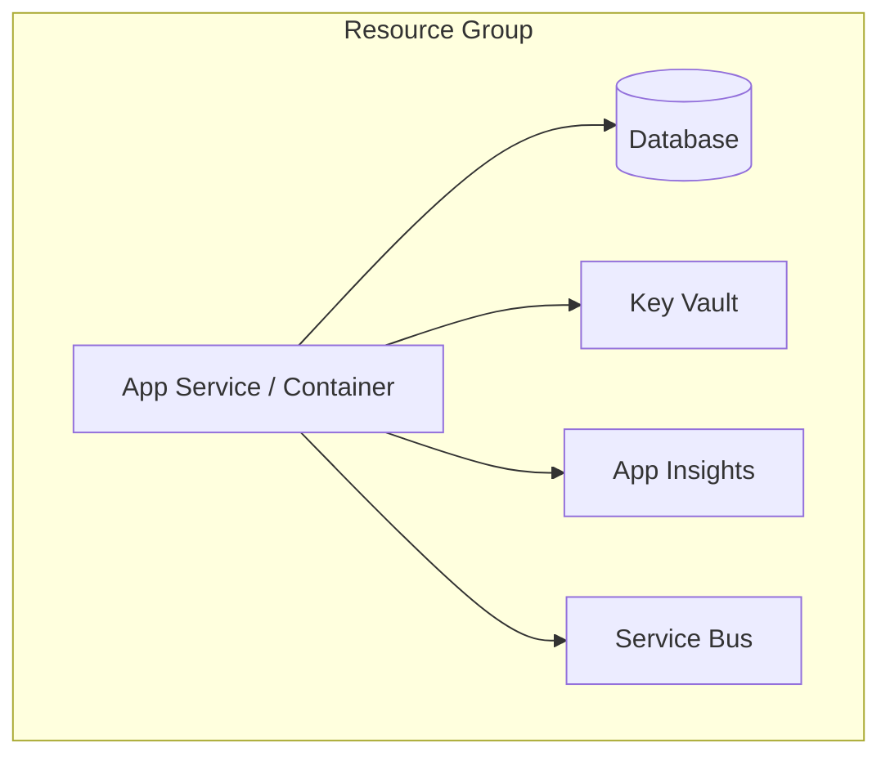

# Infrastructure as Code

> Populated by: **Prompt P3.6** from [phase3-implementation.md](../08-ai/prompts/phase3-implementation.md)

---

## IaC Summary

| Aspect | Decision |
|--------|----------|
| Tool | Bicep / Terraform / Pulumi |
| State storage | Azure Storage / S3 / Terraform Cloud |
| Module strategy | Per-resource / Per-environment / Per-service |
| Environment management | Parameter files / Workspaces / Variable groups |

---

## Resource Inventory

| Resource | Type | Environment | Configuration |
|----------|------|-------------|---------------|
| | App Service / AKS / Container App / VM | Dev / Staging / Prod | SKU / Size |
| | SQL Database / CosmosDB / PostgreSQL | Dev / Staging / Prod | Tier / Size |
| | Key Vault | Dev / Staging / Prod | Standard |
| | Service Bus / Event Hub | Dev / Staging / Prod | Tier |
| | Application Insights | Dev / Staging / Prod | — |

---

## Resource Topology

---

## Environment Differences

| Setting | Dev | Staging | Production |
|---------|-----|---------|------------|
| Compute SKU | | | |
| Database tier | | | |
| Replica count | 1 | 2 | 2+ |
| Auto-scale | No | Yes | Yes |
| Backup | No | Daily | Continuous |

---

## Tagging Strategy

| Tag | Value | Purpose |
|-----|-------|---------|
| Environment | dev / staging / prod | Cost tracking |
| Project | [Project Name] | Resource grouping |
| Owner | [Team Name] | Accountability |
| ManagedBy | Bicep / Terraform | Drift detection |

---

## Observations

- [ ] _Adjust resource topology based on project requirements and budget_
