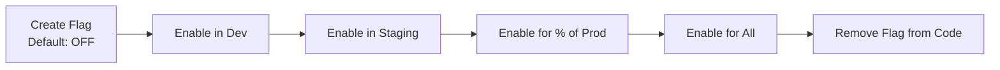

# Release Planning

> Populated by: **Prompt P3.5** from [phase3-implementation.md](../08-ai/prompts/phase3-implementation.md)

---

## Release Strategy

| Aspect | Decision |
|--------|----------|
| Versioning | Semantic Versioning (SemVer) |
| Release cadence | Sprint-based / Continuous / On-demand |
| Feature flags | LaunchDarkly / Azure App Configuration / Custom |
| Changelog | Auto-generated from conventional commits |

---

## MVP Scope

| Feature Group | Features | Priority | Sprint Target |
|--------------|----------|----------|---------------|
| | | Must / Should / Could | |

---

## Release Phases

### Phase 1: Foundation (Sprint 1–2)
- [ ] Project scaffold & CI/CD
- [ ] Authentication & authorization
- [ ] Core domain model
- [ ] Database setup & migrations
- [ ] Health checks & logging

### Phase 2: Core Features (Sprint 3–5)
- [ ] Primary use cases
- [ ] API endpoints
- [ ] Integration with external systems
- [ ] Unit & integration tests

### Phase 3: Hardening (Sprint 6–7)
- [ ] Performance testing
- [ ] Security review
- [ ] Observability setup
- [ ] Documentation

### Phase 4: Launch (Sprint 8)
- [ ] Staging validation
- [ ] Production deployment
- [ ] Monitoring & alerting
- [ ] Runbook creation

---

## Release Checklist

- [ ] All quality gates pass
- [ ] Security scan clean
- [ ] Performance meets NFRs
- [ ] Runbook updated
- [ ] Stakeholder sign-off
- [ ] Rollback plan tested
- [ ] Monitoring dashboards ready
- [ ] On-call schedule confirmed

---

## Success Criteria

| Metric | Target | Measurement |
|--------|--------|-------------|
| Deployment success rate | > 95% | CI/CD metrics |
| Time to first deployment | < 2 weeks | Project timeline |
| P95 response time | < [target] | APM metrics |
| Error rate | < 0.1% | Monitoring |
| Test coverage | > 80% | CI reports |

---

## Feature Flag Strategy

> Feature flags decouple deployment from release, enabling trunk-based development and controlled rollouts.

### Flag Types

| Type | Purpose | Lifetime | Example |
|------|---------|----------|--------|
| Release flag | Hide incomplete features | Short (remove after launch) | `enable-new-checkout` |
| Ops flag | Control operational behavior | Long (permanent toggle) | `enable-rate-limiting` |
| Experiment flag | A/B testing | Medium (remove after experiment) | `experiment-pricing-v2` |
| Permission flag | Entitlement gating | Long (per-tenant/user) | `feature-premium-reports` |

### Flag Management Decision

| Option | When to Use | Trade-offs |
|--------|-------------|------------|
| Azure App Configuration | Azure-native, simple flags | Limited targeting, good for ops flags |
| LaunchDarkly | Advanced targeting, A/B tests, audit | Cost, external dependency |
| Unleash (self-hosted) | Open-source, no vendor lock-in | Ops overhead |
| Custom (DB/config) | Very simple on/off toggles only | No targeting, no audit trail |
| None | Simple projects, < 3 devs | N/A |

### Flag Lifecycle

### Flag Hygiene Rules

- Every release flag **must** have a removal date in the backlog
- Max active release flags: **5** (prevents flag debt)
- Review stale flags monthly
- Never nest flags (flag A depends on flag B)

---

## Observations

- [ ] _Adjust release phases based on project timeline and team velocity_
