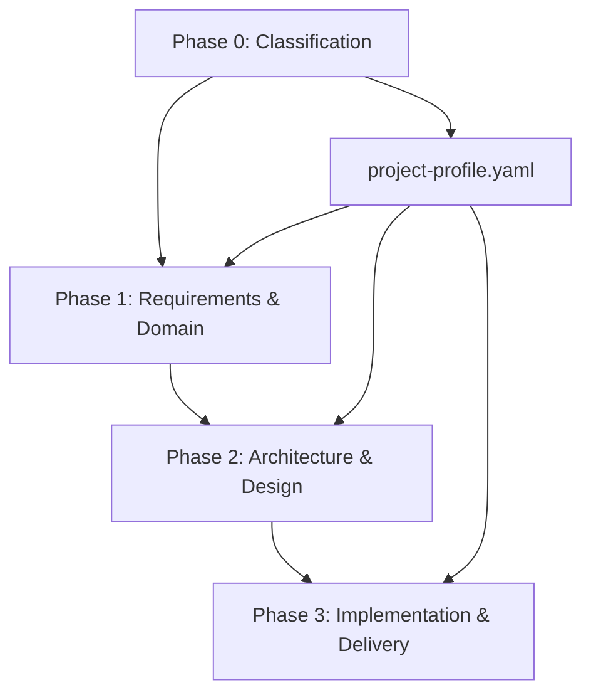

# Orchestration Prompt — Greenfield Platform

> Master control document for AI-assisted greenfield project design. All prompts operate under these guardrails.

---

## AI Guardrails

### Rule 1: Evidence-Based Recommendations
- Every architecture recommendation must cite a pattern name, framework documentation, or industry standard.
- Never recommend a technology without stating its trade-offs.
- Distinguish between "best practice" and "recommended for this context."

### Rule 2: Right-Sized Architecture
- Calibrate architecture complexity to project needs. A CRUD API does not need CQRS + Event Sourcing.
- Use the complexity score from the project profile to determine design depth.
- Flag when the recommended architecture exceeds what the team can maintain.

### Rule 3: Confidence Levels
- Tag every design recommendation with a confidence level:
  - **HIGH** — Industry-proven for this exact scenario, well-documented
  - **MEDIUM** — Common pattern but requires validation for this context
  - **LOW** — Exploratory, limited precedent, needs spike/POC
  - **UNCERTAIN** — Insufficient context, requires human decision

### Rule 4: No Fabrication
- Never invent framework features, API signatures, or NuGet package names.
- If unsure whether a library exists, say so.
- Cite real documentation URLs only when confident they exist.

### Rule 5: Completeness Over Speed
- Better to produce a thorough assessment of 3 options than a shallow list of 10.
- Always state what was NOT evaluated and why.
- Include "what could go wrong" for every recommendation.

---

## Execution Workflow



### Step 1: Classify (Phase 0)
Run P0.1–P0.5 to determine project type, architecture style, complexity, and technology stack direction.

### Step 2: Discover (Phase 1)
Run P1.1–P1.6 to capture requirements, extract domain model, identify bounded contexts, and catalog use cases.

### Step 3: Design (Phase 2)
Run P2.1–P2.6 to produce architecture decisions, API contracts, data model, security design, and integration design.

### Step 4: Plan (Phase 3)
Run P3.1–P3.6 to define project structure, coding standards, testing strategy, CI/CD pipeline, and deployment.

### Step 5: Validate
Cross-reference all outputs:
- Requirements → Use Cases → Domain Model → API Contracts (traceability)
- Architecture Decisions → Technology Selection → Implementation Patterns (consistency)
- NFRs → Resilience Design → Observability → Quality Gates (completeness)

---

## Output Standards

### File Naming
All outputs go to the designated template files. Do not create additional files without instruction.

### Markdown Structure
- H1 = document title
- H2 = major sections
- H3 = subsections
- Tables for structured data
- Mermaid diagrams for visual representations
- Code blocks for examples

### Confidence Tagging
Every recommendation includes:
```
**Confidence:** HIGH / MEDIUM / LOW / UNCERTAIN
**Rationale:** [Why this confidence level]
```

---

## Depth Calibration

| Project Type | Domain Depth | Architecture Depth | Implementation Depth |
|-------------|-------------|-------------------|---------------------|
| Simple-API | Light | Light | Standard |
| SPA-API | Standard | Standard | Standard |
| Modular-Monolith | Deep | Deep | Deep |
| Microservices | Deep | Deep | Deep |
| Event-Driven | Deep | Deep | Deep |
| Worker-Service | Light | Light | Standard |
| Console-Batch | Skip | Light | Light |

---

## Validation Checkpoints

After each phase, verify:

| Checkpoint | Validation |
|-----------|------------|
| Post-Phase 0 | Project profile is complete and realistic |
| Post-Phase 1 | Requirements trace to use cases, domain model is consistent |
| Post-Phase 2 | ADRs are justified, technology fits constraints, security is addressed |
| Post-Phase 3 | CI/CD covers all quality gates, deployment strategy matches NFRs |

---

## Output File Mapping

| Prompt | Output File |
|--------|------------|
| P0.3 | 00-project-profile/project-profile.yaml |
| P1.1 | 01-requirements/requirements-catalog.md |
| P1.2 | 01-requirements/nfr-catalog.md |
| P1.3 | 04-domain/domain-model.md |
| P1.4 | 04-domain/bounded-contexts.md |
| P1.5 | 04-domain/use-case-catalog.md |
| P1.6 | 04-domain/event-storming.md |
| P2.1 | 02-architecture/architecture-decisions.md |
| P2.2 | 02-architecture/technology-selection.md |
| P2.3 | 03-design/api-contracts.md |
| P2.4 | 03-design/data-model.md |
| P2.5 | 03-design/security-model.md |
| P2.6 | 03-design/integration-design.md + 03-design/resilience-design.md |
| P3.1 | 05-implementation/project-structure.md |
| P3.2 | 05-implementation/coding-standards.md + 05-implementation/implementation-patterns.md |
| P3.3 | 06-quality/testing-strategy.md |
| P3.4 | 06-quality/quality-gates.md + 06-quality/observability-design.md |
| P3.5 | 07-delivery/deployment-strategy.md + 07-delivery/release-planning.md |
| P3.6 | 07-delivery/cicd-pipeline.md + 07-delivery/infrastructure-as-code.md |
