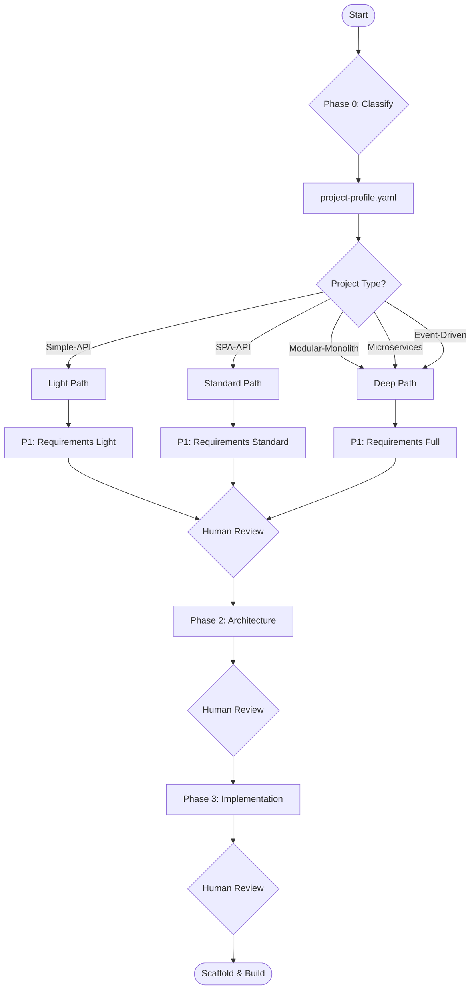

# Workflow Automation — Greenfield Platform

> Workflow definitions for AI-assisted greenfield project design pipeline.

---

## Design Pipeline

---

## Workflow Steps

| Step | Phase | Input | Output | Human Review? |
|------|-------|-------|--------|---------------|
| 1 | P0: Classify | Project brief | project-profile.yaml | Yes — validate classification |
| 2 | P1: Requirements | Profile + stakeholder input | Requirements, domain model, use cases | Yes — validate domain boundaries |
| 3 | P2: Architecture | Requirements + domain model | ADRs, API, data model, security | Yes — validate decisions |
| 4 | P3: Implementation | Architecture outputs | Structure, standards, CI/CD, deployment | Yes — validate pipeline |
| 5 | Scaffold | All outputs | Runnable project scaffold | Yes — final review |

---

## Integration Points

| Platform | Integration |
|----------|------------|
| GitHub Copilot | Run prompts directly in IDE |
| Azure OpenAI | API-based prompt execution |
| GitHub Actions | Automated scaffold generation |
| Azure DevOps | Pipeline template generation |

---

## Automation Levels

| Level | Description | What's Automated |
|-------|-------------|-----------------|
| L1 — Manual | Run prompts manually in AI chat | Nothing — copy/paste |
| L2 — Semi-Auto | Use scripts to run prompts sequentially | Prompt execution pipeline |
| L3 — Auto + Review | Automated pipeline with human checkpoints | Prompt execution + output population |
| L4 — Full Auto | Fully automated design-to-scaffold | Include project scaffold generation |
