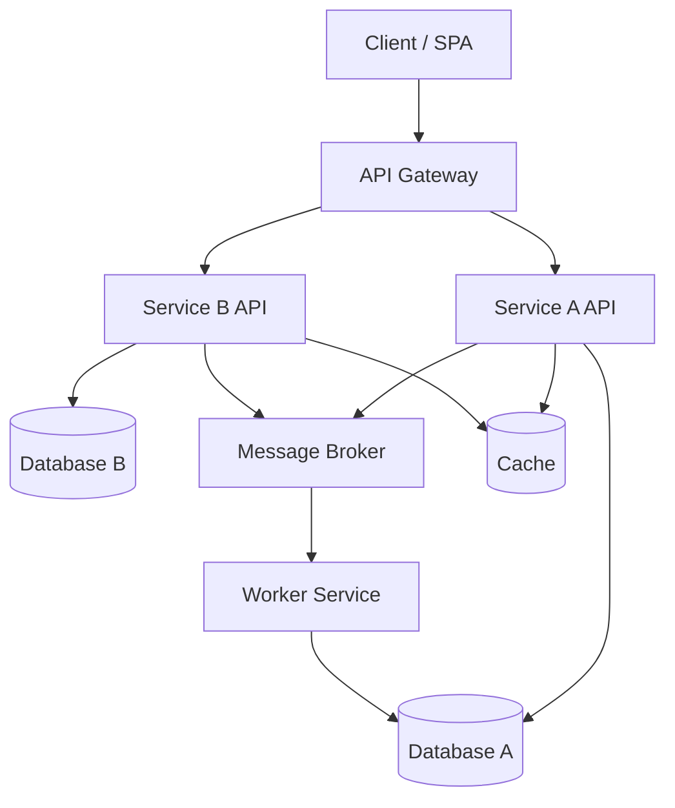
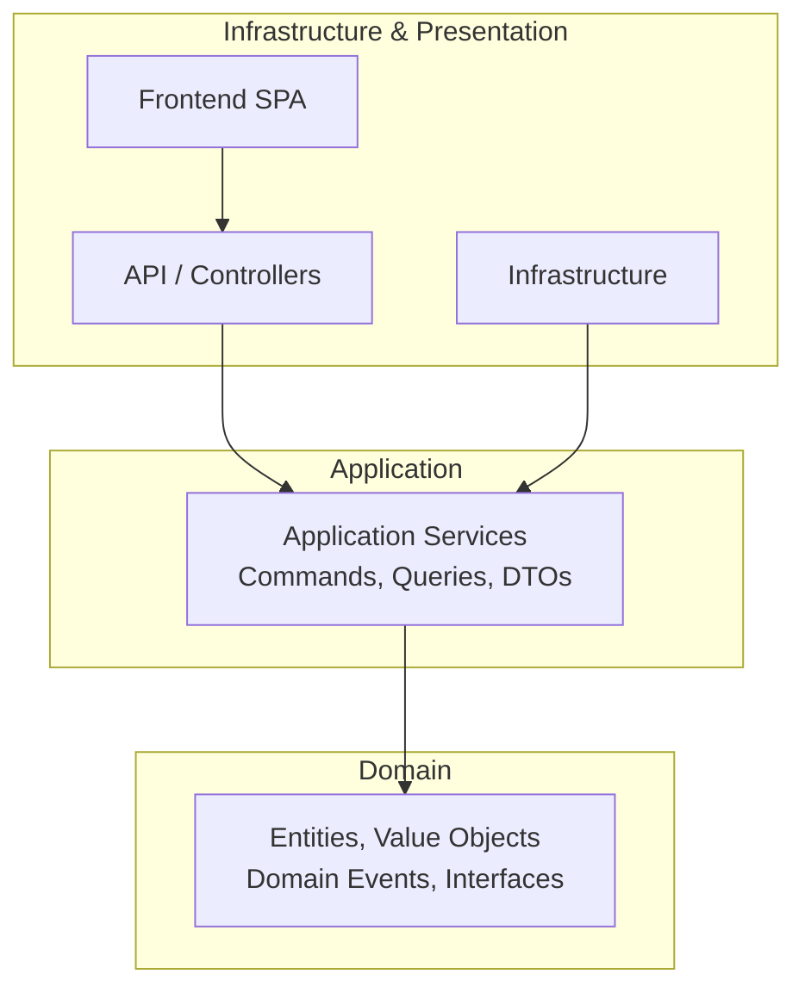
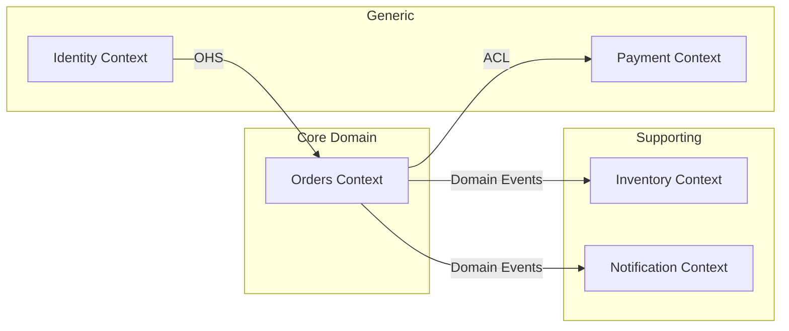
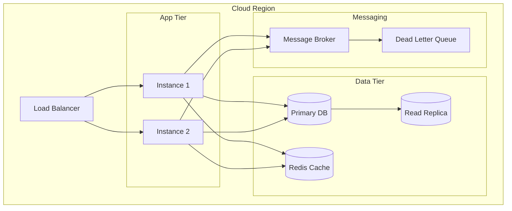
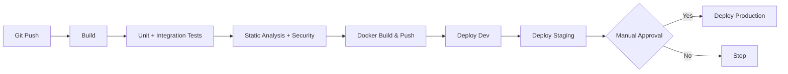
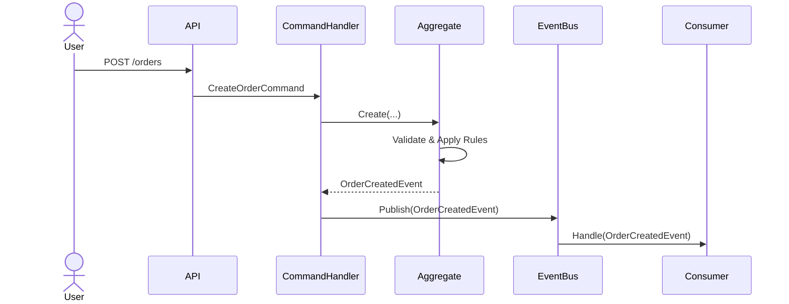
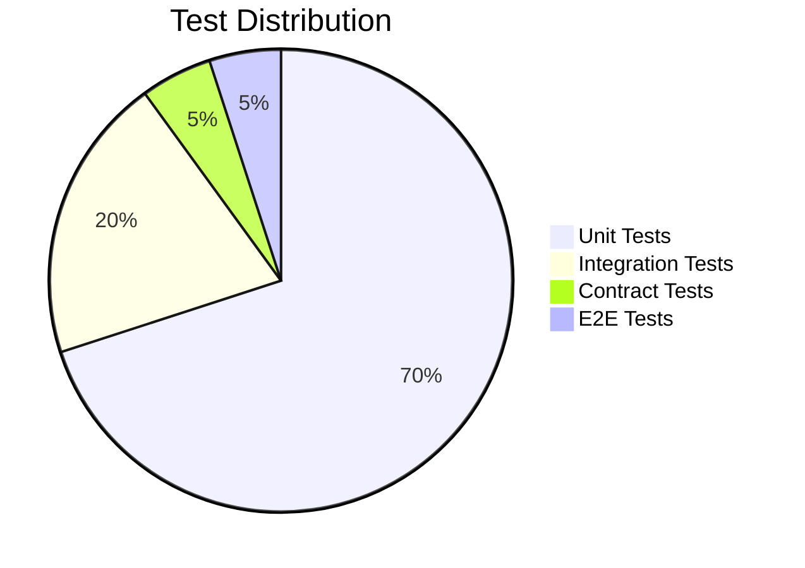
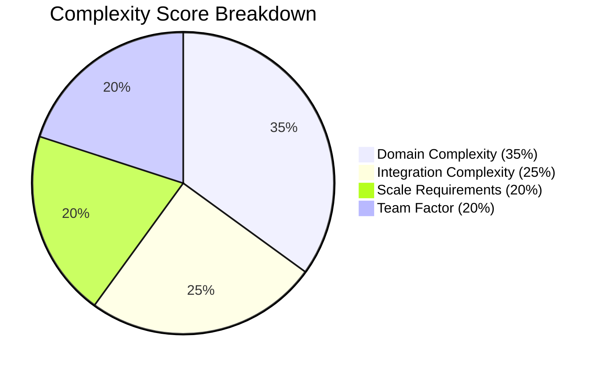

# Architecture Diagrams

> Visual diagram templates for greenfield project design and architecture documentation.

---

## 1. Architecture Overview

---

## 2. Clean Architecture Layers

---

## 3. Domain Context Map

---

## 4. Deployment Topology

---

## 5. CI/CD Pipeline Flow

---

## 6. Event Flow Diagram

---

## 7. Testing Pyramid

---

## 8. Complexity Radar

