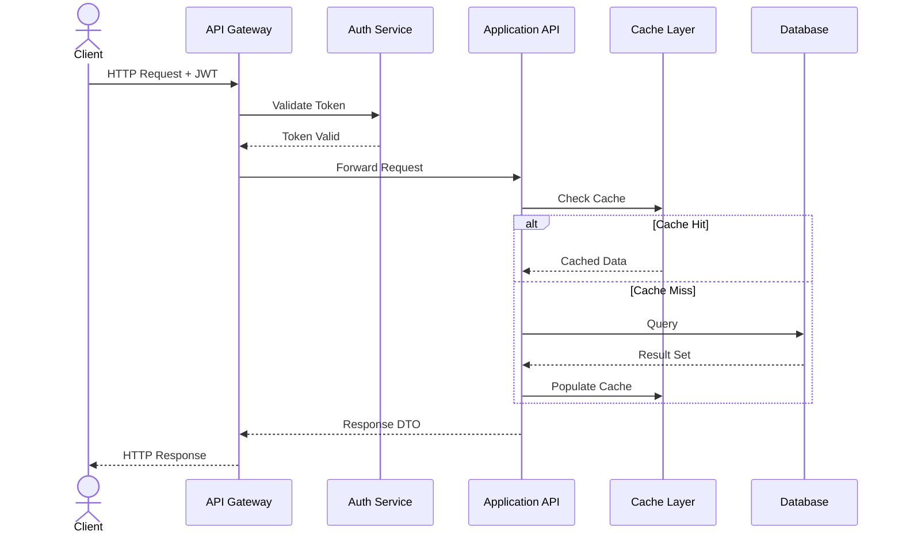
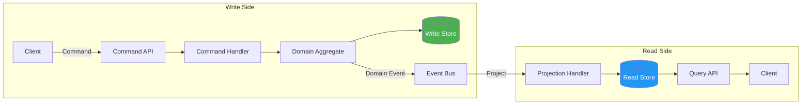
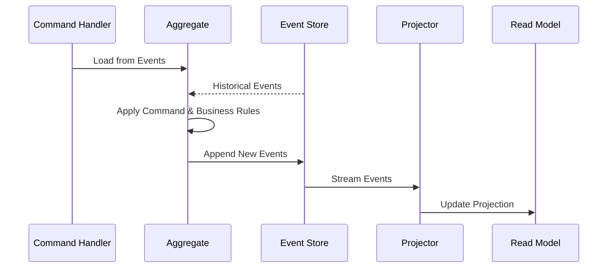
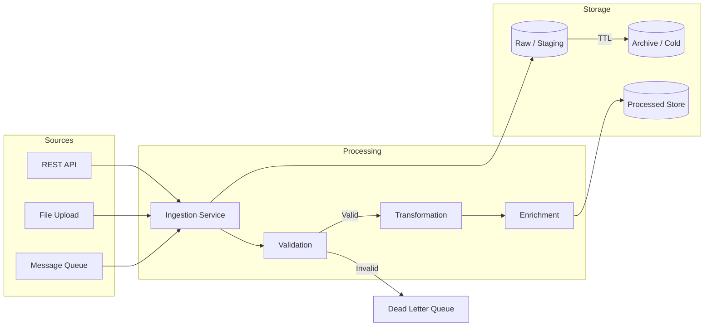
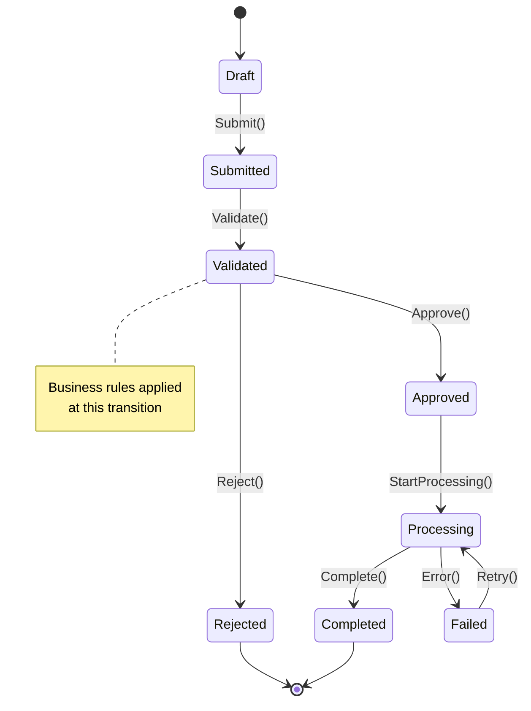
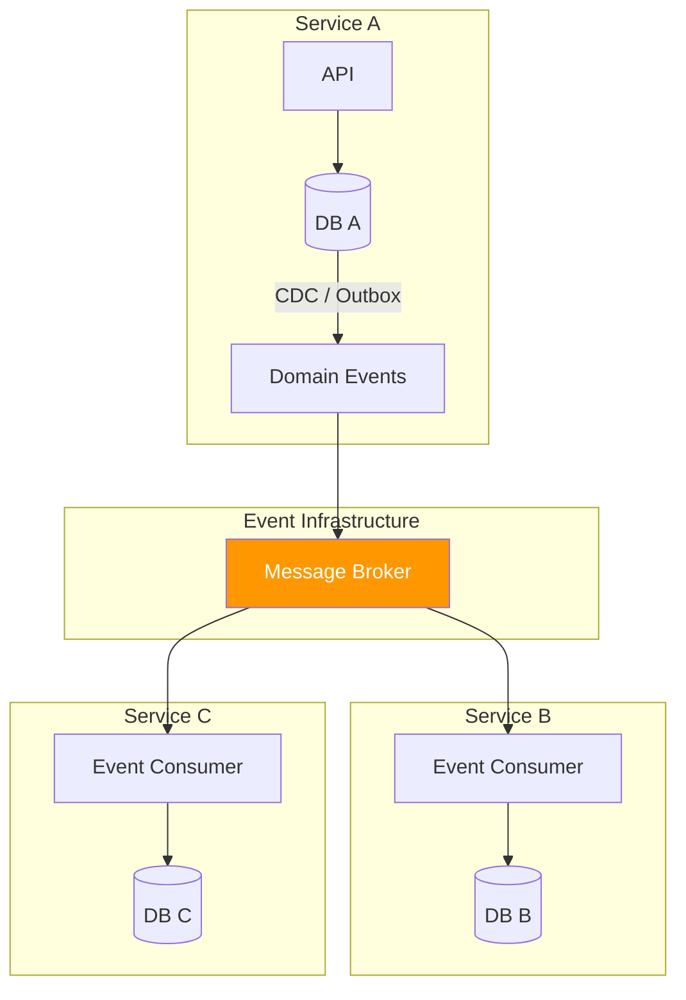
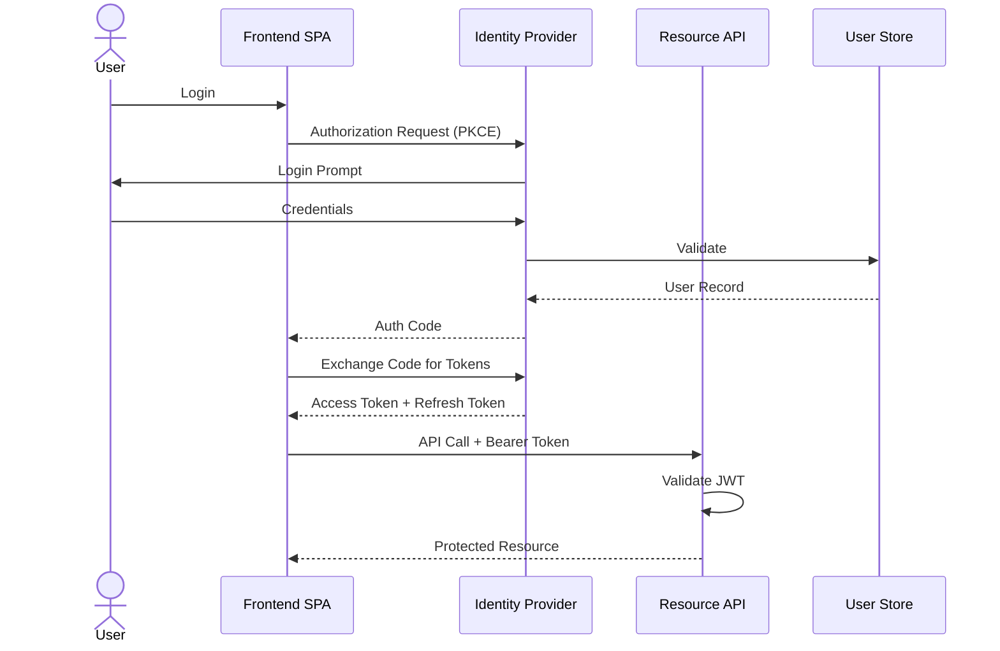

# Data Flow Diagrams

> Visual templates for data movement, transformation, and state transitions in greenfield projects.

---

## 1. API Request/Response Flow

---

## 2. CQRS Data Flow

---

## 3. Event Sourcing Data Flow

---

## 4. Data Pipeline (ETL / Ingestion)

---

## 5. State Machine — Order Lifecycle

---

## 6. Multi-Service Data Synchronization

---

## 7. Authentication & Token Flow

---

## Usage Notes

- Replace placeholder entity names (Order, Service A) with actual domain entities
- State machines should reflect your domain's actual lifecycle rules
- For event sourcing, document the event schema alongside these diagrams
- Export complex diagrams to PNG for stakeholder presentations
