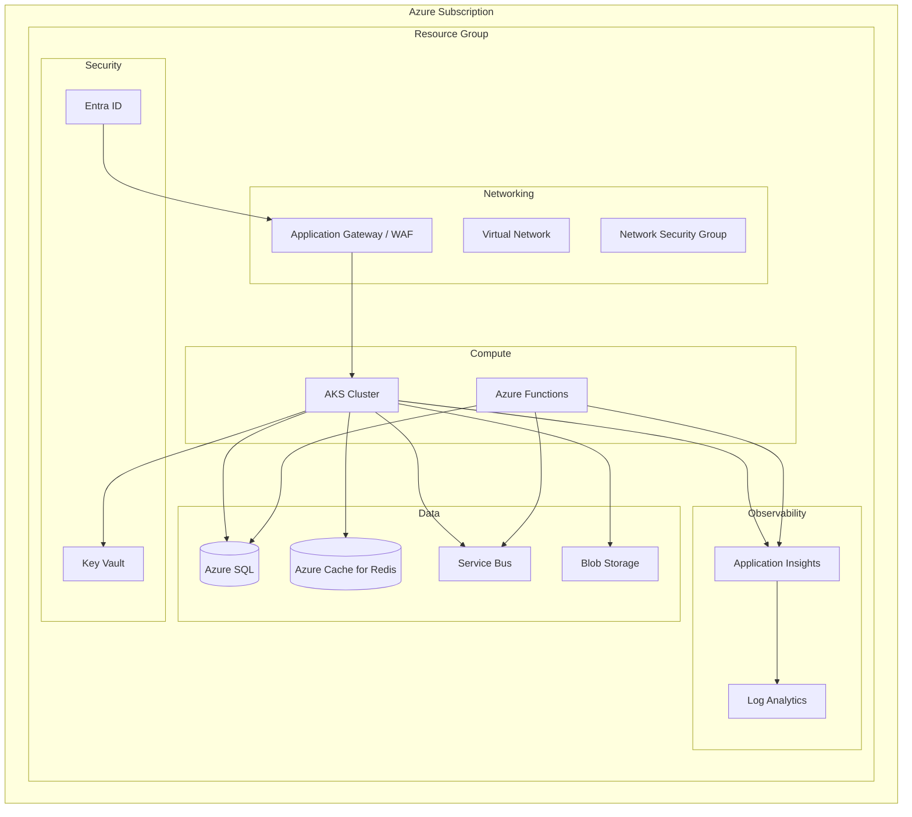
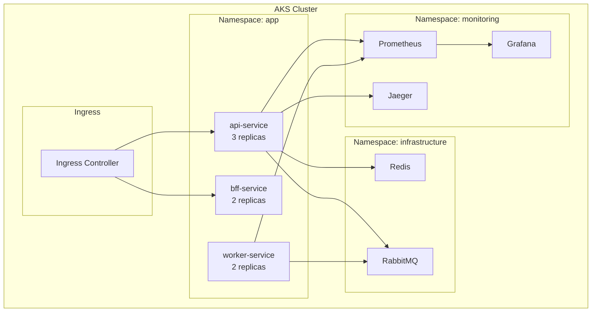
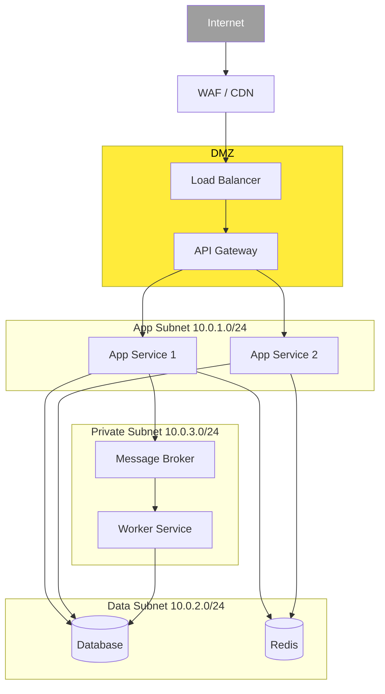
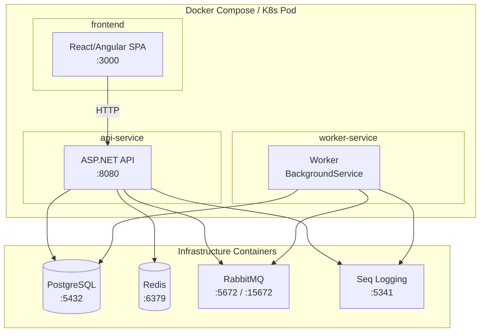
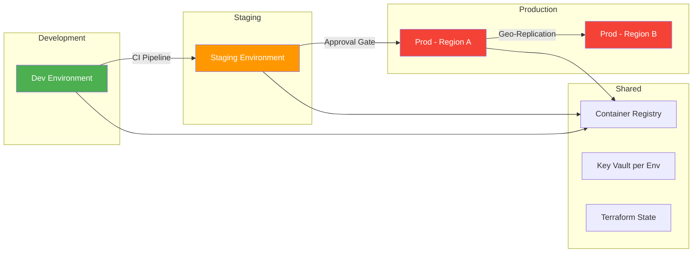
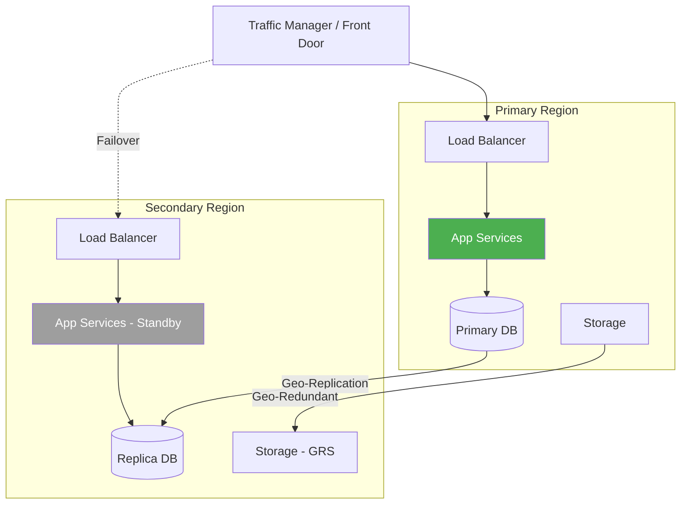

# Infrastructure Diagrams

> Visual templates for cloud infrastructure, networking, and container orchestration layouts.

---

## 1. Cloud Resource Topology (Azure)

---

## 2. Kubernetes Cluster Layout

---

## 3. Network Topology

---

## 4. Container Architecture

---

## 5. Multi-Environment Promotion

---

## 6. Disaster Recovery Topology

---

## Usage Notes

- Adapt cloud resources to your chosen provider (Azure, AWS, GCP)
- Replace placeholder service names with actual project services
- Network diagrams should reflect your security model in [03-design/security-model.md](../03-design/security-model.md)
- IaC templates should match these diagrams — see [07-delivery/infrastructure-as-code.md](../07-delivery/infrastructure-as-code.md)
