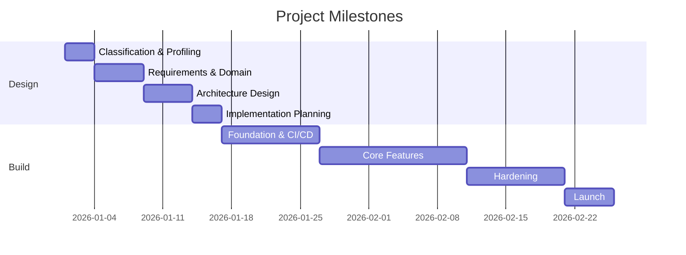

# Project Dashboard

> Executive view and project status tracking for greenfield projects.

---

## Project Summary

| Attribute | Value |
|-----------|-------|
| Project Name | |
| Project Type | |
| Architecture Style | |
| Complexity Score | |
| Team Size | |
| Target Timeline | |

---

## Design Completion

| Phase | Status | Completion |
|-------|--------|------------|
| Phase 0: Classification | Not Started / In Progress / Complete | 0% |
| Phase 1: Requirements | Not Started / In Progress / Complete | 0% |
| Phase 2: Architecture | Not Started / In Progress / Complete | 0% |
| Phase 3: Implementation | Not Started / In Progress / Complete | 0% |

---

## Architecture Decisions

| Decision | Status | Confidence |
|----------|--------|------------|
| Architecture Style | Pending / Decided | |
| Database | Pending / Decided | |
| Frontend | Pending / Decided | |
| Messaging | Pending / Decided | |
| Hosting | Pending / Decided | |
| Identity | Pending / Decided | |

---

## Risk Summary

| Risk | Impact | Likelihood | Mitigation |
|------|--------|------------|------------|
| | High / Medium / Low | High / Medium / Low | |

---

## Key Milestones

---

## Multi-Project Portfolio View

_For organizations running multiple greenfield projects simultaneously._

| Project | Type | Complexity | Phase | Risk | Target Date |
|---------|------|-----------|-------|------|-------------|
| | | | | | |

---

## Observations

- [ ] _AI-generated observations go here — review with stakeholders_
