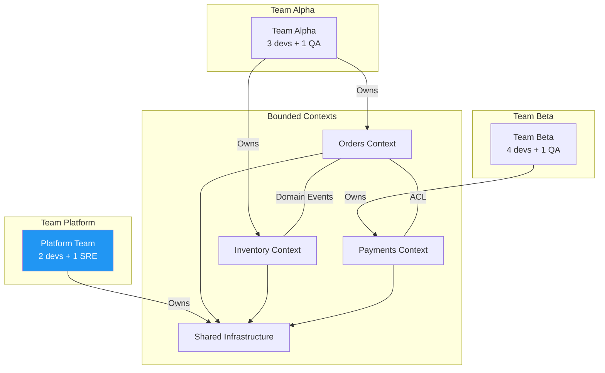
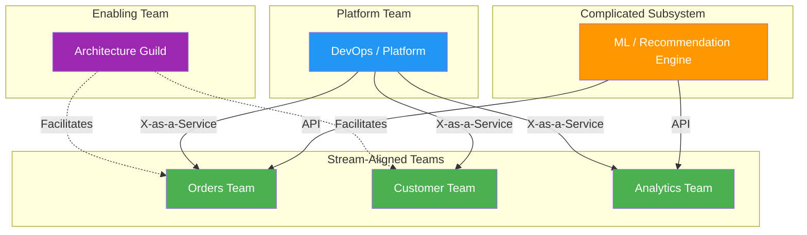
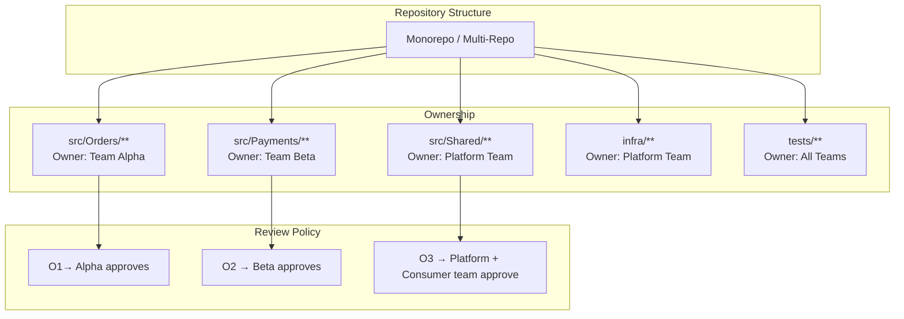
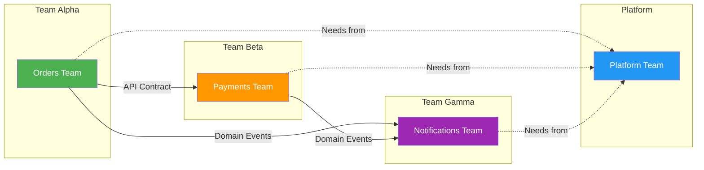
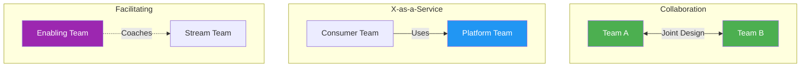
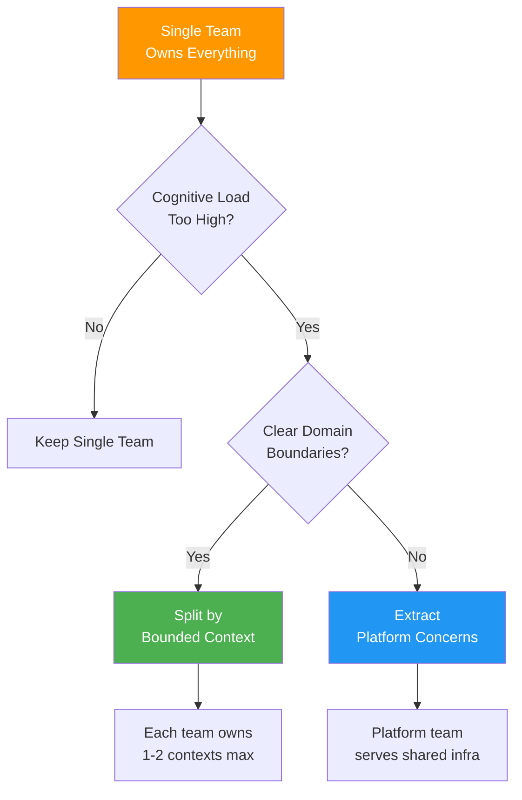

# Team Topology Diagrams

> Visual templates for team structure, ownership boundaries, and communication patterns aligned with system architecture.

---

## 1. Team-to-Bounded-Context Alignment (Conway's Law)

---

## 2. Team Topologies — Four Types

---

## 3. Code Ownership Map

---

## 4. Communication & Dependency Flow

---

## 5. Interaction Modes

| Team A | Team B | Mode | Description |
|--------|--------|------|-------------|
| Orders | Payments | **Collaboration** | Joint design of checkout flow |
| Orders | Platform | **X-as-a-Service** | Consume CI/CD, logging platform |
| Architecture Guild | Orders | **Facilitating** | Coaching on DDD patterns |
| Orders | Notifications | **Events** | Async via domain events |

---

## 6. Scaling — Team Split Decision

---

## Usage Notes

- Team boundaries should align with bounded contexts to minimize cross-team coordination
- Review [04-domain/bounded-contexts.md](../04-domain/bounded-contexts.md) to ensure alignment
- Update ownership maps when team responsibilities shift
- Reference: _Team Topologies_ by Skelton & Pais for Stream-Aligned, Enabling, Complicated Subsystem, and Platform team patterns
