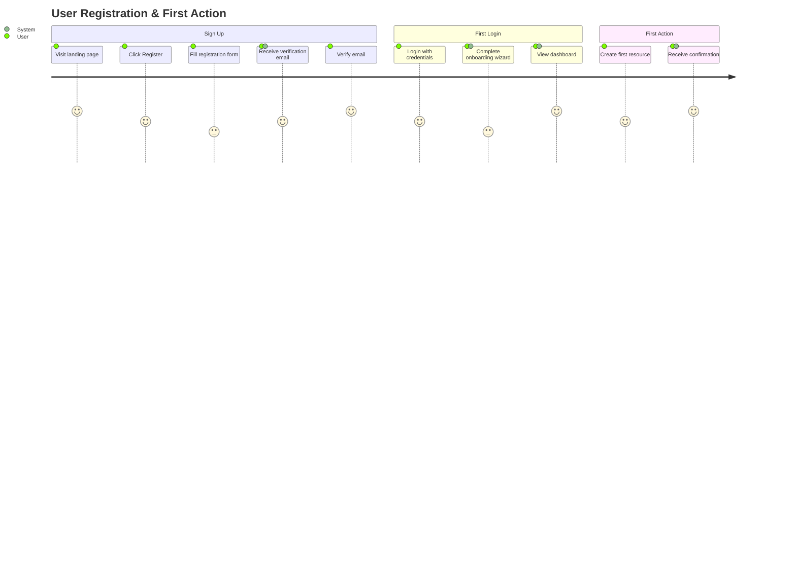
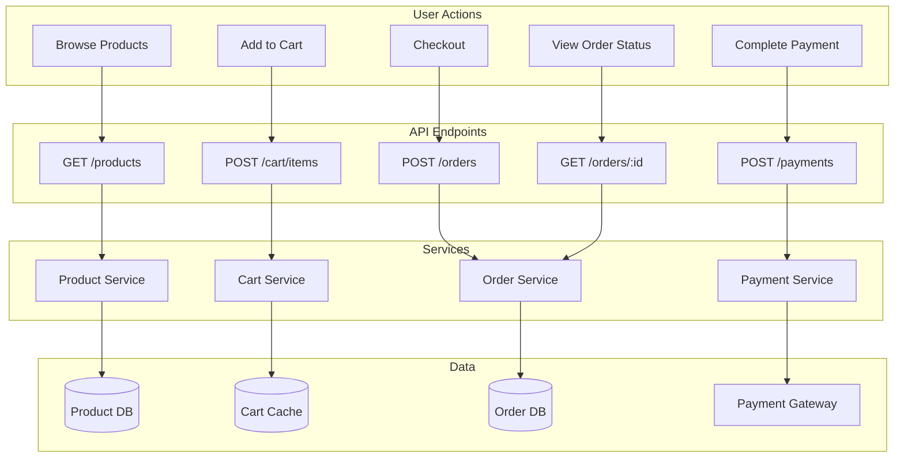
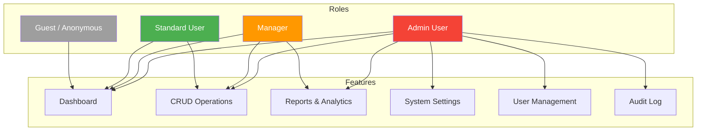
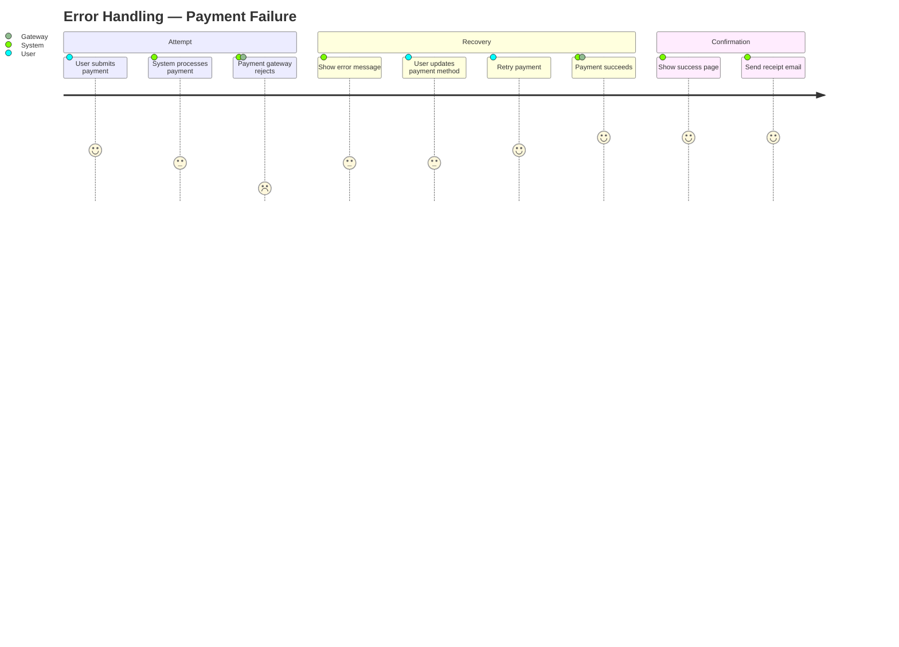
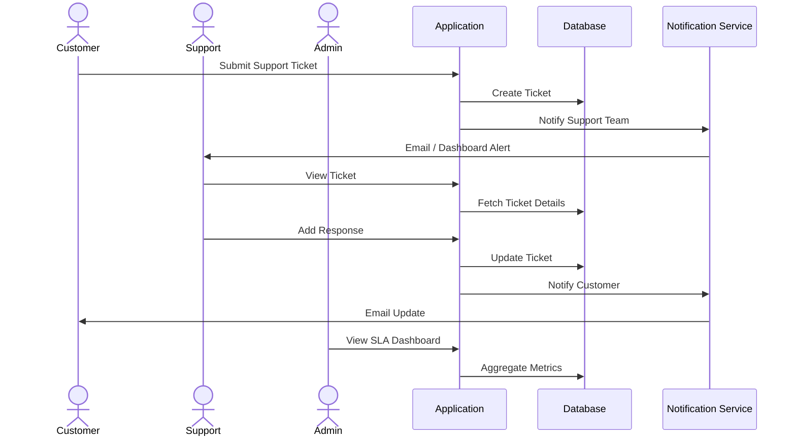
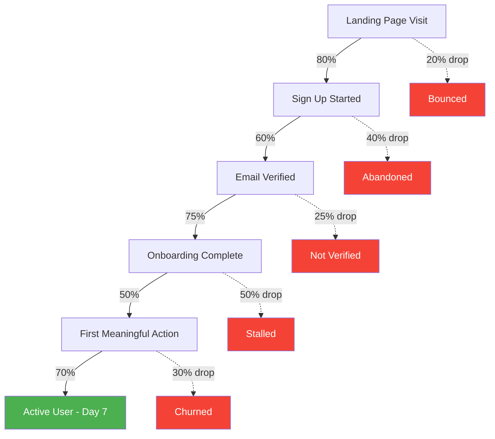

# User Journey Maps

> Visual templates mapping user interactions to system components and technical flows.

---

## 1. Primary User Journey — Happy Path

---

## 2. User Flow → System Interaction Map

---

## 3. Role-Based Access Flow

---

## 4. Error & Recovery Journey

---

## 5. Multi-Persona Interaction

---

## 6. Onboarding Funnel

---

## Usage Notes

- Replace placeholder entities with your actual domain personas and features
- Journey maps are best reviewed with product / UX stakeholders
- Use the User Flow → System Interaction Map to validate API coverage
- Role-Based Access Flow should align with your security model in [03-design/security-model.md](../03-design/security-model.md)
