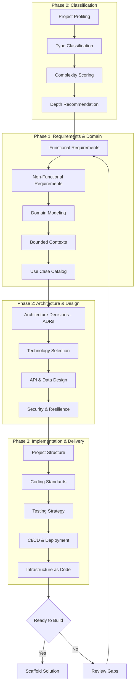
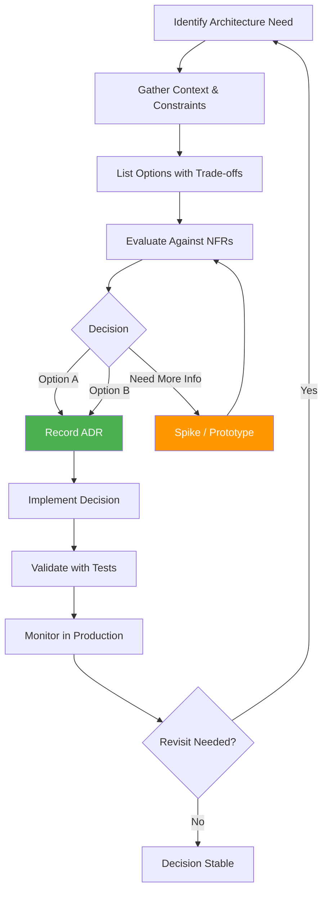
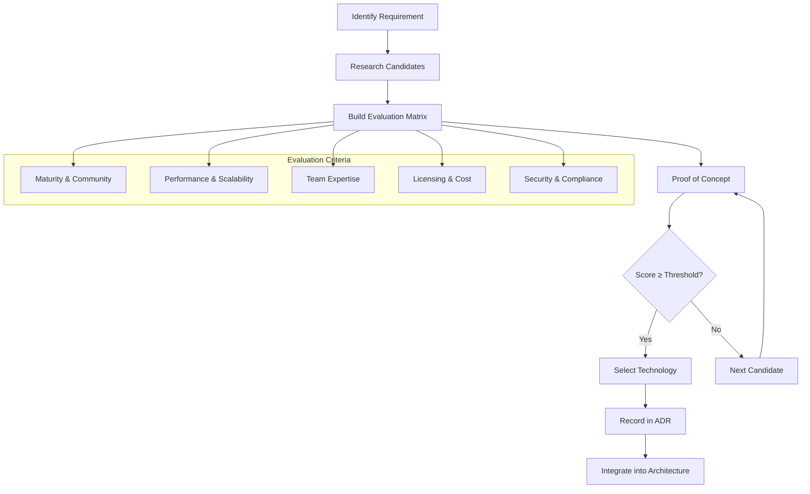
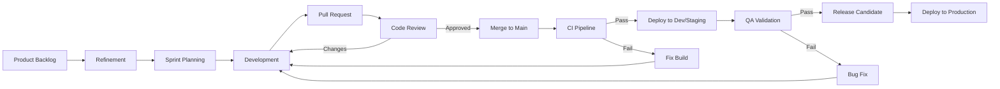
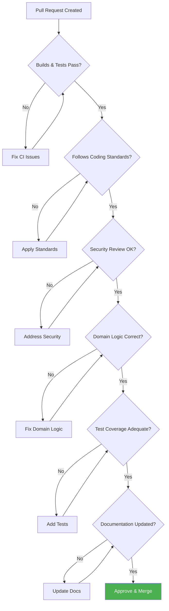
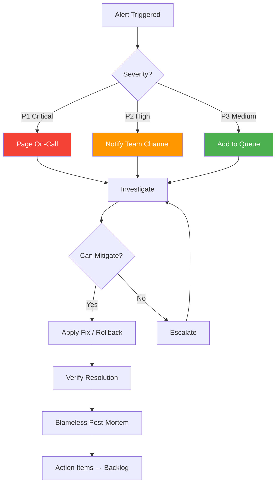
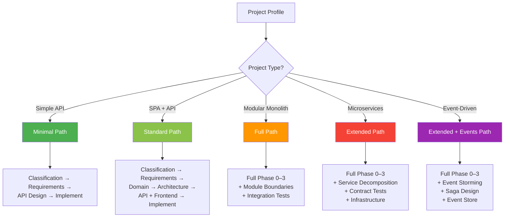

# Workflow Diagrams

> Visual templates for the greenfield design process, development workflows, and decision flows.

---

## 1. Greenfield Design Process (4-Phase Model)

---

## 2. Architecture Decision Flow

---

## 3. Technology Selection Workflow

---

## 4. Sprint / Development Workflow

---

## 5. Code Review Checklist Flow

---

## 6. Incident Response Workflow

---

## 7. Project Execution Path by Type

---

## Usage Notes

- The Phase 0–3 flow aligns with [QUICKSTART.md](../QUICKSTART.md) execution steps
- Decision flows should result in ADRs recorded in [02-architecture/architecture-decisions.md](../02-architecture/architecture-decisions.md)
- Sprint workflows should align with your CI/CD pipeline in [07-delivery/cicd-pipeline.md](../07-delivery/cicd-pipeline.md)
- Incident response should connect to observability setup in [06-quality/observability-design.md](../06-quality/observability-design.md)
