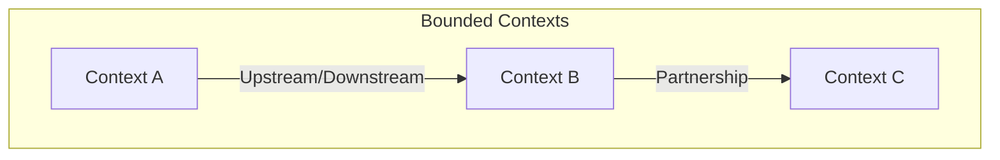

# Application Inventory

> **Generated by**: Prompts P1.1–P1.6 ([phase1-inventory.md](../09-ai/prompts/phase1-inventory.md))
> **Date**: <!-- YYYY-MM-DD -->
> **Project**: <!-- from project-profile.yaml -->

---

## 1. Applications & Services

| Name | Type | Architecture | Tech Stack | Hosting | Status |
|------|------|-------------|------------|---------|--------|
| <!-- e.g., Claims Portal --> | <!-- Web App --> | <!-- Monolith --> | <!-- .NET Framework 4.7 / WebForms --> | <!-- IIS --> | <!-- Active --> |
| | | | | | |

### Observations

- <!-- e.g., Mix of monolith + distributed services -->
- <!-- e.g., Partial modernization already started -->

---

## 2. Technology Matrix

| Component | Back-End | Front-End | Database | Messaging | Auth |
|-----------|----------|-----------|----------|-----------|------|
| <!-- Claims Portal --> | <!-- .NET 4.7 --> | <!-- WebForms --> | <!-- SQL Server 2016 --> | <!-- MSMQ --> | <!-- Windows Auth --> |
| | | | | | |

### Migration Effort per Technology

| Technology | Current Version | Target | Effort | Risk |
|-----------|----------------|--------|:------:|:----:|
| <!-- .NET Framework 4.7 --> | <!-- 4.7.2 --> | <!-- .NET 8 --> | <!-- 🔴 High --> | <!-- 🔴 High --> |
| | | | | |

---

## 3. Solution & Project Structure

```
<!-- Paste solution structure here -->
<!-- MySolution.sln -->
<!--   ├── src/ -->
<!--   │   ├── WebApp.csproj -->
<!--   │   ├── Services.csproj -->
<!--   │   └── Data.csproj -->
<!--   └── tests/ -->
<!--       └── Tests.csproj -->
```

---

## 4. External Dependencies

### Databases

| Database | Type | Version | Shared? | Used By |
|----------|------|---------|:-------:|---------|
| | | | | |

### Third-Party APIs

| API | Protocol | Direction | Auth | SLA |
|-----|----------|-----------|------|-----|
| | | | | |

### NuGet Packages (Key)

| Package | Version | Purpose | .NET 8 Compatible? |
|---------|---------|---------|:------------------:|
| | | | |

---

## 5. Deployment & Hosting

| Component | Host | CI/CD | Config Management |
|-----------|------|-------|-------------------|
| | | | |

---

## 6. Service Classification

```
Classification: <!-- Monolith / Modular Monolith / Distributed / Microservices / Hybrid -->

Justification:
- <!-- e.g., Single deployment unit, shared database = Monolith -->
```

---

## 7. Bounded Context Candidates

> From Prompt P1.5 — preliminary context identification

| Context Name | Key Entities | Owner Service | Data Store |
|-------------|-------------|---------------|------------|
| | | | |

### Context Map (Mermaid)



---

## 8. Performance Baseline

> From Prompt P1.6 — baseline metrics before modernization

| Metric | Current Value | Target | Measurement Method |
|--------|:------------:|:------:|-------------------|
| P95 Response Time | <!-- ms --> | <!-- ms --> | <!-- APM tool --> |
| Throughput (req/s) | | | |
| Error Rate (%) | | | |
| DB Query P95 | <!-- ms --> | <!-- ms --> | <!-- SQL DMV --> |
| Memory Usage | <!-- MB --> | <!-- MB --> | <!-- PerfMon --> |
| CPU Utilization | <!-- % --> | <!-- % --> | <!-- PerfMon --> |

### SQL Server Baseline Queries

```sql
-- Top 10 queries by avg elapsed time (run before migration)
-- See phase1-inventory.md Prompt P1.6 for full query set
```
