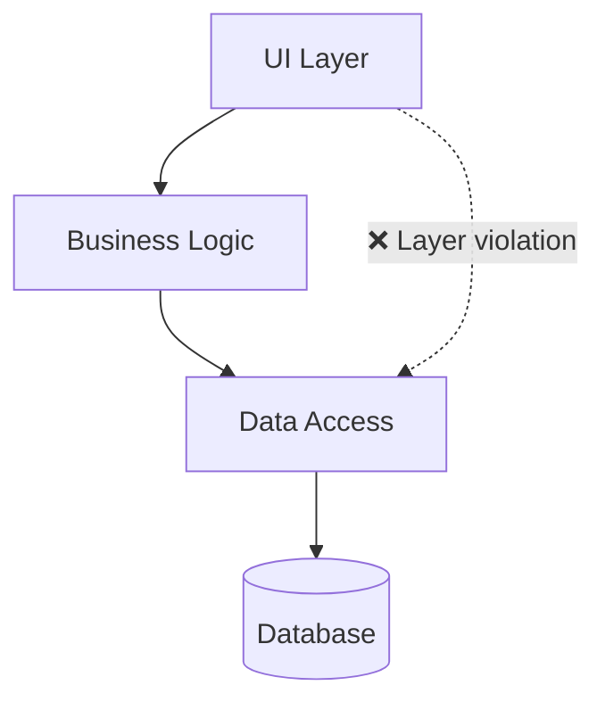

# Code Layer Assessment

> **Generated by**: Prompt P2 ([phase2-code-health.md](../09-ai/prompts/phase2-code-health.md))
> **Layer**: 1 of 4 (Code → Service → Event → Domain)
> **Date**: <!-- YYYY-MM-DD -->

---

## 1. Dependency Graph

### Project/Assembly Dependencies



### Dependency Metrics

| Assembly | Ca (Afferent) | Ce (Efferent) | Instability | Category |
|----------|:------------:|:------------:|:-----------:|----------|
| | | | | <!-- Stable / Unstable / Balanced --> |

### Circular Dependencies

| Cycle | Components | Severity | Resolution |
|-------|-----------|:--------:|------------|
| | | | |

---

## 2. Dead Code Analysis

### Summary

| Category | Files | Methods | LOC | % of Total |
|----------|:-----:|:-------:|:---:|:----------:|
| Unused classes | | | | |
| Unused methods | | | | |
| Deprecated APIs | | | | |
| Dead feature flags | | | | |
| **Total** | | | | |

### Dead Code Detail

| File | Element | Type | Last Referenced | Confidence | Safe to Remove? |
|------|---------|------|----------------|:----------:|:---------------:|
| | | | | | |

---

## 3. Complexity Analysis

### Hotspot Summary

| File/Class | Cyclomatic | Cognitive | LOC | Methods | Category |
|-----------|:----------:|:---------:|:---:|:-------:|----------|
| | | | | | <!-- God Class / Complex / Normal --> |

### Complexity Thresholds

| Metric | 🟢 Good | 🟡 Warning | 🔴 Critical | This Project |
|--------|:-------:|:----------:|:-----------:|:------------:|
| Cyclomatic (per method) | ≤10 | 11–20 | >20 | |
| Cognitive (per method) | ≤15 | 16–30 | >30 | |
| Method LOC | ≤30 | 31–60 | >60 | |
| Class LOC | ≤300 | 301–600 | >600 | |

### Maintainability Index

```
MI = MAX(0, (171 - 5.2 × ln(HV) - 0.23 × CC - 16.2 × ln(LOC)) × 100/171)
```

| Component | MI Score | Rating |
|-----------|:--------:|--------|
| | | <!-- 🟢 >60 / 🟡 40-60 / 🔴 <40 --> |

---

## 4. Refactoring Priority

### Priority Matrix

| Component | Business Criticality | Change Frequency | Complexity | Coupling | Test Coverage | Priority Score |
|-----------|:-------------------:|:---------------:|:----------:|:--------:|:-------------:|:--------------:|
| | /5 | /5 | /5 | /5 | /5 | |

```
Priority Score = (BusinessCrit × 0.30) + (ChangeFreq × 0.25) + (Complexity × 0.20) + (Coupling × 0.15) + ((5 − TestCoverage) × 0.10)
```

### Refactoring Heatmap

- 🔴 **High priority** (fix first): <!-- list -->
- 🟡 **Medium**: <!-- list -->
- 🟢 **Low**: <!-- list -->

### SQALE Technical Debt Estimate

| Component | Debt (hours) | Debt Ratio | Rating |
|-----------|:------------:|:----------:|--------|
| | | | <!-- A(≤5%) / B(6-10%) / C(11-20%) / D(21-50%) / E(>50%) --> |

---

## 5. Code Health Score

```
Code Health Score = (Complexity + Coupling + DeadCode + TestCoverage) / 4
```

| Metric | Score (1–5) | Notes |
|--------|:-----------:|-------|
| Complexity | | |
| Coupling | | |
| Dead Code | | |
| Test Coverage | | |
| **Code Health Score** | **/5** | **<!-- Poor / Fair / Good / Excellent -->** |
