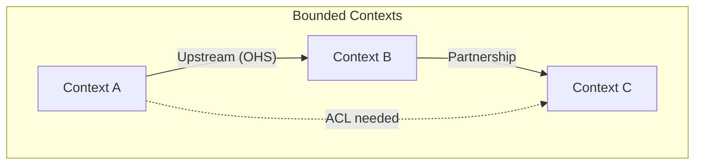

# Domain Layer Assessment

> **Generated by**: Prompts P1.4, P1.5, P3.3 ([phase1-inventory.md](../09-ai/prompts/phase1-inventory.md), [phase3-architecture-scoring.md](../09-ai/prompts/phase3-architecture-scoring.md))
> **Layer**: 4 of 4 (Code → Service → Event → Domain)
> **Date**: <!-- YYYY-MM-DD -->

---

## 1. Bounded Contexts Identified

| Context | Key Entities | Aggregates | Owner Service | Data Store |
|---------|-------------|-----------|---------------|------------|
| | | | | |

---

## 2. Context Map

### Context Relationships

| Upstream | Downstream | Relationship Type | Integration Pattern |
|----------|-----------|-------------------|---------------------|
| | | <!-- Conformist / ACL / OHS / Partnership / Shared Kernel --> | <!-- REST / Event / Shared DB --> |

---

## 3. Aggregate Identification

| Aggregate Root | Value Objects | Invariants | Bounded Context |
|---------------|--------------|-----------|-----------------|
| | | | |

---

## 4. Domain-Service-Event Triangulation

> Cross-reference: domains identified in code, services, and events should align.

| Domain Concept | Found in Code? | Found in Services? | Found in Events? | Alignment |
|---------------|:--------------:|:------------------:|:----------------:|:---------:|
| | | | | <!-- ✅ Aligned / ⚠️ Partial / ❌ Orphan --> |

### Orphan Detection

| Type | Element | Found In | Missing From | Action |
|------|---------|----------|-------------|--------|
| <!-- Service orphan --> | <!-- ValidationService --> | <!-- Service layer --> | <!-- No domain, no events --> | <!-- Investigate --> |
| | | | | |

---

## 5. Business Rules Catalog (Summary)

> Detailed rules in: [../04-domain/domain-mapping.md](../04-domain/domain-mapping.md)

| Rule Category | Count | Source | Confidence Distribution |
|--------------|:-----:|--------|-------------------------|
| Validation rules | | <!-- Code / SP / Config --> | <!-- HIGH: X, MEDIUM: Y, LOW: Z --> |
| Calculations | | | |
| State transitions | | | |
| Authorization | | | |
| Cross-entity | | | |
| **Total** | | | |

---

## 6. Domain Layer Score

| Metric | Score (1–5) | Evidence |
|--------|:-----------:|---------|
| Context Clarity | | <!-- Are boundaries clear? --> |
| Aggregate Design | | <!-- Proper aggregate roots? --> |
| Business Rule Coverage | | <!-- % of rules documented --> |
| Triangulation Alignment | | <!-- Code-Service-Event match? --> |
| **Domain Layer Score** | **/5** | |
