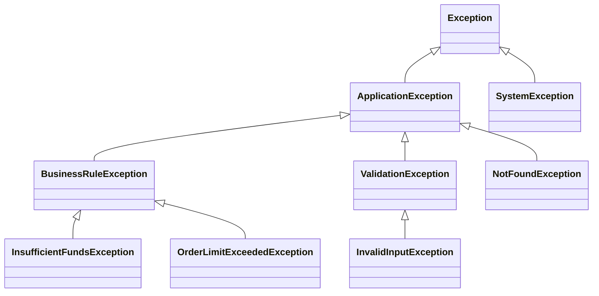

# Error Handling Catalog

> **Generated by**: Prompt P6.9 — Error Handling & Recovery Pattern Extraction
> **Related Prompts**: [phase6-discovery-legacy.md](../09-ai/prompts/phase6-discovery-legacy.md)
> **Date**: <!-- YYYY-MM-DD -->

---

## 1. Error Handling Summary

| Pattern Type | Count | With Business Logic | Pure Infrastructure |
|-------------|:-----:|:-------------------:|:-------------------:|
| Custom exception classes | | | |
| Try/catch blocks | | | |
| Global error handlers | | | |
| Error pages / responses | | | |
| Retry mechanisms | | | |
| Circuit breakers | | | |
| **Total** | | | |

---

## 2. Custom Exception Hierarchy

### Exception Catalog

| Exception Class | Base Class | Purpose | Contains Business Logic? | Used By |
|----------------|-----------|---------|:-----------------------:|---------|
| | | | <!-- ✅ / ❌ --> | <!-- Component count --> |

---

## 3. Error Handling Patterns

### Global Error Handlers

| Handler | Type | Scope | Actions | Business Logic? |
|---------|------|-------|---------|:--------------:|
| | <!-- Filter / Module / Middleware / Application_Error --> | <!-- Global / Controller / Method --> | <!-- Log / Redirect / Response --> | |

### Try/Catch Patterns

| Pattern | Count | Example Locations | Assessment |
|---------|:-----:|-------------------|-----------|
| Catch-all (`catch (Exception)`) | | | <!-- 🔴 Overly broad --> |
| Specific exception catching | | | <!-- 🟢 Good practice --> |
| Empty catch blocks | | | 🔴 Silent failure |
| Catch-log-rethrow | | | <!-- 🟡 Review needed --> |
| Catch-transform-throw | | | <!-- 🟢 If intentional --> |
| Catch with business recovery | | | <!-- Document business rule --> |

---

## 4. Business Logic in Error Handling

> Error handling that encodes business decisions

| Component | Error Scenario | Business Decision | Source |
|-----------|---------------|-------------------|--------|
| | <!-- e.g., Payment declined --> | <!-- e.g., Retry 3x, then notify manager, hold order --> | |
| | <!-- e.g., Inventory unavailable --> | <!-- e.g., Backorder if qty<10, reject if qty≥10 --> | |

### Recovery Patterns with Business Rules

| ERR ID | Trigger | Recovery Action | Business Rule | Confidence |
|:------:|---------|----------------|--------------|:----------:|
| ERR-001 | | <!-- Retry / Compensate / Notify / Degrade --> | | |

---

## 5. Transaction Boundaries

| Component | Transaction Scope | On Error | Compensating Action? |
|-----------|------------------|----------|:-------------------:|
| | <!-- Method / Request / Multi-step --> | <!-- Rollback / Partial commit / Log --> | <!-- ✅ / ❌ --> |

### Distributed Transaction Patterns

| Pattern | Components Involved | Consistency | Risk |
|---------|-------------------|:-----------:|:----:|
| Two-phase commit (DTC) | | Strong | 🔴 Remove for migration |
| TransactionScope | | | 🟡 Evaluate scope |
| Manual compensation | | Eventual | 🟢 |
| None (hope for the best) | | None | 🔴 |

---

## 6. Error Response Catalog

### API Error Responses

| Status Code | Scenario | Response Body | Standard? |
|:-----------:|----------|--------------|:---------:|
| 400 | | | <!-- RFC 7807? --> |
| 401 | | | |
| 403 | | | |
| 404 | | | |
| 500 | | | |

### UI Error Pages

| Error | Current Display | User Action | Logging |
|-------|----------------|------------|:-------:|
| | | | <!-- ✅ / ❌ --> |

---

## 7. Resilience Patterns

| Pattern | Implemented? | Where | Configuration |
|---------|:------------:|-------|--------------|
| Retry with backoff | | | <!-- Count / Delay --> |
| Circuit breaker | | | <!-- Threshold / Duration --> |
| Timeout | | | <!-- Duration --> |
| Bulkhead | | | <!-- Concurrency limit --> |
| Fallback | | | <!-- Fallback behavior --> |

### Missing Resilience

| Integration / Dependency | Current Error Handling | Recommended Pattern |
|------------------------|----------------------|-------------------|
| | <!-- None / Basic try-catch --> | <!-- Polly retry + circuit breaker --> |

---

## 8. Migration Recommendations

| Priority | Action | Components | Effort |
|:--------:|--------|:----------:|:------:|
| P0 | Remove empty catch blocks | | 🟢 |
| P1 | Standardize error responses (RFC 7807) | | 🟡 |
| P2 | Extract business rules from catch blocks to domain | | 🟡 |
| P3 | Replace DTC with saga / compensation patterns | | 🔴 |
| P4 | Add Polly resilience to all external calls | | 🟡 |

---

## 9. Validation Checklist

| Item | Status | Notes |
|------|:------:|-------|
| All custom exceptions cataloged | <!-- ✅ / ❌ --> | |
| Empty catch blocks flagged | <!-- ✅ / ❌ --> | |
| Business logic in error handling documented | <!-- ✅ / ❌ --> | |
| Transaction boundaries mapped | <!-- ✅ / ❌ --> | |
| Resilience gaps identified | <!-- ✅ / ❌ --> | |
