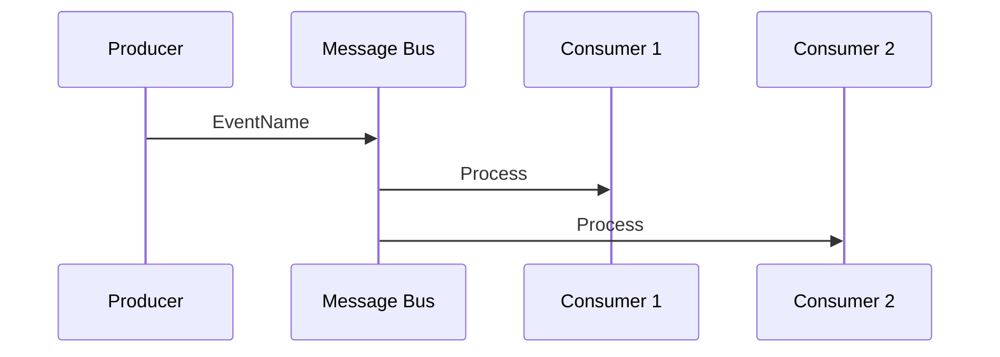

# Event Layer Assessment

> **Generated by**: Prompt P3.2 ([phase3-architecture-scoring.md](../09-ai/prompts/phase3-architecture-scoring.md))
> **Layer**: 3 of 4 (Code → Service → Event → Domain)
> **Date**: <!-- YYYY-MM-DD -->
> **Skip if**: Architecture type is Monolith with no async messaging

---

## 1. Event Maturity Level

| Level | Description | Current? |
|:-----:|------------|:--------:|
| **L1** | Basic pub/sub — fire and forget | |
| **L2** | Retry + DLQ — delivery guarantees | |
| **L3** | Versioned schemas — backward compatible | |
| **L4** | Event sourcing — events as source of truth | |

**Current Maturity**: <!-- L1 / L2 / L3 / L4 -->
**Target Maturity**: <!-- L2 / L3 / L4 -->

---

## 2. Event Catalog

| Event Name | Producer | Consumer(s) | Payload Schema | Idempotent? | Version |
|-----------|----------|-------------|---------------|:-----------:|:-------:|
| | | | | | |

---

## 3. Event Flow Diagram

---

## 4. Event Maturity Checklist

| Aspect | L1 | L2 | L3 | L4 | Current | Gap |
|--------|:--:|:--:|:--:|:--:|:-------:|-----|
| Naming (domain vs technical) | ⬜ | ⬜ | ⬜ | ⬜ | | |
| Delivery guarantee | ⬜ | ⬜ | ⬜ | ⬜ | | |
| Retry policy | ⬜ | ⬜ | ⬜ | ⬜ | | |
| Dead letter queue | ⬜ | ⬜ | ⬜ | ⬜ | | |
| Schema registry | ⬜ | ⬜ | ⬜ | ⬜ | | |
| Backward compatibility | ⬜ | ⬜ | ⬜ | ⬜ | | |
| Idempotent consumers | ⬜ | ⬜ | ⬜ | ⬜ | | |
| Event ordering | ⬜ | ⬜ | ⬜ | ⬜ | | |
| Event versioning | ⬜ | ⬜ | ⬜ | ⬜ | | |
| Event store / replay | ⬜ | ⬜ | ⬜ | ⬜ | | |

---

## 5. Issues & Gaps

| Issue | Severity | Current State | Recommendation |
|-------|:--------:|--------------|----------------|
| <!-- No DLQ handling --> | 🔴 | | <!-- Add DLQ to all queues --> |
| <!-- No schema versioning --> | 🟡 | | <!-- Introduce versioned contracts --> |
| | | | |

---

## 6. Event Layer Score

| Metric | Score (1–5) | Evidence |
|--------|:-----------:|---------|
| Event Coverage | | <!-- % of cross-service comms using events --> |
| Delivery Guarantees | | <!-- At-least-once? Exactly-once? --> |
| Schema Management | | <!-- Versioned? Registry? --> |
| Error Handling | | <!-- DLQ? Retry? --> |
| **Event Layer Score** | **/5** | |
