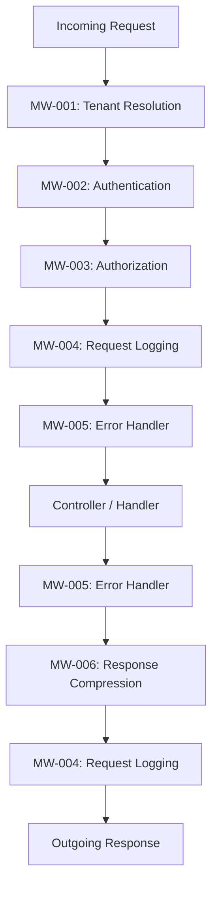

# Middleware & Pipeline Analysis

> **Generated by**: Prompt P6.8 — Middleware & HTTP Pipeline Extraction
> **Related Prompts**: [phase6-discovery-legacy.md](../09-ai/prompts/phase6-discovery-legacy.md)
> **Date**: <!-- YYYY-MM-DD -->

---

## 1. Pipeline Summary

| Pipeline Type | Component Count | With Business Logic | Pure Infrastructure |
|--------------|:---------------:|:-------------------:|:-------------------:|
| HTTP Modules (IIS) | | | |
| OWIN Middleware | | | |
| ASP.NET Core Middleware | | | |
| Message Handlers | | | |
| Action Filters | | | |
| WCF Behaviors | | | |
| **Total** | | | |

---

## 2. Middleware Catalog

### MW-001: <!-- e.g., TenantResolutionModule -->

| Attribute | Value |
|-----------|-------|
| **ID** | MW-001 |
| **Name** | <!-- TenantResolutionModule --> |
| **Type** | <!-- HTTP Module / OWIN / Filter / Handler --> |
| **Source File** | <!-- path --> |
| **Execution Order** | <!-- Position in pipeline --> |
| **Confidence** | <!-- HIGH / MEDIUM / LOW --> |

**Purpose**:
<!-- Brief description of what this middleware does -->

**Business Logic**:
| Rule | Description | Should Move To |
|------|-------------|---------------|
| | | <!-- Domain service / Policy / Keep in middleware --> |

**Dependencies**:
| Dependency | Type | Purpose |
|-----------|------|---------|
| | <!-- Service / Config / DB / HttpContext --> | |

**Request/Response Modifications**:
| Phase | Modification | Impact |
|-------|-------------|--------|
| BeginRequest | | |
| AuthenticateRequest | | |
| AuthorizeRequest | | |
| EndRequest | | |

---

<!-- Repeat for each middleware component -->

## 3. Execution Order

### Order Dependencies

| Middleware | Must Run Before | Must Run After | Reason |
|-----------|----------------|---------------|--------|
| | | | |

---

## 4. Business Logic in Middleware

> Rules that should potentially be extracted to domain layer

| MW ID | Business Rule | Current Implementation | Risk if Removed | Recommendation |
|:-----:|--------------|----------------------|:---------------:|---------------|
| | | <!-- Inline check / Service call / Config lookup --> | <!-- 🔴/🟡/🟢 --> | <!-- Extract / Keep / Refactor --> |

### Categories

| Category | Count | Examples |
|----------|:-----:|---------|
| Multi-tenancy / context resolution | | <!-- Tenant header → DB routing --> |
| Business authorization (beyond auth) | | <!-- Role + data-level permissions --> |
| Request transformation / enrichment | | <!-- Add business metadata --> |
| Rate limiting with business rules | | <!-- Per-customer limits --> |
| Audit / compliance logging | | <!-- Regulatory requirements --> |

---

## 5. Technology Migration Map

| Current | Target (.NET 8+) | Migration Complexity | Notes |
|---------|-----------------|:--------------------:|-------|
| `IHttpModule` | ASP.NET Core Middleware | 🟡 | Rewrite with `IMiddleware` |
| `IHttpHandler` | Minimal API / Controller | 🟡 | |
| Global.asax events | `Program.cs` middleware | 🟢 | |
| OWIN Middleware | ASP.NET Core Middleware | 🟢 | Similar pattern |
| `DelegatingHandler` | `IMiddleware` or keep | 🟢 | |
| `IActionFilter` | `IActionFilter` (Core) | 🟢 | Minor API changes |
| WCF `IDispatchMessageInspector` | gRPC Interceptor / Middleware | 🔴 | Full rewrite |
| `IAuthorizationFilter` | Policy-based auth | 🟡 | Redesign as policies |

---

## 6. Cross-Cutting Concerns

| Concern | Current Implementation | Components | Target Pattern |
|---------|----------------------|:----------:|---------------|
| Authentication | | | <!-- ASP.NET Core Identity / JWT --> |
| Authorization | | | <!-- Policy-based --> |
| Logging | | | <!-- Serilog / OpenTelemetry --> |
| Exception handling | | | <!-- Problem Details middleware --> |
| Caching | | | <!-- IDistributedCache --> |
| CORS | | | <!-- Core CORS middleware --> |
| Compression | | | <!-- Response compression middleware --> |
| Rate limiting | | | <!-- Core rate limiting middleware --> |

---

## 7. Migration Recommendations

| Priority | Action | Components | Effort |
|:--------:|--------|:----------:|:------:|
| P0 | Extract business logic from HTTP modules | | |
| P1 | Map execution order to Core middleware pipeline | | |
| P2 | Convert action filters to Core equivalents | | |
| P3 | Replace custom cross-cutting with built-in middleware | | |

---

## 8. Validation Checklist

| Item | Status | Notes |
|------|:------:|-------|
| All middleware components cataloged | <!-- ✅ / ❌ --> | |
| Execution order documented | <!-- ✅ / ❌ --> | |
| Business logic identified and tagged | <!-- ✅ / ❌ --> | |
| Migration target assigned per component | <!-- ✅ / ❌ --> | |
| Order dependencies verified | <!-- ✅ / ❌ --> | |
