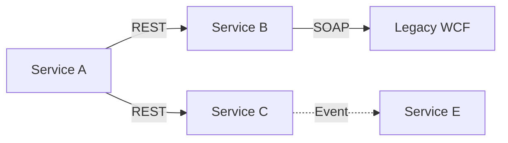

# Service Layer Assessment

> **Generated by**: Prompt P3.1 ([phase3-architecture-scoring.md](../09-ai/prompts/phase3-architecture-scoring.md))
> **Layer**: 2 of 4 (Code → Service → Event → Domain)
> **Date**: <!-- YYYY-MM-DD -->

---

## 1. Service Catalog

| Service | Type | Protocol | Dependencies | Consumers | Criticality |
|---------|------|----------|:------------:|:---------:|:-----------:|
| | | | | | <!-- High / Medium / Low --> |

---

## 2. Service Coupling Analysis

### Sync Dependencies

| From Service | To Service | Protocol | Coupling Type | Fallback? |
|-------------|-----------|----------|---------------|:---------:|
| | | <!-- REST / gRPC / SOAP --> | <!-- Direct / Gateway / Queue --> | |

### Dependency Graph

---

## 3. API Contract Analysis

| Endpoint | Method | Request Schema | Response Schema | Versioned? | Breaking Changes? |
|----------|--------|---------------|-----------------|:----------:|:-----------------:|
| | | | | | |

---

## 4. Service Scoring

| Factor | Score (1–5) | Evidence |
|--------|:-----------:|---------|
| Modularity | | <!-- Can services be deployed independently? --> |
| Scalability | | <!-- Can individual services scale? --> |
| Resilience | | <!-- Circuit breakers, retries, fallbacks? --> |
| Observability | | <!-- Logging, tracing, metrics? --> |
| **Architecture Fitness Score** | **/5** | |

---

## 5. Issues & Recommendations

| Issue | Severity | Current State | Recommendation |
|-------|:--------:|--------------|----------------|
| <!-- Shared database --> | 🔴 | <!-- 3 services share 1 DB --> | <!-- Database per service --> |
| <!-- Synchronous chain --> | 🟡 | <!-- A→B→C→D sync calls --> | <!-- Introduce async messaging --> |
| | | | |
