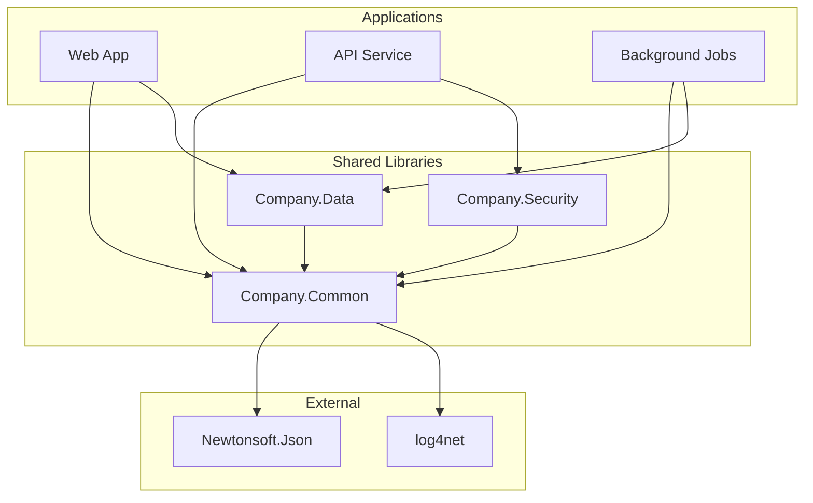

# Shared Library Analysis

> **Generated by**: Prompt P6.7 — Shared Library & Cross-Cutting Concern Extraction
> **Related Prompts**: [phase6-discovery-legacy.md](../09-ai/prompts/phase6-discovery-legacy.md)
> **Date**: <!-- YYYY-MM-DD -->

---

## 1. Shared Library Summary

| Total Shared Libraries | Internal | Third-Party | With Business Logic | Pure Utility |
|:----------------------:|:--------:|:-----------:|:-------------------:|:------------:|
| | | | | |

---

## 2. Shared Library Catalog

### LIB-001: <!-- e.g., Company.Common -->

| Attribute | Value |
|-----------|-------|
| **ID** | LIB-001 |
| **Name** | <!-- Company.Common --> |
| **Type** | <!-- NuGet / Project Reference / GAC / DLL --> |
| **Version** | <!-- 3.2.1 --> |
| **Owner** | <!-- Team / Vendor / Unknown --> |
| **Consumers** | <!-- Count of projects referencing it --> |
| **Confidence** | <!-- HIGH / MEDIUM / LOW --> |

**Namespace Breakdown**:
| Namespace | Purpose | Contains Business Logic? |
|-----------|---------|:-----------------------:|
| | | <!-- ✅ / ❌ --> |

**Business Logic Found**:
| Class / Method | Logic Type | Used By | Migration Impact |
|---------------|-----------|---------|:----------------:|
| | <!-- Validation / Calculation / Authorization --> | <!-- List consumers --> | <!-- 🔴/🟡/🟢 --> |

**Cross-Cutting Concerns**:
| Concern | Implementation | Pattern |
|---------|---------------|---------|
| Logging | | <!-- Static / DI / AOP --> |
| Caching | | |
| Exception handling | | |
| Authentication | | |
| Authorization | | |

**Dependency Chain**:
| This Library Depends On | Depended On By |
|------------------------|---------------|
| | |

---

<!-- Repeat for each shared library -->

## 3. Dependency Graph

---

## 4. Business Logic in Shared Libraries

> Business rules that belong in domain layer but live in shared libraries

| Rule | Library | Class.Method | Consumers | Action |
|------|---------|-------------|:---------:|--------|
| | | | | <!-- Move to domain / Keep shared / Duplicate per context --> |

### Risk: Shared Business Logic

| Issue | Libraries | Impact |
|-------|----------|--------|
| Business rule changes require all consumers to update | | 🔴 |
| Version conflicts between consumers | | 🟡 |
| Implicit coupling through shared models | | 🔴 |

---

## 5. Migration Strategy per Library

| LIB ID | Library | Strategy | Target | Effort | Priority |
|:------:|---------|---------|--------|:------:|:--------:|
| | | <!-- Keep / Replace / Split / Inline / Upgade --> | | <!-- S/M/L --> | <!-- P0-P3 --> |

### Strategy Details

| Strategy | When to Use | Example |
|----------|-----------|---------|
| **Keep** | Pure utility, no business logic, compatible | Logging helpers |
| **Replace** | Deprecated or .NET Framework-only | `System.Web` utilities → new abstractions |
| **Split** | Mixed business + utility logic | Extract domain logic to bounded contexts |
| **Inline** | Used by single consumer | Merge into consuming project |
| **Upgrade** | Compatible package available | `Newtonsoft.Json` → `System.Text.Json` |

---

## 6. Compatibility Assessment

| Library | .NET Standard? | .NET 8+ Compatible? | Blocking APIs | Migration Path |
|---------|:--------------:|:-------------------:|--------------|---------------|
| | <!-- ✅ / ❌ --> | <!-- ✅ / ❌ --> | <!-- System.Web / etc --> | |

---

## 7. Validation Checklist

| Item | Status | Notes |
|------|:------:|-------|
| All shared libraries cataloged | <!-- ✅ / ❌ --> | |
| Business logic locations identified | <!-- ✅ / ❌ --> | |
| Version conflicts documented | <!-- ✅ / ❌ --> | |
| Migration strategy assigned per library | <!-- ✅ / ❌ --> | |
| No circular dependencies in shared libs | <!-- ✅ / ❌ --> | |
