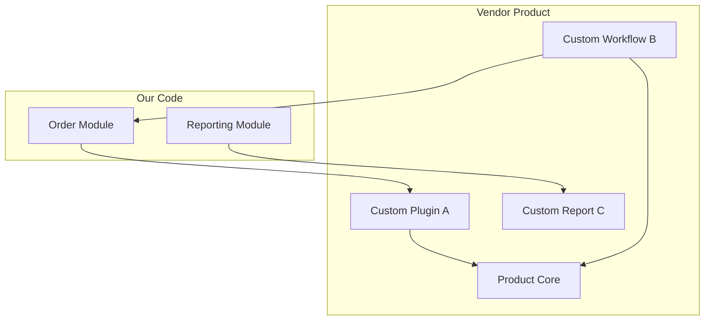

# Vendor & Third-Party Customization Catalog

> **Generated by**: Prompt P6.11 — Third-Party Product Customization Extraction
> **Related Prompts**: [phase6-discovery-legacy.md](../09-ai/prompts/phase6-discovery-legacy.md)
> **Date**: <!-- YYYY-MM-DD -->

---

## 1. Vendor Product Summary

| Product | Vendor | Version | Customization Count | Business Logic in Customizations |
|---------|--------|---------|:-------------------:|:-------------------------------:|
| | | | | |
| **Total** | | | | |

---

## 2. Customization Catalog

### VEND-001: <!-- e.g., SAP Integration Customization -->

| Attribute | Value |
|-----------|-------|
| **ID** | VEND-001 |
| **Product** | <!-- SAP / Dynamics / Salesforce / SharePoint / BizTalk --> |
| **Vendor** | |
| **Version** | |
| **Customization Type** | <!-- Plugin / Extension / Config / Script / Overlay / Hook --> |
| **Source Files** | <!-- paths --> |
| **Confidence** | <!-- HIGH / MEDIUM / LOW --> |

**Customization Detail**:
| Component | Type | Purpose | Business Logic? |
|-----------|------|---------|:--------------:|
| | <!-- Plugin / Workflow / Form / Script / Report --> | | |

**Business Logic in Customization**:
| Rule | Description | Portable? | Migration Action |
|------|-------------|:---------:|-----------------|
| | | <!-- ✅ Can extract / ❌ Product-locked --> | <!-- Extract to domain / Rewrite / Keep --> |

**Dependencies on Product Internals**:
| Dependency | Type | Risk if Product Upgraded |
|-----------|------|:------------------------:|
| | <!-- API / Internal class / DB schema / Config --> | <!-- 🔴 / 🟡 / 🟢 --> |

**Upgrade / Migration History**:
| Date | Change | Impact on Customization |
|------|--------|------------------------|
| | | |

---

<!-- Repeat for each vendor product customization -->

## 3. Customization Dependency Map

---

## 4. Risk Assessment

### Vendor Lock-In Analysis

| Product | Lock-In Level | Exit Effort | Business Logic Trapped |
|---------|:-------------:|:-----------:|:---------------------:|
| | <!-- 🔴 High / 🟡 Med / 🟢 Low --> | <!-- S/M/L/XL --> | <!-- Count of rules --> |

### Customization Risks

| Risk | Products Affected | Impact |
|------|:-----------------:|--------|
| Vendor deprecates customization API | | 🔴 Customizations break |
| Product upgrade breaks customizations | | 🔴 Must rewrite |
| Undocumented internal API usage | | 🔴 No upgrade guarantee |
| Business logic only in product scripts | | 🟡 Not portable |
| Custom DB objects in vendor schema | | 🔴 Upgrade conflict |

---

## 5. Business Logic Extraction Plan

| VEND ID | Business Rule | Current Location | Extraction Strategy | Target Location | Effort |
|:-------:|--------------|-----------------|--------------------|--------------:|:------:|
| | | <!-- Plugin / Script / Config --> | <!-- Copy / Rewrite / Adapter --> | <!-- Domain service --> | |

### Extraction Priority

| Priority | Criteria |
|:--------:|---------|
| P0 | Business logic trapped in product being decommissioned |
| P1 | Logic in customizations that block product upgrade |
| P2 | Logic that duplicates domain layer rules |
| P3 | Portable utility customizations |

---

## 6. Product Migration Decisions

| Product | Decision | Rationale | Timeline |
|---------|---------|-----------|---------|
| | <!-- Keep + Upgrade / Replace / Decommission / Modernize API --> | | |

### For Products Being Replaced

| Product | Replacement | Customizations to Migrate | Customizations to Drop |
|---------|------------|:-------------------------:|:---------------------:|
| | | | |

### For Products Being Kept

| Product | Upgrade Path | Customizations Requiring Rework | Effort |
|---------|-------------|:-------------------------------:|:------:|
| | | | |

---

## 7. Validation Checklist

| Item | Status | Notes |
|------|:------:|-------|
| All vendor products cataloged | <!-- ✅ / ❌ --> | |
| All customizations documented | <!-- ✅ / ❌ --> | |
| Business logic identified in each customization | <!-- ✅ / ❌ --> | |
| Lock-in level assessed per product | <!-- ✅ / ❌ --> | |
| Extraction plan reviewed with business | <!-- ✅ / ❌ --> | |
