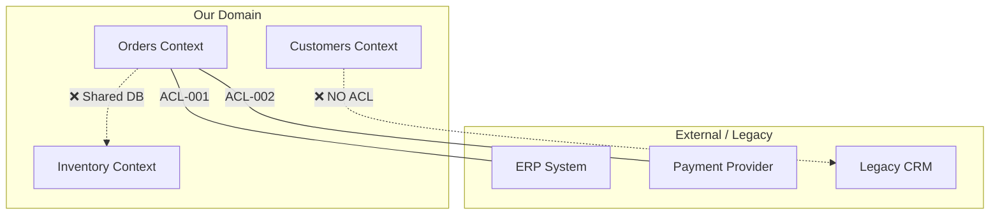
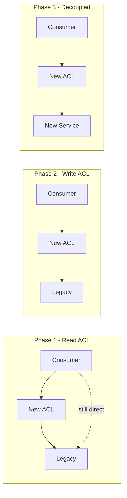

# Anti-Corruption Layer Analysis

> **Generated by**: Prompt P6.12 — Anti-Corruption Layer Identification
> **Related Prompts**: [phase6-discovery-legacy.md](../09-ai/prompts/phase6-discovery-legacy.md)
> **Date**: <!-- YYYY-MM-DD -->

---

## 1. ACL Summary

| Existing ACLs | Needed ACLs | Gap Count | Bounded Context Boundaries |
|:-------------:|:-----------:|:---------:|:--------------------------:|
| | | | |

---

## 2. Existing Anti-Corruption Layers

### ACL-001: <!-- e.g., ERP Adapter -->

| Attribute | Value |
|-----------|-------|
| **ID** | ACL-001 |
| **Name** | <!-- ERP Adapter --> |
| **Protected Context** | <!-- Orders (our domain) --> |
| **External Context** | <!-- ERP System (legacy/3rd-party) --> |
| **Pattern** | <!-- Adapter / Facade / Translator / Gateway --> |
| **Implementation** | <!-- Class / Service / Middleware --> |
| **Source Files** | <!-- path(s) --> |
| **Confidence** | <!-- HIGH / MEDIUM / LOW --> |

**Translation Mapping**:
| External Concept | Internal Concept | Translation Logic |
|-----------------|-----------------|-------------------|
| | | <!-- Rename / Reshape / Enrich / Filter --> |

**Quality Assessment**:
| Criterion | Status | Notes |
|-----------|:------:|-------|
| Complete isolation | <!-- ✅ / ⚠️ / ❌ --> | |
| No leaking of external models | <!-- ✅ / ⚠️ / ❌ --> | |
| Testable in isolation | <!-- ✅ / ⚠️ / ❌ --> | |
| Error translation | <!-- ✅ / ⚠️ / ❌ --> | |

---

<!-- Repeat for each existing ACL -->

## 3. Missing ACLs — Gap Analysis

> Boundaries where foreign models leak into our domain

| Gap ID | Our Context | Foreign Context | Leakage Type | Evidence | Priority |
|:------:|------------|----------------|-------------|---------|:--------:|
| GAP-001 | | | <!-- Shared DB / Direct model reference / Shared DTO --> | <!-- File:Line --> | <!-- P0/P1/P2 --> |

### Leakage Patterns Found

| Pattern | Count | Severity | Fix Strategy |
|---------|:-----:|:--------:|-------------|
| Shared database tables across contexts | | 🔴 | Introduce DB view + ACL service |
| External DTOs used in domain logic | | 🔴 | Map to internal models |
| Direct API calls without adapter | | 🟡 | Wrap in gateway pattern |
| Shared ORM entities across contexts | | 🔴 | Split into per-context models |
| Legacy naming conventions in domain | | 🟡 | Rename in ACL translation |

---

## 4. Context Map

### Relationship Types

| Upstream | Downstream | Relationship | ACL Exists? | Action |
|----------|-----------|:------------:|:-----------:|--------|
| | | <!-- Conformist / Customer-Supplier / Shared Kernel / Partnership --> | <!-- ✅ / ❌ --> | |

---

## 5. Strangler Fig Plan

> For contexts where a new ACL must be introduced incrementally

| Phase | Scope | Action | Components | Duration |
|:-----:|-------|--------|-----------|----------|
| 1 | <!-- Read path --> | Introduce adapter, route reads through ACL | | |
| 2 | <!-- Write path --> | Route writes through ACL, dual-write if needed | | |
| 3 | <!-- Full isolation --> | Remove direct dependencies, decommission old path | | |

### Strangler Sequence

---

## 6. ACL Implementation Recommendations

| Gap ID | Recommended Pattern | Target Architecture | Effort | Risk |
|:------:|-------------------|--------------------|:------:|:----:|
| GAP-001 | <!-- Adapter + Mediator --> | <!-- Interface + Implementation --> | <!-- S/M/L --> | |

### Implementation Checklist

| ACL Component | Template |
|--------------|----------|
| Interface definition | `I{ExternalSystem}Gateway.cs` |
| Translation mapper | `{External}To{Internal}Mapper.cs` |
| Error translator | `{External}ExceptionHandler.cs` |
| Integration tests | `{ExternalSystem}GatewayTests.cs` |
| Contract tests | `{ExternalSystem}ContractTests.cs` |

---

## 7. Validation Queue

| Item | Status | Notes |
|------|:------:|-------|
| All bounded context boundaries identified | <!-- ✅ / ❌ --> | |
| No direct external model usage in domain | <!-- ✅ / ❌ --> | |
| All ACLs have integration tests | <!-- ✅ / ❌ --> | |
| Strangler plan reviewed with team | <!-- ✅ / ❌ --> | |
| No shared mutable state across contexts | <!-- ✅ / ❌ --> | |
