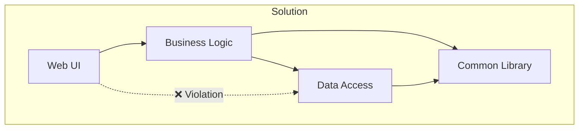
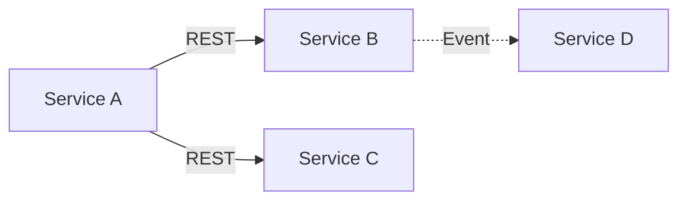

# Dependency Model

> **Generated by**: Prompts P1.3, P2 ([phase1-inventory.md](../09-ai/prompts/phase1-inventory.md), [phase2-code-health.md](../09-ai/prompts/phase2-code-health.md))
> **Date**: <!-- YYYY-MM-DD -->

---

## 1. Code Dependencies (Project → Project)

| From Project | To Project | Type | Layer Violation? |
|-------------|-----------|------|:----------------:|
| | | <!-- Direct / Transitive / NuGet --> | |

### Circular Dependencies

| Cycle | Components | Severity | Resolution Strategy |
|-------|-----------|:--------:|---------------------|
| | | | |

---

## 2. Runtime Dependencies (Service → Service)

| From Service | To Service | Protocol | Sync/Async | Failure Impact |
|-------------|-----------|----------|:----------:|---------------|
| | | <!-- REST / gRPC / SOAP --> | | <!-- Cascading / Isolated / Degraded --> |

---

## 3. Event Dependencies (Producer → Consumer)

| Event | Producer | Consumer(s) | Coupling Level |
|-------|----------|-------------|:-------------:|
| | | | <!-- Loose / Medium / Tight --> |

---

## 4. Data Dependencies

| Database | Services Using It | Shared Tables | Ownership |
|----------|-------------------|:-------------:|-----------|
| | | | <!-- Owned / Shared / Unknown --> |

---

## 5. External Dependencies

| External System | Internal Consumer(s) | Protocol | Replaceable? |
|----------------|---------------------|----------|:------------:|
| | | | |

---

## 6. Critical Issues

| Issue | Components | Risk | Resolution |
|-------|-----------|:----:|------------|
| <!-- Shared DB --> | <!-- Services A, B, C --> | 🔴 | <!-- Separate databases --> |
| <!-- Sync chain --> | <!-- A→B→C→D --> | 🔴 | <!-- Introduce async --> |
| <!-- Cyclic dep --> | <!-- BL ↔ DAL --> | 🟡 | <!-- Extract interface --> |

---

## 7. Dependency Risk Score

| Metric | Score (1–5) | Notes |
|--------|:-----------:|-------|
| Circular dependencies | | |
| Layer violations | | |
| External coupling | | |
| Shared databases | | |
| **Dependency Risk** | **/5** | <!-- 1=Low risk, 5=High risk --> |
