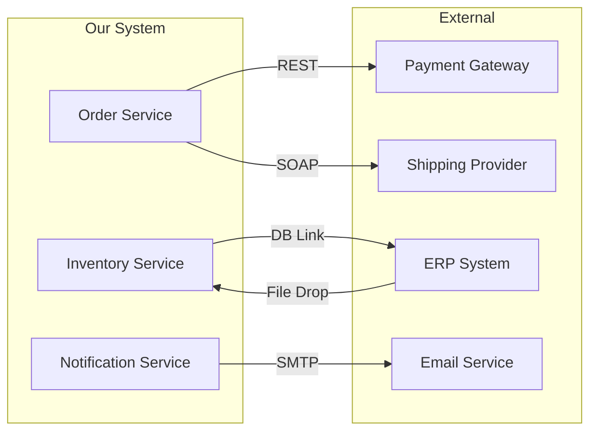

# Integration Catalog

> **Generated by**: Prompt P6.4 — Document External Integrations & APIs
> **Related Prompts**: [phase6-discovery-legacy.md](../09-ai/prompts/phase6-discovery-legacy.md)
> **Date**: <!-- YYYY-MM-DD -->

---

## 1. Integration Summary

| Total Integrations | Inbound | Outbound | Bidirectional | Internal Service-to-Service |
|:------------------:|:-------:|:--------:|:-------------:|:---------------------------:|
| | | | | |

---

## 2. Integration Catalog

### INT-001: <!-- e.g., Payment Gateway (Stripe) -->

| Attribute | Value |
|-----------|-------|
| **ID** | INT-001 |
| **Name** | <!-- Payment Gateway --> |
| **External System** | <!-- Stripe / SAP / Salesforce / Custom --> |
| **Direction** | <!-- Inbound / Outbound / Bidirectional --> |
| **Protocol** | <!-- REST / SOAP / gRPC / File / MQ / DB Link --> |
| **Authentication** | <!-- API Key / OAuth2 / Certificate / Basic / None --> |
| **Frequency** | <!-- Real-time / Batch (daily) / On-demand / Scheduled --> |
| **SLA** | <!-- Timeout: Xs / Availability: 99.X% --> |
| **Confidence** | <!-- HIGH / MEDIUM / LOW --> |

**Endpoints / Connection Points**:
| Endpoint | Method | Purpose | Data Format |
|----------|--------|---------|-------------|
| | <!-- GET/POST/PUT --> | | <!-- JSON / XML / CSV / Binary --> |

**Data Mapping**:
| Source Field | Target Field | Transformation |
|-------------|-------------|---------------|
| | | <!-- Direct / Mapped / Calculated --> |

**Error / Fallback Behavior**:
| Scenario | Current Behavior | Retry? | Fallback |
|----------|-----------------|:------:|----------|
| Timeout | | <!-- Y/N --> | |
| 4xx Error | | | |
| 5xx Error | | | |
| Network Failure | | | |

**Business Logic in Integration**:
| Rule | Description | Should Move To |
|------|-------------|---------------|
| | <!-- Validation before send / Transform after receive --> | <!-- Domain service / Mapper --> |

---

<!-- Repeat the block above for each integration -->

## 3. Integration Dependency Map

---

## 4. Integration Risk Assessment

| INT ID | System | Coupling Level | Change Risk | Data Loss Risk | Overall Risk |
|:------:|--------|:--------------:|:----------:|:--------------:|:------------:|
| | | <!-- Tight / Loose --> | <!-- 🔴/🟡/🟢 --> | <!-- 🔴/🟡/🟢 --> | |

### High-Risk Integrations

| Issue | Integrations Affected | Impact |
|-------|:---------------------:|--------|
| No retry mechanism | | Data loss on failure |
| Hardcoded credentials | | Security risk |
| No circuit breaker | | Cascading failure |
| Synchronous blocking calls | | Performance bottleneck |
| Undocumented contract | | Breaking changes |

---

## 5. Authentication & Security Inventory

| INT ID | Auth Method | Secret Storage | Rotation Policy | Migration Action |
|:------:|------------|---------------|:--------------:|-----------------|
| | <!-- API Key --> | <!-- Config file / DB / Vault --> | <!-- Manual / Auto / None --> | <!-- Move to Azure Key Vault --> |

---

## 6. Protocol Migration Path

| Current Protocol | Target Protocol | Integrations | Effort | Notes |
|-----------------|----------------|:------------:|:------:|-------|
| SOAP / WCF | REST / gRPC | | | <!-- WSDL → OpenAPI conversion needed --> |
| DB Link | API | | | <!-- Decouple shared DB --> |
| File Drop / FTP | Event / API | | | <!-- Replace with async messaging --> |
| Named Pipes / MSMQ | Azure Service Bus | | | <!-- Message format migration --> |
| COM / DCOM | REST / gRPC | | | <!-- Full rewrite required --> |

---

## 7. Integration Testing Strategy

| INT ID | Test Type | Environment | Mock Available? | Contract Tests? |
|:------:|----------|-------------|:--------------:|:---------------:|
| | <!-- Unit / Integration / E2E --> | <!-- Dev / Staging / Prod-mirror --> | | |

---

## 8. Migration Recommendations

| Priority | Action | Integrations | Effort |
|:--------:|--------|:------------:|:------:|
| P0 | Add circuit breakers to all sync integrations | | |
| P1 | Externalize credentials to secret store | | |
| P2 | Add contract tests for all external APIs | | |
| P3 | Replace file-based integrations with event-driven | | |
