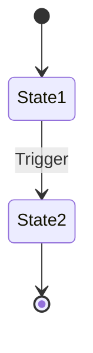

# Domain Mapping

> **Generated by**: Phase 4–6 Discovery Prompts ([phase4-discovery-core.md](../09-ai/prompts/phase4-discovery-core.md), [phase5-discovery-tech.md](../09-ai/prompts/phase5-discovery-tech.md), [phase6-discovery-legacy.md](../09-ai/prompts/phase6-discovery-legacy.md))
> **Date**: <!-- YYYY-MM-DD -->

---

## Related Detail Files

> This file is the **summary hub** for domain extraction. Detailed output lives in dedicated catalogs:

| Deep-Dive Catalog | Prompts | Focus |
|-------------------|---------|-------|
| [use-case-catalog.md](use-case-catalog.md) | 1.18 | Reverse-engineered use cases, actors, flows |
| [sp-business-logic.md](sp-business-logic.md) | 1.6–1.7 | SP rules, caller map, migration strategy |
| [state-machine-catalog.md](state-machine-catalog.md) | 1.27 | Formal state definitions, transitions, diagrams |
| [ui-behavior-catalog.md](ui-behavior-catalog.md) | 1.23 | UI business rules, validation cross-check |
| [../03-dependencies/integration-catalog.md](../03-dependencies/integration-catalog.md) | 1.21 | External integrations, protocols, SLAs |
| [../03-dependencies/anti-corruption-layers.md](../03-dependencies/anti-corruption-layers.md) | 1.29 | ACL inventory, gap analysis, strangler plan |
| [../02-assessment/configuration-catalog.md](../02-assessment/configuration-catalog.md) | 1.22 | Config, feature flags, secrets audit |
| [../02-assessment/shared-library-analysis.md](../02-assessment/shared-library-analysis.md) | 1.24 | Shared libraries, cross-cutting concerns |
| [../02-assessment/middleware-analysis.md](../02-assessment/middleware-analysis.md) | 1.25 | Middleware, HTTP pipeline, execution order |
| [../02-assessment/error-handling-catalog.md](../02-assessment/error-handling-catalog.md) | 1.26 | Exceptions, recovery, transaction boundaries |
| [../02-assessment/vendor-customization-catalog.md](../02-assessment/vendor-customization-catalog.md) | 1.28 | 3rd-party customizations, vendor lock-in |
| [../02-assessment/testability.md](../02-assessment/testability.md) | 0.7 + Manual | Test coverage, barriers, untested rules |

---

## 1. Domain Concepts Discovered

| Domain Concept | Source Technology | Source Files | Code Snippet | Confidence |
|---------------|------------------|-------------|--------------|:----------:|
| | | | | |

---

## 2. Entity → Aggregate Mapping

| Entity | Aggregate Root | Value Objects | Invariants | Bounded Context |
|--------|---------------|--------------|-----------|-----------------|
| | | | | |

---

## 3. Business Rules Extracted

### By Source

| Source | Rules Count | HIGH | MEDIUM | LOW | UNCERTAIN |
|-------|:----------:|:----:|:------:|:---:|:---------:|
| C# Code | | | | | |
| VB.NET Code | | | | | |
| Stored Procedures | | | | | |
| Config/Settings | | | | | |
| UI Code-Behind | | | | | |
| **Total** | | | | | |

### Rule Detail

| ID | Rule Description | Source File | Line # | Confidence | Evidence | Migration Target |
|----|------------------|-----------|:------:|:----------:|---------|-----------------|
| BR-001 | | | | | | |

---

## 4. State Machines

| Entity | States | Transitions | Source | Documented? |
|--------|:------:|:----------:|--------|:----------:|
| | | | | |

### State Diagram

---

## 5. Use Case Catalog

| UC ID | Name | Actor | Entry Point | Business Rules | Complexity |
|-------|------|-------|------------|:--------------:|:----------:|
| UC-001 | | | | | |

---

## 6. SP Caller Map

| SP Name | C# Callers | VB.NET Callers | SQL Callers | Total | Migration Impact |
|---------|:----------:|:--------------:|:-----------:|:-----:|:----------------:|
| | | | | | |

---

## 7. Anti-Corruption Layers

| Location | Type | From | To | Status | Quality |
|----------|------|------|-----|:------:|---------|
| | | | | <!-- Explicit / Implicit / Missing --> | |

---

## 8. Validation Queue (Rules Needing Human Review)

| Rule ID | Description | Confidence | Assigned To | Status |
|---------|-------------|:----------:|-------------|:------:|
| | | <!-- LOW / UNCERTAIN --> | | <!-- Pending / Reviewed / Confirmed / Rejected --> |
