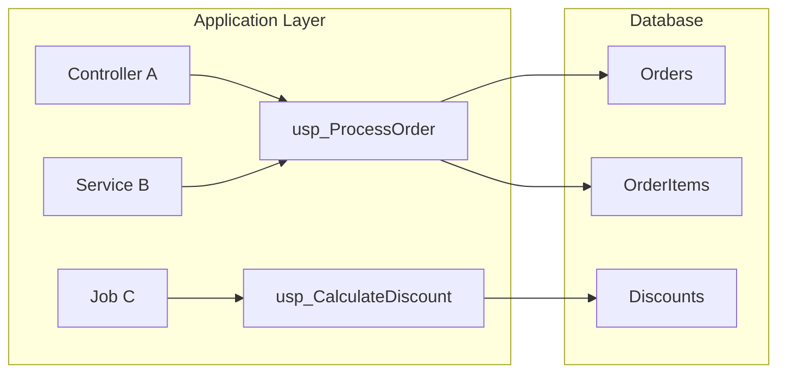

# Stored Procedure Business Logic Extraction

> **Generated by**: Prompt P4.6 — SP Deep Business Rules Extraction + Prompt P4.7 — SP Caller Technology Mapping
> **Related Prompts**: [phase4-discovery-core.md](../09-ai/prompts/phase4-discovery-core.md)
> **Date**: <!-- YYYY-MM-DD -->

---

## 1. SP Inventory Summary

| Total SPs | With Business Logic | Pure CRUD | Reporting | Utility | Confidence HIGH | MEDIUM | LOW |
|:---------:|:-------------------:|:---------:|:---------:|:-------:|:---------------:|:------:|:---:|
| | | | | | | | |

---

## 2. SP Business Logic Detail

### SP: <!-- dbo.usp_ProcessOrder -->

| Attribute | Value |
|-----------|-------|
| **Schema.Name** | <!-- dbo.usp_ProcessOrder --> |
| **Database** | <!-- MainDB --> |
| **Category** | <!-- Business Logic / CRUD / Reporting / Utility --> |
| **Complexity** | <!-- Lines / Branches / Nested depth --> |
| **Confidence** | <!-- HIGH / MEDIUM / LOW --> |

**Parameters**:
| Name | Type | Direction | Purpose |
|------|------|:---------:|---------|
| | | IN/OUT | |

**Business Rules**:
| Rule # | Description | Logic Type | Confidence | Evidence |
|:------:|-------------|-----------|:----------:|---------|
| 1 | | <!-- Validation / Calculation / Authorization / Workflow --> | | <!-- Lines N-M --> |

**Data Dependencies**:
| Table | Operation | Purpose |
|-------|-----------|---------|
| | <!-- SELECT/INSERT/UPDATE/DELETE --> | |

**Control Flow**:
```
<!-- Pseudo-code or simplified flow showing branching logic -->
IF condition THEN
    action A
ELSE
    action B
    IF nested THEN ...
```

**Transaction Boundaries**:
| Scope | Isolation Level | Savepoints? |
|-------|:--------------:|:-----------:|
| <!-- Explicit / Implicit --> | | |

**Error Handling**:
| Pattern | Action | Rollback? |
|---------|--------|:---------:|
| TRY/CATCH | | |
| RAISERROR | | |

---

<!-- Repeat the block above for each SP with business logic -->

## 3. SP Caller Map

> Maps which application components call each stored procedure

| SP Name | Caller Technology | Caller Component | Call Pattern | Parameters Passed |
|---------|-------------------|-----------------|-------------|-------------------|
| | <!-- C# / VB.NET / Java / PHP --> | <!-- Class.Method --> | <!-- Direct ADO.NET / EF / Dapper / JDBC --> | |

### Caller Dependency Graph



---

## 4. Business Rule Consolidation

> Rules extracted from SPs cross-referenced with application-layer rules

| Rule Domain | SP Source | App Source | Consistent? | Owner Recommendation |
|-------------|----------|-----------|:-----------:|---------------------|
| <!-- Order validation --> | <!-- usp_ProcessOrder, Line 45 --> | <!-- OrderService.Validate() --> | <!-- ✅ / ⚠️ / ❌ --> | <!-- Move to domain layer --> |

---

## 5. SP Migration Strategy

| SP Name | Business Logic? | Recommended Action | Target | Effort |
|---------|:--------------:|-------------------|--------|:------:|
| | ✅ | <!-- Extract to domain service / Keep as SP / Inline --> | | <!-- S/M/L --> |
| | ❌ | <!-- Replace with EF / Keep / Remove --> | | |

### Migration Priority Matrix

| Priority | SP Name | Business Value | Caller Count | Risk |
|:--------:|---------|:--------------:|:------------:|:----:|
| P0 | | HIGH | | 🔴 |
| P1 | | | | 🟡 |

---

## 6. AI Guardrails Applied

| Guardrail | Status |
|-----------|--------|
| Only document patterns actually found in code | ✅ |
| Flag uncertain interpretations as MEDIUM/LOW confidence | ✅ |
| Cross-reference with caller map before migration recommendation | ✅ |
| Do not assume business intent from column names alone | ✅ |
| Track confidence distribution: HIGH ≥60% of rules | <!-- ✅ / ⚠️ --> |
