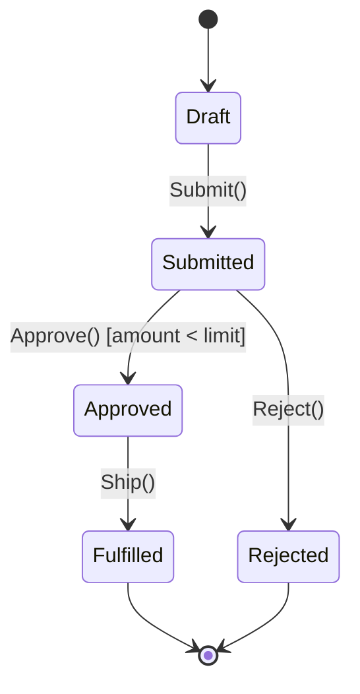

# State Machine Catalog

> **Generated by**: Prompt P6.10 — Discover State Machines & Workflows
> **Related Prompts**: [phase6-discovery-legacy.md](../09-ai/prompts/phase6-discovery-legacy.md)
> **Date**: <!-- YYYY-MM-DD -->

---

## 1. State Machine Summary

| Total Discovered | In Code | In Database | In Config | Hybrid | Confidence HIGH | MEDIUM | LOW |
|:----------------:|:-------:|:-----------:|:---------:|:------:|:---------------:|:------:|:---:|
| | | | | | | | |

---

## 2. State Machine Detail

### SM-001: <!-- e.g., Order Lifecycle -->

| Attribute | Value |
|-----------|-------|
| **ID** | SM-001 |
| **Name** | <!-- Order Lifecycle --> |
| **Entity** | <!-- Order --> |
| **Implementation** | <!-- Enum + switch / Status column + SP / Workflow engine / State pattern --> |
| **Source Files** | <!-- paths --> |
| **Confidence** | <!-- HIGH / MEDIUM / LOW --> |

**States**:
| State | Description | Terminal? |
|-------|-------------|:---------:|
| | | ❌ |
| | | ✅ |

**Transitions**:
| From | To | Trigger | Guard Condition | Side Effect |
|------|-----|---------|-----------------|-------------|
| | | <!-- Event / Action / Timer --> | <!-- Business rule check --> | <!-- Email / Log / DB update --> |

**State Diagram**:

**Business Rules in Transitions**:
| Transition | Rule | Source | Confidence |
|-----------|------|--------|:----------:|
| Draft→Submitted | <!-- All required fields filled --> | | |
| Submitted→Approved | <!-- Amount < approval limit --> | | |

**Invalid Transitions (Enforced)**:
| From | To | Enforcement Mechanism |
|------|------|----------------------|
| | | <!-- Exception / DB constraint / UI disable --> |

---

<!-- Repeat the block above for each state machine -->

## 3. State Machine Cross-Reference

### State Machines per Bounded Context

| Bounded Context | State Machines | Interactions |
|----------------|:--------------:|-------------|
| | | <!-- SM-001 triggers SM-002 --> |

### State Machines Sharing Entities

| Entity | State Machines | Conflict Risk |
|--------|:--------------:|:-------------:|
| | | <!-- 🔴 / 🟡 / 🟢 --> |

---

## 4. Implementation Patterns

| Pattern | Count | Components | Migration Complexity |
|---------|:-----:|-----------|:--------------------:|
| Enum + switch/case | | | 🟢 Low |
| Status column + stored procedure | | | 🟡 Medium |
| Workflow engine (WF/BizTalk) | | | 🔴 High |
| State design pattern | | | 🟢 Low |
| Implicit (if/else chains) | | | 🔴 High — must formalize |

---

## 5. Migration Recommendations

| SM ID | Current Pattern | Target Pattern | Migration Strategy | Effort |
|:-----:|-----------------|---------------|-------------------|:------:|
| SM-001 | | <!-- Strong-typed state + MediatR / Domain events / Saga --> | | <!-- S/M/L --> |

### Risks During Migration

| Risk | Affected SMs | Mitigation |
|------|:------------:|------------|
| Implicit states lost | | Formalize all states before migration |
| Guard conditions scattered | | Consolidate into domain service |
| Side effects in transition | | Extract to event handlers |

---

## 6. Validation Queue

| Item | Status | Notes |
|------|:------:|-------|
| All terminal states reachable | <!-- ✅ / ❌ --> | |
| No orphan states | <!-- ✅ / ❌ --> | |
| Guard conditions have tests | <!-- ✅ / ❌ --> | |
| Side effects are idempotent | <!-- ✅ / ❌ --> | |
