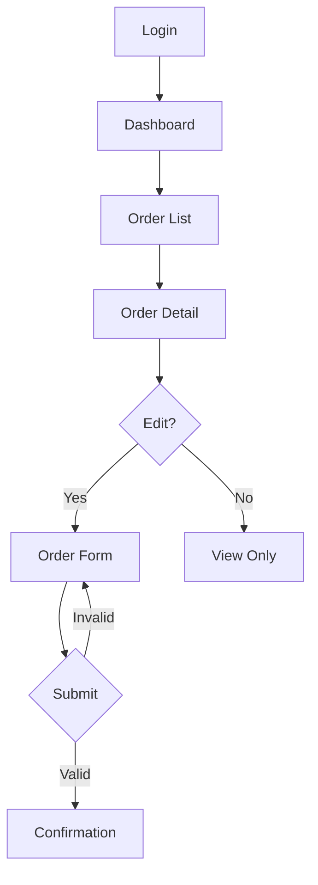

# UI Behavior Catalog

> **Generated by**: Prompt P6.6 — UI Behavior & Business Rule Extraction
> **Related Prompts**: [phase6-discovery-legacy.md](../09-ai/prompts/phase6-discovery-legacy.md)
> **Date**: <!-- YYYY-MM-DD -->

---

## 1. UI Inventory Summary

| UI Technology | Page/View Count | With Business Logic | Pure Display | Forms with Validation |
|--------------|:---------------:|:-------------------:|:------------:|:---------------------:|
| WebForms (.aspx) | | | | |
| MVC Views (.cshtml) | | | | |
| WPF (XAML) | | | | |
| WinForms | | | | |
| Angular Components | | | | |
| **Total** | | | | |

---

## 2. UI Business Rules

### Page/View: <!-- e.g., OrderEntry.aspx -->

| Attribute | Value |
|-----------|-------|
| **Page/Component** | <!-- OrderEntry.aspx --> |
| **Technology** | <!-- WebForms / MVC / WPF / Angular --> |
| **Code-Behind** | <!-- OrderEntry.aspx.cs --> |
| **Confidence** | <!-- HIGH / MEDIUM / LOW --> |

**Client-Side Validation Rules**:
| Field | Rule | Implementation | Server-Side Mirror? |
|-------|------|----------------|:-------------------:|
| | <!-- Required / Range / Regex / Custom --> | <!-- JS / jQuery Validate / Angular form --> | <!-- ✅ / ❌ --> |

**UI Workflow Sequences**:
| Step | User Action | System Response | Business Rule |
|:----:|------------|-----------------|---------------|
| 1 | | | |
| 2 | | | |

**Conditional Display Logic**:
| Element | Condition | Business Reason |
|---------|-----------|----------------|
| | <!-- Visible when Status == 'Approved' --> | |

**Code-Behind Business Logic**:
| Method | Logic Type | Lines | Should Move To |
|--------|-----------|:-----:|---------------|
| | <!-- Calculation / Validation / Formatting / Workflow --> | | <!-- Domain service / Validator / ViewModel --> |

---

<!-- Repeat the block above for each page/view with business logic -->

## 3. Validation Cross-Check Matrix

> Compare client-side, server-side, and database validation rules

| Field / Rule | Client-Side | Code-Behind | Domain Layer | Database | Consistent? |
|-------------|:-----------:|:-----------:|:------------:|:--------:|:-----------:|
| | ✅ | ✅ | ❌ | ✅ | ⚠️ Missing in domain |
| | ✅ | ❌ | ✅ | ✅ | ⚠️ Missing in code-behind |

### Gaps Found

| Gap Type | Count | Risk |
|----------|:-----:|:----:|
| Client-only validation (no server check) | | 🔴 |
| Server-only (no client feedback) | | 🟡 |
| Database-only constraint | | 🟡 |
| Conflicting rules across layers | | 🔴 |

---

## 4. UI-Embedded Business Logic Summary

| Category | Page Count | Rule Count | Migration Impact |
|----------|:----------:|:----------:|:----------------:|
| Calculations in code-behind | | | 🔴 Extract to domain |
| Workflow orchestration in UI | | | 🔴 Extract to service |
| Authorization checks in UI | | | 🟡 Move to middleware |
| Formatting as business logic | | | 🟢 Keep in presentation |

---

## 5. UI Navigation & Workflow Map

---

## 6. Technology-Specific Findings

### WebForms-Specific

| Pattern | Count | Migration Action |
|---------|:-----:|-----------------|
| ViewState-dependent logic | | Replace with API state |
| PostBack event chains | | Convert to API calls |
| UserControl shared state | | Extract to components |
| UpdatePanel partial renders | | Replace with SPA patterns |

### WPF-Specific

| Pattern | Count | Migration Action |
|---------|:-----:|-----------------|
| ViewModel business logic | | Move to domain services |
| ICommand with business rules | | Extract to use cases |
| Converter business logic | | Move to domain |
| DataTrigger conditions | | Evaluate for domain rules |

### Angular-Specific

| Pattern | Count | Migration Action |
|---------|:-----:|-----------------|
| Component business logic | | Move to service layer |
| Pipe transformations | | Evaluate for backend |
| Guard conditions | | Verify server-side enforcement |
| Resolver data manipulation | | Move to API layer |

---

## 7. Migration Recommendations

| Priority | Action | Pages Affected | Effort |
|:--------:|--------|:--------------:|:------:|
| P0 | Extract all calculations to domain services | | |
| P1 | Deduplicate validation (single source of truth) | | |
| P2 | Remove workflow orchestration from code-behind | | |
| P3 | Document and preserve UI-specific formatting | | |
