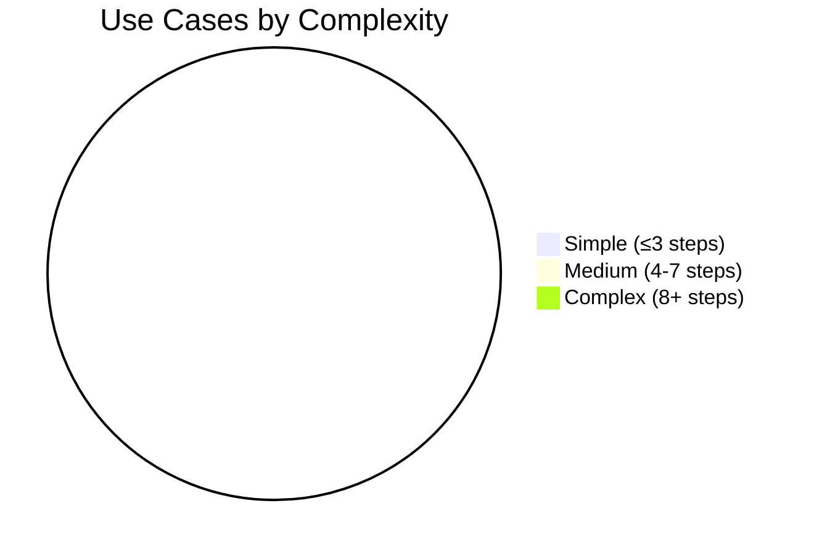

# Use Case Catalog

> **Generated by**: Prompt P6.1 — Reverse-Engineer Use Cases
> **Related Prompts**: [phase6-discovery-legacy.md](../09-ai/prompts/phase6-discovery-legacy.md)
> **Date**: <!-- YYYY-MM-DD -->

---

## 1. Use Case Summary

| Total Discovered | From Code | From SP Logic | From UI Flows | From Docs | Confidence HIGH | Confidence MEDIUM | Confidence LOW |
|:----------------:|:---------:|:-------------:|:------------:|:---------:|:---------------:|:-----------------:|:--------------:|
| | | | | | | | |

---

## 2. Use Case Catalog

### UC-001: <!-- Use Case Name -->

| Attribute | Value |
|-----------|-------|
| **ID** | UC-001 |
| **Name** | <!-- e.g., "Submit Purchase Order" --> |
| **Actor(s)** | <!-- e.g., "Purchasing Manager" --> |
| **Entry Point** | <!-- Controller/Page/API endpoint --> |
| **Technology** | <!-- ASP.NET MVC / WebForms / WCF / etc. --> |
| **Confidence** | <!-- HIGH / MEDIUM / LOW --> |
| **Evidence** | <!-- File paths, method names --> |

**Preconditions**:
<!-- - User is authenticated with role X -->

**Happy Path**:
1. <!-- Step 1 -->
2. <!-- Step 2 -->
3. <!-- Step 3 -->

**Business Rules Applied**:
| Rule ID | Description | Source | Confidence |
|---------|-------------|--------|:----------:|
| | | | |

**Error / Alternate Paths**:
| Condition | Behavior | Error Type |
|-----------|----------|-----------|
| | | |

**Data Entities Involved**:
| Entity | Operation | Table(s) |
|--------|-----------|----------|
| | <!-- CRUD --> | |

---

<!-- Copy the block above for each discovered use case -->

## 3. Use Case → Bounded Context Map

| Use Case ID | Use Case Name | Bounded Context | Aggregate(s) | Domain Events |
|:-----------:|---------------|-----------------|---------------|---------------|
| UC-001 | | | | |

---

## 4. Coverage Analysis

### Entry Points without Use Cases

| Entry Point | Type | Reason |
|------------|------|--------|
| | <!-- Controller / API / SP --> | <!-- Dead code? / System-only? / Unknown --> |

### Use Cases Spanning Multiple Bounded Contexts

| Use Case | Contexts Crossed | Coupling Risk |
|----------|:----------------:|:-------------:|
| | | <!-- 🔴 High / 🟡 Medium --> |

---

## 5. Complexity Distribution

---

## 6. Migration Prioritization

| Use Case ID | Business Criticality | Complexity | Change Frequency | Priority Score |
|:-----------:|:--------------------:|:----------:|:----------------:|:--------------:|
| | <!-- 1-5 --> | <!-- 1-5 --> | <!-- 1-5 --> | <!-- Calculated --> |

> **Priority Score** = `(BusinessCrit × 0.40) + (Complexity × 0.30) + (ChangeFreq × 0.30)`
