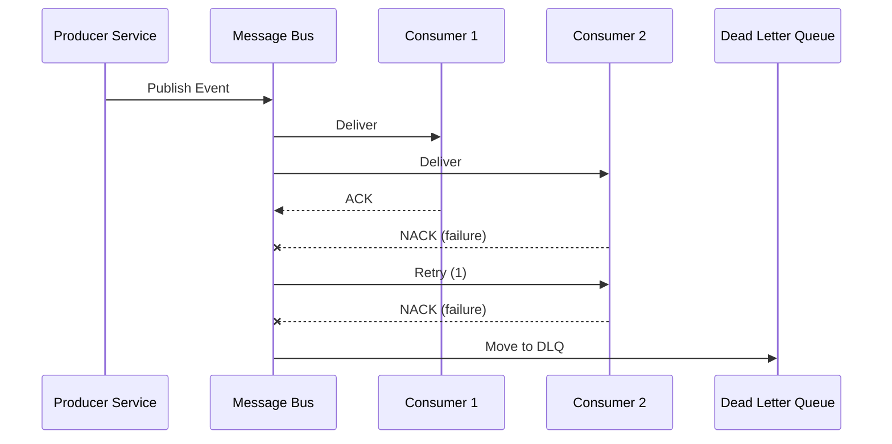

# Event Architecture

> **Generated by**: Prompts P3.2, P6.3 ([phase3-architecture-scoring.md](../09-ai/prompts/phase3-architecture-scoring.md), [phase6-discovery-legacy.md](../09-ai/prompts/phase6-discovery-legacy.md))
> **Date**: <!-- YYYY-MM-DD -->
> **Skip if**: No async messaging in the system

---

## 1. Event Catalog

| Event Name | Domain | Producer | Consumer(s) | Payload | Idempotent? | Version |
|-----------|--------|----------|-------------|---------|:-----------:|:-------:|
| | | | | | | |

---

## 2. Event Flow Diagrams

### Primary Flows

---

## 3. Messaging Infrastructure

| Aspect | Current | Target |
|--------|---------|--------|
| Broker | <!-- MSMQ / RabbitMQ / Azure Service Bus --> | |
| Protocol | | |
| Serialization | | |
| Schema Registry | <!-- None / Custom / Avro --> | |

---

## 4. Event Maturity Assessment

**Current Level**: <!-- L1 / L2 / L3 / L4 -->

| Aspect | Current State | Target State | Gap | Priority |
|--------|--------------|-------------|-----|:--------:|
| Naming | <!-- Technical (OnInsert) vs Domain (OrderPlaced) --> | | | |
| Delivery guarantee | <!-- At-most-once / At-least-once / Exactly-once --> | | | |
| Retry policy | | | | |
| Dead letter queue | | | | |
| Schema versioning | | | | |
| Idempotent consumers | | | | |
| Event ordering | | | | |
| Observability | | | | |

---

## 5. Issues & Recommendations

| Issue | Severity | Description | Recommendation |
|-------|:--------:|------------|----------------|
| | | | |

---

## 6. Event-Driven Migration Roadmap

| Phase | Action | From | To | Risk |
|:-----:|--------|------|-----|:----:|
| 1 | | | | |
| 2 | | | | |
| 3 | | | | |
