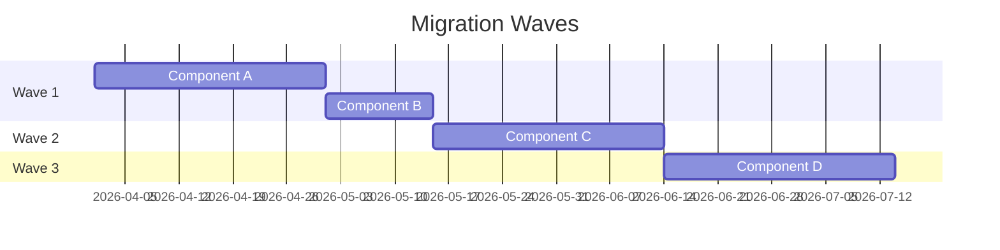

# Migration Strategy

> **Generated by**: Scoring Model decision matrix ([scoring-model.md](../07-scoring/scoring-model.md))
> **Date**: <!-- YYYY-MM-DD -->

---

## 1. Recommended Approach

**Strategy**: <!-- Rehost / Replatform / Refactor+Modernize / Re-architect -->

**Justification**:
<!-- 
- Combined score: X.X → indicates [strategy]
- Key factors: ...
-->

---

## 2. Migration Pattern

| Pattern | Use When | Selected? |
|---------|----------|:---------:|
| **Lift & Shift** | Score ≥ 4.0, minimal code changes | |
| **Strangler Fig** | Incremental replacement, low risk | |
| **Big Bang** | Small app, short timeline | |
| **Blue-Green** | Zero-downtime requirement | |
| **Branch by Abstraction** | Deep internal refactoring needed | |

---

## 3. Phased Plan

### Phase 1: Stabilization

**Duration**: <!-- weeks -->
**Goal**: Reduce risk before migration

| Task | Owner | Status |
|------|-------|:------:|
| Add logging & monitoring | | |
| Increase test coverage to ≥60% | | |
| Document all UNCERTAIN business rules | | |
| Fix critical circular dependencies | | |
| Externalize configuration | | |

### Phase 2: Decoupling

**Duration**: <!-- weeks -->
**Goal**: Prepare architecture for migration

| Task | Owner | Status |
|------|-------|:------:|
| Remove shared database dependencies | | |
| Introduce API boundaries | | |
| Add anti-corruption layers | | |
| Migrate config to Key Vault / settings | | |

### Phase 3: Migration

**Duration**: <!-- weeks -->
**Goal**: Execute the migration

| Task | Owner | Status |
|------|-------|:------:|
| Migrate to target .NET version | | |
| Replace incompatible libraries | | |
| Set up CI/CD for new platform | | |
| Performance testing vs baseline | | |

### Phase 4: Optimization

**Duration**: <!-- weeks -->
**Goal**: Modernize post-migration

| Task | Owner | Status |
|------|-------|:------:|
| Introduce event-driven patterns | | |
| Containerize services | | |
| Add observability (traces, metrics) | | |
| Remove legacy ACLs | | |

---

## 4. Migration Wave Plan (for multiple components)

| Wave | Components | Strategy | Dependencies | Risk |
|:----:|-----------|----------|-------------|:----:|
| 1 | | | <!-- Must go first because... --> | |
| 2 | | | <!-- Depends on Wave 1 --> | |
| 3 | | | | |

---

## 5. Rollback Strategy

| Scenario | Trigger | Rollback Action | RTO |
|----------|---------|----------------|:---:|
| Migration failure | Build/deploy fails | Redeploy previous version | <!-- mins --> |
| Data corruption | Data validation fails | Restore from backup | <!-- hours --> |
| Performance degradation | P95 > 2× baseline | Route traffic to old system | <!-- mins --> |

---

## 6. Success Criteria

| Metric | Baseline | Target | Measurement |
|--------|:--------:|:------:|-------------|
| P95 Response Time | <!-- ms --> | <!-- ≤ baseline --> | APM |
| Error Rate | <!-- % --> | <!-- ≤ baseline --> | Monitoring |
| Test Coverage | <!-- % --> | <!-- ≥ 60% --> | CI pipeline |
| Deployment Frequency | <!-- per month --> | <!-- ≥ 2× baseline --> | CI/CD metrics |
