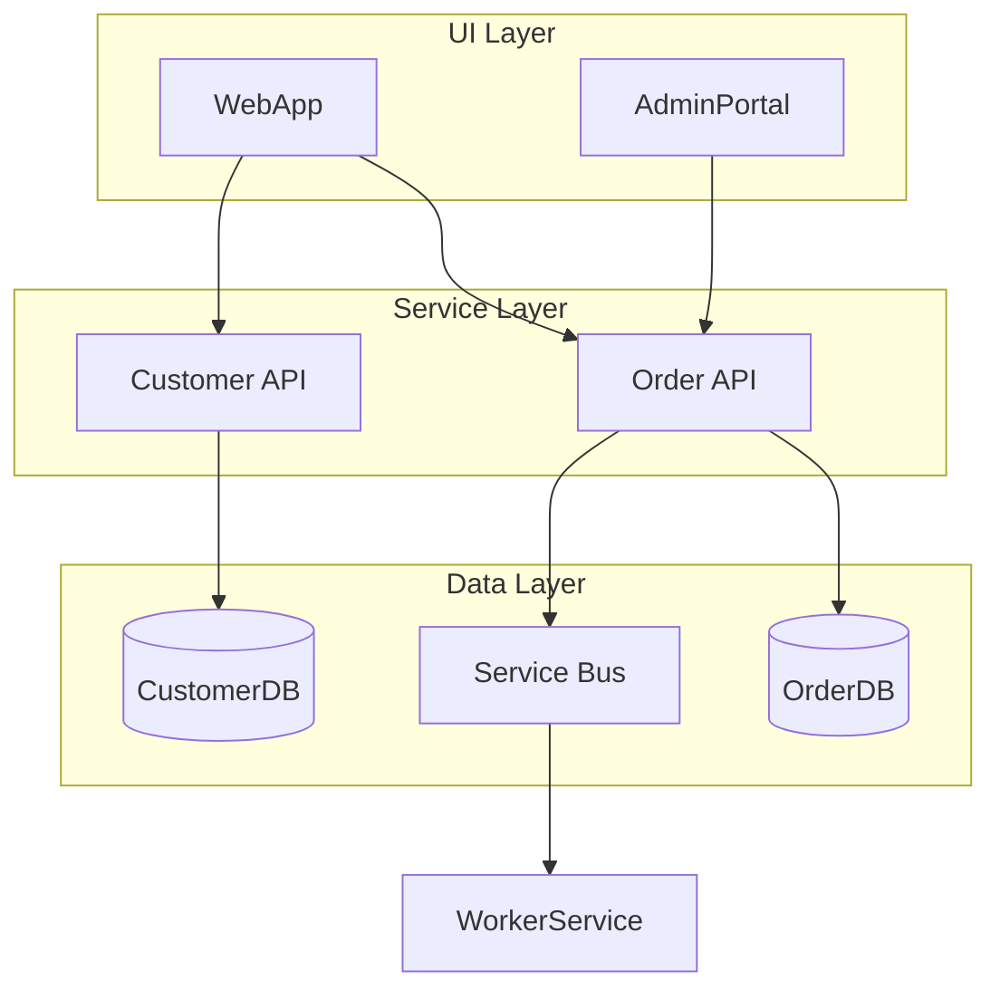
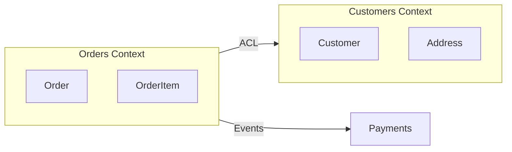

# Phase 1 (P1): Inventory & Baseline Prompts

> Component inventory, technology matrix, dependency mapping, domain modeling, bounded contexts,
> and performance baselining.

**⚠️ AI GUARDRAILS APPLY**: All prompts in this phase MUST follow the AI Guardrails defined in [ORCHESTRATION-PROMPT.md](ORCHESTRATION-PROMPT.md#ai-guardrails-anti-hallucination-rules). Key rules:
- **Verify files exist** before listing them in inventories
- **All metrics must come from actual tool output** — never fabricate or estimate
- **Acknowledge uncertainty** when information is incomplete

---

## Document Information

| Property | Value |
|----------|-------|
| **Document Version** | 4.0.0 |
| **Last Updated** | March 2026 |
| **Status** | Active |
| **Part Of** | Comprehensive Prompt Library |

### Related Documents

| Document | Description |
|----------|-------------|
| [PROMPT-INDEX.md](PROMPT-INDEX.md) | Quick reference catalog |
| [phase0-classification.md](phase0-classification.md) | Prerequisite: project classification |
| [phase2-code-health.md](phase2-code-health.md) | Next: code health assessment (P2) |
| [phase3-architecture-scoring.md](phase3-architecture-scoring.md) | Architecture scoring (P3) |
| [ORCHESTRATION-PROMPT.md](ORCHESTRATION-PROMPT.md) | Execution workflow |

---

## Table of Contents

- [P1.1 Component Inventory](#p11-component-inventory)
- [P1.2 Technology Matrix](#p12-technology-matrix)
- [P1.3 Dependency Mapping](#p13-dependency-mapping)
- [P1.4 Create Domain Model](#p14-create-domain-model)
- [P1.5 Define Bounded Contexts](#p15-define-bounded-contexts)
- [P1.6 Performance Baselining](#p16-performance-baselining)

---

## P1.1 Component Inventory

```
**Goal**: Create comprehensive inventory of all application components

**Prerequisite**: project-profile.yaml from Prompt P0.3

**⚠️ AI GUARDRAIL: File Verification Required**
Before listing ANY component:
1. Use directory listing to verify the file/folder exists
2. Record the actual path found (not assumed)
3. If a file doesn't exist, do NOT include it in inventory

**Scan Directories** (verify each path exists first):
- Solution files (*.sln)
- Project files (*.csproj, *.vbproj, *.fsproj)
- Service configurations (*.config, web.config, app.config)
- Deployment artifacts (*.pubxml, *.yml, *.yaml)
- Docker files (Dockerfile, docker-compose.yml)

**For Each Component, Capture**:
| Field | Description |
|-------|-------------|
| Name | Project/application name |
| Type | WebForms, WCF, WPF, Console, Worker, Library, API, SPA |
| Language | C#, VB.NET, F#, Mixed |
| Framework | .NET Framework version or .NET Core/5+/6+/7+/8+ |
| Data Access | EF6, EF Core, ADO.NET, Dapper, Stored Procs, LINQ to SQL |
| External Dependencies | NuGet packages, COM references, P/Invoke |
| Hosting | IIS, Windows Service, Azure App Service, AKS, Containers |
| Status | Active, Legacy, Deprecated, Unknown |

**Architecture-Aware Extensions**:

For **Distributed/EDA systems**, also capture per component:
| Field | Description |
|-------|-------------|
| Communication | REST, gRPC, WCF, Message Queue |
| Messages Produced | Events/commands this component publishes |
| Messages Consumed | Events/commands this component subscribes to |
| Data Store | Which database(s) this component uses |
| Deployment Unit | Independently deployable? |

**Output**: `/docs/inventory/component-catalog.md`

**Format**:
```markdown
# Component Catalog

**Total Components**: {count}
**Generated**: {date}
**Source**: Prompt P1.1

## Components

| Name | Type | Language | Framework | Data Access | Host | Status |
|------|------|----------|-----------|-------------|------|--------|

## Service Communication (Distributed Only)

| Service | Produces | Consumes | Protocol | Data Store |
|---------|----------|----------|----------|------------|

## Observations
- {Key findings}
- {Architecture patterns detected}
```

**Constraints**:
- Include all projects, even test projects
- Note deprecated/legacy markers
- Flag components with no recent changes (potential dead code)
- Cross-reference with project-profile.yaml components list
```

---

## P1.2 Technology Matrix

```
**Goal**: Map all technologies used across the enterprise with modernization paths

**Analyze by Category**:

1. **UI Technologies**: WebForms, MVC, WPF, WinForms, Blazor, Angular, React
2. **Service Technologies**: WCF, ASMX, Web API, gRPC, Minimal APIs
3. **Data Technologies**: SQL Server, Oracle, MongoDB, Redis, CosmosDB
4. **Messaging**: MSMQ, Azure Service Bus, RabbitMQ, Event Hubs, Kafka
5. **Authentication**: Windows Auth, Forms Auth, OAuth 2.0, SAML, Azure AD/Entra ID
6. **CI/CD**: Azure DevOps, GitHub Actions, Jenkins, TeamCity
7. **Monitoring**: Application Insights, Dynatrace, ELK, Prometheus

**Output**: `/docs/inventory/technology-matrix.md`

**Format**:
| Technology | Category | Components Using | Version(s) | Modernization Path | Risk | Effort |
|------------|----------|------------------|------------|-------------------|------|--------|
| WCF | Service | ServiceA, ServiceB | 4.x | → gRPC or REST API | Medium | High |
| WebForms | UI | AppA, AppB | 4.8 | → Blazor or Angular | High | High |
| MSMQ | Messaging | WorkerA | N/A | → Azure Service Bus | Medium | Medium |
| EF6 | Data | All | 6.4 | → EF Core 8 | Low | Medium |

**Include**:
- Count of components per technology
- Version spread (how many versions in use)
- Recommended modernization target
- Risk level (High/Medium/Low) for migration
- Estimated effort (High/Medium/Low)
- Known compatibility issues with target platform

**Summary Statistics**:
| Metric | Value |
|--------|-------|
| Total unique technologies | |
| Technologies requiring migration | |
| Highest-risk technology | |
| Most widely used technology | |
```

---

## P1.3 Dependency Mapping

```
**Goal**: Document inter-component dependencies and data flows at multiple levels

**Analyze**:
1. Project references (*.csproj, *.vbproj)
2. Service references (WCF, ASMX, REST clients)
3. Database connections (connection strings in config files)
4. File system dependencies (shared folders, config files)
5. Message queue dependencies (producers/consumers)
6. NuGet package dependencies (especially shared internal packages)

**Output**: `/docs/inventory/dependency-map.md`

**Include**:

### 1. Dependency Graph (Mermaid)



### 2. Dependency Matrix

| Component | Depends On | Depended By | Coupling Level |
|-----------|------------|-------------|----------------|

### 3. Shared Resources (Migration Blockers)

| Resource | Type | Components | Risk Level | Notes |
|----------|------|------------|------------|-------|
| Database1 | SQL Server | A, B, C | 🔴 High | Shared DB = migration blocker |
| FileShare | Network | A, D | 🟡 Medium | Can be replaced with blob storage |

### 4. Communication Map (Distributed/EDA Only)

| Source | Target | Protocol | Sync/Async | Data Exchanged | Criticality |
|--------|--------|----------|------------|----------------|-------------|

**Identify & Flag**:
- ❌ Circular dependencies
- ❌ Highly coupled components (>5 dependencies)
- ❌ Shared databases (migration blockers)
- ✅ Components with no dependencies (candidates for early migration)
- ⚠️ Single points of failure
```

---

## P1.4 Create Domain Model

```
**Goal**: Create formal domain model from discovered entities

**Input**: 
- Prompt P1.1 Component Inventory
- Source code scan (entities, services, repositories)
- Database schema
- Stored procedures

**Output**: `/docs/domain/model-v1.md`

**Include**:

1. **Entities** — Name, key properties, identity field
2. **Value Objects** — Name, properties, equality rules
3. **Aggregates** — Root entity, boundaries, invariants (business rules that must always be true)
4. **Relationships** — ASCII/Mermaid diagrams showing:
   - One-to-many (1 ──< n)
   - Many-to-many (n >──< n)
   - Aggregate boundaries (dashed boxes)
5. **Domain Events** — Name, trigger, payload
6. **Workflows** — 10 main use cases as numbered sequence steps

**Entity Discovery Sources**:

| Source | What to Look For | Confidence |
|--------|-----------------|------------|
| EF/Dapper entities | Class files mapping to DB tables | HIGH |
| Database tables | Core entity tables (not lookup/staging) | HIGH |
| Stored procedures | Parameters and result sets | MEDIUM |
| API DTOs | Request/response models | MEDIUM |
| UI models | ViewModels, form models | LOW |

**Format**:
- Bullet lists for readability
- Mermaid class diagrams for relationships
- ASCII diagrams as fallback
- Code snippets for complex invariants
```

---

## P1.5 Define Bounded Contexts

```
**Goal**: Define bounded contexts and integration strategy (DDD)

**Input**: Prompt P1.4 Domain Model

**Output**: `/docs/domain/context-map.md`

**Include**:

### 1. Bounded Contexts (3–6 recommended)

For each context:
- Name and single responsibility
- Key aggregates owned
- Team/ownership suggestion
- Data it owns exclusively

### 2. Context Relationships (DDD Patterns)

| Source Context | Target Context | Relationship | Data Flow |
|---------------|---------------|--------------|-----------|
| Orders | Customers | Customer/Supplier | Orders consumes customer data |
| Orders | Payments | Published Language | Shared payment events |
| Legacy Portal | Orders | Anti-Corruption Layer | Legacy UI adapted to new API |

**Relationship Types**:
- **Customer/Supplier** — upstream/downstream with negotiated contract
- **Conformist** — downstream conforms to upstream's model
- **Anti-Corruption Layer** — translate between bounded contexts
- **Shared Kernel** — small shared model (use sparingly)
- **Published Language** — well-documented shared API/events

### 3. Data Ownership Matrix

| Entity | Owner Context | Consumers | Sync Strategy |
|--------|---------------|-----------|---------------|

### 4. Context Map (Mermaid)



### 5. Risk Assessment

- High coupling areas (shared tables, circular deps)
- Migration blockers
- Recommended decoupling sequence (which context to extract first)

**Constraints**:
- Focus on incremental migration (not big bang)
- Identify quick wins (isolated contexts)
- Flag shared databases as risks
```

---

## P1.6 Performance Baselining

```
**Goal**: Establish comprehensive performance baselines BEFORE migration to enable
accurate comparison and prevent "feels slower" post-migration complaints

**Output**: `/docs/baseline/performance-baseline.md`

**Capture Metrics By Category**:

### 1. Response Time Metrics (per endpoint/operation)

| Metric | Description | Capture Tool |
|--------|-------------|--------------|
| p50 (Median) | 50th percentile response time | Application Insights, Dynatrace |
| p95 | 95th percentile response time | Application Insights, Dynatrace |
| p99 | 99th percentile response time | Application Insights, Dynatrace |
| Max | Maximum observed response time | APM logs |
| Average | Mean response time | APM |

### 2. Throughput Metrics

| Metric | Description | Capture Method |
|--------|-------------|----------------|
| Requests/Second (RPS) | Peak and average throughput | Load test at peak hours |
| Transactions/Second (TPS) | Database transaction rate | SQL Server DMVs |
| Messages/Second | Queue processing rate | Message broker metrics |
| Concurrent Users | Peak simultaneous users | Session tracking |

### 3. Database Performance

| Metric | SQL Source | Target |
|--------|-----------|--------|
| Query Duration (p95) | sys.dm_exec_query_stats | < 100ms |
| SP Execution Time | Extended Events / Profiler | Per SP baseline |
| CPU Time per Query | sys.dm_exec_query_stats | Aggregate |
| Logical Reads | sys.dm_exec_query_stats | Per query baseline |
| Lock Wait Time | sys.dm_os_wait_stats | < 50ms |
| Deadlock Count | Extended Events | 0 target |

**SP Performance Baseline Query**:
```sql
SELECT 
    OBJECT_NAME(ps.object_id) AS ProcedureName,
    ps.execution_count AS ExecutionCount,
    ps.total_elapsed_time / ps.execution_count / 1000.0 AS AvgDurationMs,
    ps.total_worker_time / ps.execution_count / 1000.0 AS AvgCpuMs,
    ps.total_logical_reads / ps.execution_count AS AvgLogicalReads,
    ps.total_physical_reads / ps.execution_count AS AvgPhysicalReads,
    ps.last_execution_time AS LastExecuted
FROM sys.dm_exec_procedure_stats ps
WHERE database_id = DB_ID()
ORDER BY ps.total_elapsed_time DESC;
```

### 4. Resource Utilization

| Resource | Metric | Capture Tool | Period |
|----------|--------|--------------|--------|
| CPU | Average %, Peak % | Perfmon / Azure Monitor | 7 days |
| Memory | Working Set, GC pressure | Perfmon / APM | 7 days |
| Disk I/O | IOPS, latency | Perfmon / Azure Monitor | 7 days |
| Network | Bandwidth, latency | Network monitoring | 7 days |
| Connection Pool | Active, waiting | APM / SQL DMVs | Peak hours |

### 5. Error & Availability Metrics

| Metric | How to Capture |
|--------|----------------|
| Error Rate % | APM / Logs |
| Availability % | Uptime monitoring |
| Failed Transactions/hour | APM |
| Timeout Rate % | APM / Logs |
| 5xx Errors/day | IIS Logs / APM |
| 4xx Errors/day | IIS Logs / APM |

### 6. Business Metrics (Domain-Specific)

| Metric | Example | Why It Matters |
|--------|---------|----------------|
| Orders/Hour | 500 peak | Validate throughput maintained |
| Processing Time | End-to-end workflow | User-perceived performance |
| Batch Job Duration | Nightly job: 45 min | Prevent regression |
| Report Generation | Monthly report: 12 min | Critical for SLAs |

**Capture Process**:

1. **Duration**: Minimum 7 days, ideally 30 days (month-end patterns)
2. **Include Peak Periods**: Daily/weekly/monthly/seasonal peaks
3. **Sampling**: 100% during baseline capture period

**Post-Migration Comparison Thresholds**:

| Metric | Baseline | Acceptable | Needs Investigation |
|--------|----------|------------|---------------------|
| p50 Latency | {X}ms | < {X × 1.2} (+20%) | > {X × 1.5} (+50%) |
| p99 Latency | {X}ms | < {X × 1.2} (+20%) | > {X × 1.6} (+60%) |
| Error Rate | {X}% | < {X × 5} | > {X × 10} |
| Throughput | {X} RPS | > {X × 0.9} (-10%) | < {X × 0.8} (-20%) |

**Output Format**:

```markdown
# Performance Baseline Report

**Capture Period**: {start_date} – {end_date}
**Environment**: Production
**Captured By**: {team/person}

## Executive Summary
- Total requests analyzed: {number}
- Peak throughput: {RPS} req/sec
- Overall error rate: {X}%
- p99 latency: {X}ms

## Endpoint Performance
| Endpoint | p50 | p95 | p99 | RPS (peak) | Error % |
|----------|-----|-----|-----|------------|---------|

## Stored Procedure Performance
| Procedure | Avg Duration | Calls/Day | Avg Reads |
|-----------|--------------|-----------|-----------|

## Resource Utilization
| Resource | Average | Peak | p95 |
|----------|---------|------|-----|

## Post-Migration Comparison Thresholds
| Metric | Baseline | Acceptable | Investigate |
|--------|----------|------------|-------------|
```

**Integration with Other Phases**:

| Phase | Baseline Usage |
|-------|----------------|
| Phase 0 | Capture baseline (this prompt) |
| Phase P3.4 | Factor into migration readiness score |
| Post-Migration | Compare against baseline |
| Optimization | Target areas above baseline |
```
