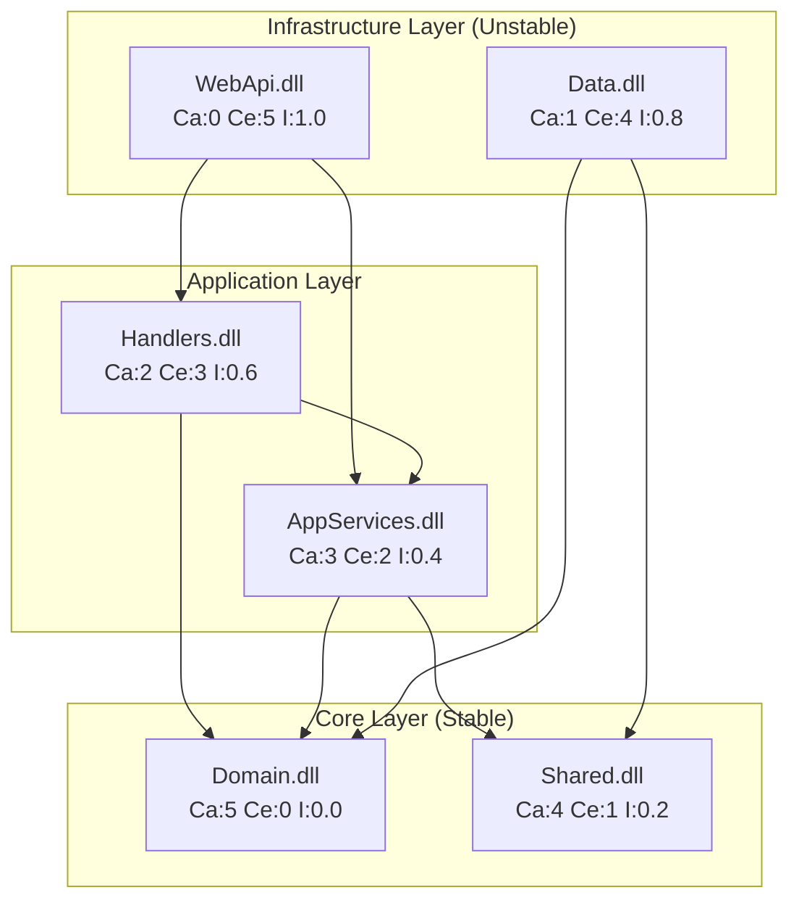

# Phase 2 (P2): Code Health Assessment & Refactoring Prioritization

> Dependency graphs, dead code detection, complexity metrics, and prioritized refactoring roadmap.
> Enhanced with quantitative scoring, multi-technology dead code detection, and phased remediation.

**⚠️ AI GUARDRAILS APPLY**: All metrics MUST come from actual tool output or code inspection. Never fabricate scores. See [ORCHESTRATION-PROMPT.md](ORCHESTRATION-PROMPT.md#ai-guardrails-anti-hallucination-rules).

---

## Document Information

| Property | Value |
|----------|-------|
| **Document Version** | 4.0.0 |
| **Last Updated** | March 2026 |
| **Status** | Active |
| **Part Of** | Comprehensive Prompt Library |

### Related Documents

| Document | Description |
|----------|-------------|
| [PROMPT-INDEX.md](PROMPT-INDEX.md) | Quick reference catalog |
| [phase1-inventory.md](phase1-inventory.md) | Prerequisite: Inventory (P1.1–P1.6) |
| [phase3-architecture-scoring.md](phase3-architecture-scoring.md) | Feeds into: Scoring engine (P3.4) |
| [ORCHESTRATION-PROMPT.md](ORCHESTRATION-PROMPT.md) | Execution workflow |

---

## Table of Contents

- [P2 Code Health Assessment](#p2-code-health-assessment)
  - [Part 1: Dependency Graph Generation (P2.1)](#part-1-dependency-graph-generation-p21)
  - [Part 2: Dead Code Identification (P2.2)](#part-2-dead-code-identification-p22)
  - [Part 3: Code Complexity Metrics (P2.3)](#part-3-code-complexity-metrics-p23)
  - [Part 4: Refactoring Prioritization Matrix (P2.4)](#part-4-refactoring-prioritization-matrix-p24)

---

## P2 Code Health Assessment

```
**Goal**: Generate comprehensive dependency graphs, identify dead code, measure code complexity 
metrics, and create a prioritized refactoring roadmap based on technical debt and business impact

**Input**: 
- P1.1 Component Inventory output
- P1.3 Dependency Mapping output
- Source code repositories

**Output Files**:
- /docs/health/dependency-graph-analysis.md
- /docs/health/dead-code-inventory.md
- /docs/health/complexity-metrics.md
- /docs/health/refactoring-priority-matrix.md
```

---

## Part 1: Dependency Graph Generation

**Goal**: Create multi-level dependency graphs for impact analysis and migration planning

### P2.1.1 Project/Assembly Level Dependencies

**Scan**:
- Solution files (*.sln)
- Project files (*.csproj, *.vbproj, *.fsproj)
- Package references (packages.config, PackageReference)
- Project references

**Capture Per Project**:

| Field | Description |
|-------|-------------|
| Project Name | Assembly/project name |
| Project Type | Library, Executable, Web, Test |
| Direct Dependencies | Projects it references |
| Transitive Dependencies | All downstream dependencies |
| Dependents | Projects that reference it |
| Afferent Coupling (Ca) | Number of projects depending on this |
| Efferent Coupling (Ce) | Number of projects this depends on |
| Instability (I) | Ce / (Ca + Ce) — 0=stable, 1=unstable |

**Dependency Graph Output (Mermaid)**:



**Layer Violation Detection**:
- Infrastructure → Domain (allowed ✅)
- Domain → Infrastructure (violation ❌)
- UI → Domain directly bypassing Application (violation ❌)

### P2.1.2 Circular Dependency Detection

| Cycle ID | Components | Severity | Breaking Strategy |
|----------|------------|----------|-------------------|
| CYC-001 | A → B → A | 🔴 High | Extract shared interface to Core |
| CYC-002 | A → B → C → A | 🟡 Medium | Introduce mediator/events |
| CYC-003 | Namespace within project | 🟢 Low | Reorganize namespace structure |

### P2.1.3 Class/Module Level Dependencies (High-Coupling Only)

**For components with Ce > 10 or Ca > 10**:

| Class | Namespace | Deps Out | Deps In | God Class? | Recommendation |
|-------|-----------|----------|---------|------------|----------------|

### P2.1.4 External Dependency Analysis

| Package | Version | Used By | Latest Version | CVE Issues | Update Priority |
|---------|---------|---------|----------------|------------|-----------------|

**Tools**: `dotnet list package --outdated`, `dotnet list package --vulnerable`

---

## Part 2: Dead Code Identification

**Goal**: Systematically identify unused code across ALL technology types

### P2.2.1 .NET Dead Code Detection

| Category | Detection Method | Tool/Technique |
|----------|------------------|----------------|
| Unused Types | No references in solution | Roslyn analyzer, ReSharper |
| Unused Methods | No call sites found | Static analysis |
| Unused Parameters | Parameter never read | Compiler warning CS0168 |
| Unused Variables | Assigned but not used | Compiler warning |
| Unreachable Code | Code after return/throw | Compiler warning |
| Obsolete Code | [Obsolete] with no callers | Attribute search + reference check |

**Output Format**:

| File | Line | Type | Name | Last Modified | Confidence | Action |
|------|------|------|------|---------------|------------|--------|

### P2.2.2 JavaScript/TypeScript Dead Code Detection

**Patterns**:
- Unused exports (no imports found)
- Unused imports
- Unreachable code (after return)
- Unused variables
- Dead feature flags

**Tools**: ESLint (no-unused-vars), TypeScript compiler (noUnusedLocals), webpack-deadcode-plugin

### P2.2.3 SQL/Database Dead Code Detection

| Object Type | Detection Method |
|-------------|------------------|
| Unused Tables | No SELECT/INSERT/UPDATE/DELETE references in code |
| Orphaned SPs | No callers in application code |
| Unused Views | No references in SPs or code |
| Unused Indexes | sys.dm_db_index_usage_stats shows 0 seeks/scans |
| Unused Columns | No SELECT or WHERE references |

**SQL for Unused Stored Procedures**:
```sql
SELECT 
    SCHEMA_NAME(o.schema_id) AS SchemaName,
    o.name AS ProcedureName,
    o.create_date, o.modify_date,
    ps.last_execution_time AS LastExecuted
FROM sys.objects o
LEFT JOIN sys.dm_exec_procedure_stats ps ON o.object_id = ps.object_id
WHERE o.type = 'P'
    AND (ps.last_execution_time IS NULL 
         OR ps.last_execution_time < DATEADD(MONTH, -6, GETDATE()))
ORDER BY ps.last_execution_time;
```

**SQL for Unused Indexes**:
```sql
SELECT 
    OBJECT_NAME(i.object_id) AS TableName,
    i.name AS IndexName, i.type_desc,
    ius.user_seeks + ius.user_scans + ius.user_lookups AS TotalReads,
    ius.user_updates AS TotalWrites
FROM sys.indexes i
LEFT JOIN sys.dm_db_index_usage_stats ius 
    ON i.object_id = ius.object_id AND i.index_id = ius.index_id
WHERE OBJECTPROPERTY(i.object_id, 'IsUserTable') = 1
    AND i.type_desc != 'HEAP'
    AND (ius.user_seeks + ius.user_scans + ius.user_lookups) = 0
    AND ius.user_updates > 0
ORDER BY ius.user_updates DESC;
```

### P2.2.4 Dead Code Summary

| Category | Count | Est. Lines | Storage Impact | Recommendation |
|----------|-------|------------|----------------|----------------|
| Unused Classes | | | N/A | Remove in Phase 1 |
| Unused Methods | | | N/A | Remove incrementally |
| Orphaned SPs | | | | Archive then drop |
| Unused Tables | | | | Backup then drop |
| Unused Indexes | | | | Drop (improves write perf) |

---

## Part 3: Code Complexity Metrics

**Goal**: Quantify code health using industry-standard metrics

### P2.3.1 Cyclomatic Complexity

| Score | Risk Level | Recommendation |
|-------|------------|----------------|
| 1–10 | 🟢 Low | Simple, maintainable |
| 11–20 | 🟡 Medium | Moderate, consider simplifying |
| 21–50 | 🟠 High | Complex, difficult to test, refactor priority |
| 50+ | 🔴 Very High | Untestable, high defect risk, urgent refactor |

**Per-Method Output**:

| File | Method | Cyclomatic | Lines | Params | Nesting | Risk |
|------|--------|------------|-------|--------|---------|------|

### P2.3.2 Cognitive Complexity

**Scoring Rules**:
- +1 for each `if`, `else if`, `else`, `switch`, `for`, `foreach`, `while`, `do`, `catch`, `?:`
- +1 for each level of nesting (compounds with control structures)
- +1 for breaks in linear flow (`break`, `continue`, `goto`, early `return`)
- +1 for recursion

| File | Method | Cognitive Score | Issue | Refactoring Strategy |
|------|--------|-----------------|-------|---------------------|

### P2.3.3 Method/Class Size Metrics

**Method Thresholds**:

| Metric | Ideal | ⚠️ Warning | 🔴 Critical |
|--------|-------|---------|----------|
| Lines of Code | < 20 | 20–50 | > 50 |
| Parameters | < 4 | 4–6 | > 6 |
| Local Variables | < 5 | 5–10 | > 10 |
| Nesting Depth | < 3 | 3–4 | > 4 |

**Class Thresholds**:

| Metric | Ideal | ⚠️ Warning | 🔴 Critical |
|--------|-------|---------|----------|
| Lines of Code | < 200 | 200–500 | > 500 |
| Methods | < 10 | 10–20 | > 20 |
| Fields | < 10 | 10–15 | > 15 |
| Dependencies | < 5 | 5–10 | > 10 |

**God Classes Output**:

| Class | File | LOC | Methods | Fields | Deps | Issue |
|-------|------|-----|---------|--------|------|-------|

### P2.3.4 Maintainability Index

**Formula**:
```
MI = MAX(0, (171 - 5.2 × ln(HV) - 0.23 × CC - 16.2 × ln(LOC)) × 100 / 171)
```

| Score | Rating | Action |
|-------|--------|--------|
| 80–100 | 🟢 High | No action needed |
| 60–79 | 🟡 Moderate | Monitor, improve opportunistically |
| 40–59 | 🟠 Low | Plan refactoring |
| 0–39 | 🔴 Very Low | Urgent refactoring required |

**Per-Component Output**:

| Component | MI Score | Rating | LOC | Avg CC | Tech Debt Hours |
|-----------|----------|--------|-----|--------|-----------------|

### P2.3.5 Technical Debt Estimation (SQALE-based)

| Issue Type | Remediation Time | Example |
|------------|------------------|---------|
| Duplicate Code Block | 30 min per block | Extract method |
| High Cyclomatic Complexity | 1 hr per 10 pts above threshold | Refactor method |
| God Class | 4 hrs per class | Split responsibilities |
| Missing Tests | 30 min per uncovered method | Write tests |
| Deprecated API Usage | 15 min per occurrence | Update to new API |

**Summary**:

| Category | Count | Est. Hours | Cost @ $100/hr |
|----------|-------|------------|----------------|
| Code Duplication | | | |
| High Complexity | | | |
| God Classes | | | |
| Missing Tests | | | |
| **Total Technical Debt** | | | |

---

## Part 4: Refactoring Prioritization Matrix

**Goal**: Create actionable refactoring roadmap based on complexity × business impact

### P2.4.1 Business Impact Scoring (1–5 scale)

| Criterion | Weight | Description |
|-----------|--------|-------------|
| Change Frequency | 25% | How often this code changes (commits/month) |
| Bug Density | 25% | Historical bugs in this component |
| Business Criticality | 30% | Impact on core business functions |
| User-Facing | 10% | Direct impact on end users |
| Compliance/Security | 10% | Regulatory or security implications |

**Formula**:
```
BusinessImpact = (ChangeFreq × 0.25) + (BugDensity × 0.25) + (Criticality × 0.30) + 
                 (UserFacing × 0.10) + (Compliance × 0.10)
```

### P2.4.2 Priority Score Formula

```
PriorityScore = (ComplexityScore × 0.4) + (BusinessImpact × 0.4) + (DebtHours × 0.2)
```

All scores normalized to 0–100.

### P2.4.3 Priority Matrix Output

| Rank | Component | Complexity | Business Impact | Debt (hrs) | Priority Score | Bucket |
|------|-----------|------------|-----------------|------------|----------------|--------|

### P2.4.4 Priority Buckets

| Bucket | Score Range | Action | Timeline |
|--------|-------------|--------|----------|
| 🔴 Critical | 80–100 | Immediate attention | Current sprint |
| 🟠 High | 60–79 | Near-term refactoring | 1–2 months |
| 🟡 Medium | 40–59 | Opportunistic | Within quarter |
| 🟢 Low | 0–39 | Monitor only | Backlog |

### P2.4.5 Quick Wins (High Impact, Low Effort < 4 hours)

| Component | Issue | Fix | Effort | Impact | ROI |
|-----------|-------|-----|--------|--------|-----|

### P2.4.6 Recommended Refactoring Sequence

**Phase 1 — Quick Wins (Week 1–2)**:
1. Remove dead code from Part 2
2. Fix all Quick Wins from P2.4.5
3. Update deprecated API usages
4. Add missing null checks

**Phase 2 — Critical Components (Week 3–6)**:
1. Refactor Critical-bucket components
2. Break up God Classes
3. Add unit tests for refactored components

**Phase 3 — High Priority (Week 7–12)**:
1. Resolve circular dependencies from Part 1
2. Simplify high cognitive complexity methods
3. Extract shared library logic

**Phase 4 — Ongoing (Continuous)**:
1. Boy Scout Rule (leave code better than found)
2. Refactor opportunistically on Medium-priority code
3. Re-measure metrics quarterly

---

## Output Summary

**Files Generated**:

| File | Content |
|------|---------|
| `/docs/health/dependency-graph-analysis.md` | Mermaid graphs, coupling metrics, circular deps, layer violations |
| `/docs/health/dead-code-inventory.md` | Unused code across .NET, JS/TS, SQL with removal plan |
| `/docs/health/complexity-metrics.md` | Cyclomatic, cognitive, MI scores, tech debt estimate |
| `/docs/health/refactoring-priority-matrix.md` | Scored priority matrix, quick wins, phased roadmap |

**Feeds Into**:
- Prompt P3.4 (Scoring Engine) — Code Health Score input
- Prompt P3.5 (Migration Readiness) — Readiness factor
- Phase 4–6 Discovery — Focus on high-complexity hotspots first
