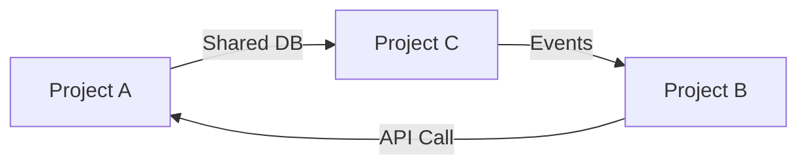

# Phase 3 (P3): Architecture Assessment, Scoring & Migration Readiness

> Multi-layer architecture assessment, event maturity, domain-service-event triangulation,
> quantitative scoring engine, migration readiness, and portfolio view.
> 
> **NEW in v4.0** — These prompts bridge the gap between code-level health (P2) and 
> business-level migration decisions. Derived from the strategic framework concepts.

**⚠️ AI GUARDRAILS APPLY**: See [ORCHESTRATION-PROMPT.md](ORCHESTRATION-PROMPT.md#ai-guardrails-anti-hallucination-rules)

---

## Document Information

| Property | Value |
|----------|-------|
| **Document Version** | 4.0.0 |
| **Last Updated** | March 2026 |
| **Status** | Active |
| **Part Of** | Comprehensive Prompt Library |

### Related Documents

| Document | Description |
|----------|-------------|
| [PROMPT-INDEX.md](PROMPT-INDEX.md) | Quick reference catalog |
| [phase2-code-health.md](phase2-code-health.md) | Prerequisite: Code health (P2) |
| [phase1-inventory.md](phase1-inventory.md) | Prerequisite: Inventory (P1.1–P1.6) |
| [phase4-discovery-core.md](phase4-discovery-core.md) | Next: Domain discovery |
| [ORCHESTRATION-PROMPT.md](ORCHESTRATION-PROMPT.md) | Execution workflow |

---

## Table of Contents

- [P3.1 Multi-Layer Assessment Model](#p31-multi-layer-assessment-model)
- [P3.2 Event Maturity Assessment](#p32-event-maturity-assessment)
- [P3.3 Domain-Service-Event Triangulation](#p33-domain-service-event-triangulation)
- [P3.4 Quantitative Scoring Engine](#p34-quantitative-scoring-engine)
- [P3.5 Migration Readiness Assessment](#p35-migration-readiness-assessment)
- [P3.6 Portfolio View](#p36-portfolio-view)

---

## P3.1 Multi-Layer Assessment Model

```
**Goal**: Assess the system across 4 distinct architectural layers to ensure 
modernization covers all dimensions — not just code

**Why This Matters**: Most teams only assess Layer 1 (code). Real modernization requires 
ALL 4 layers aligned. Gaps in any layer create migration failures.

**Input**:
- P1.1 Component Inventory
- P1.3 Dependency Map
- P2 Code Health metrics

**Output**: /docs/architecture/multi-layer-assessment.md
```

### Layer 1: Code Layer (Inside Application)

```
**What to Assess**:
- Code complexity (from P2.3)
- Dead code percentage (from P2.2)
- Test coverage (from P2.3.5)
- Internal dependency graph (from P2.1)
- Coding standards adherence

**Key Questions**:
1. Can individual classes/methods be understood independently?
2. Are responsibilities clearly separated (SRP)?
3. Is the code testable without heavy mocking?
4. Are there God classes or God methods?

**Score** (1–5):
| Score | Meaning |
|-------|---------|
| 5 | Clean, well-tested, low complexity |
| 4 | Good structure, some hotspots |
| 3 | Mixed — some clean, some legacy |
| 2 | Mostly legacy, tightly coupled |
| 1 | Spaghetti code, untestable |

**Output Table**:

| Metric | Value | Score (1–5) | Notes |
|--------|-------|-------------|-------|
| Avg Cyclomatic Complexity | | | From P2.3.1 |
| Dead Code % | | | From P2.2.4 |
| Test Coverage % | | | From analysis tools |
| God Classes Count | | | From P2.3.3 |
| Maintainability Index (avg) | | | From P2.3.4 |
| **Layer 1 Score** | | **/5** | |
```

### Layer 2: Service Layer (Distributed View)

```
**What to Assess** (Skip for Monoliths):
- Service coupling (sync dependencies between services)
- API contract clarity (versioned? documented?)
- Service boundaries alignment with domain
- Deployment independence

**Key Questions**:
1. Can services be deployed independently?
2. Are API contracts versioned and documented?
3. Do services share databases? (red flag)
4. Are there synchronous dependency chains? (latency risk)

**Score** (1–5):
| Score | Meaning |
|-------|---------|
| 5 | Loosely coupled, independently deployable, clear contracts |
| 4 | Mostly independent, some shared resources |
| 3 | Partial independence, some tight coupling |
| 2 | Heavy coupling, shared DBs, synchronous chains |
| 1 | Distributed monolith (worst of both worlds) |

**Output Table**:

| Metric | Value | Score (1–5) | Notes |
|--------|-------|-------------|-------|
| Services count | | | |
| Shared databases | | | Each shared DB = -1 |
| Sync dependency chains | | | Length of longest chain |
| API contracts documented | | | % with OpenAPI/Swagger |
| Independent deployability | | | % truly independent |
| **Layer 2 Score** | | **/5** | |
```

### Layer 3: Event Layer (EDA Systems)

```
**What to Assess** (Skip if no messaging):
- Event producers/consumers clarity
- Event schema management
- Error handling (DLQ, retry)
- Event versioning

**Key Questions**:
1. Are events well-defined with schemas?
2. Is there dead letter queue (DLQ) handling?
3. Are events versioned for backward compatibility?
4. Can you trace an event through the entire system?

**Score** (1–5):
- Scored using Event Maturity Model in Prompt P3.2

**Output Table**:

| Metric | Value | Score (1–5) | Notes |
|--------|-------|-------------|-------|
| Event types count | | | |
| Events with schemas | | | % documented |
| DLQ handling | | | Yes/No/Partial |
| Event versioning | | | None/Basic/Full |
| Observability (tracing) | | | None/Partial/Full |
| **Layer 3 Score** | | **/5** | |
```

### Layer 4: Domain Layer (Business View)

```
**What to Assess**:
- Domain model clarity (are entities well-defined?)
- Bounded context boundaries (are they identified?)
- Business rule location (in code? in SPs? scattered?)
- Data ownership (clear or shared?)

**Key Questions**:
1. Can you explain the domain model to a business person?
2. Are bounded contexts identified and respected?
3. Where do business rules live? (Ideally: domain layer, not UI/SP)
4. Is data ownership clear per bounded context?

**Score** (1–5):
| Score | Meaning |
|-------|---------|
| 5 | Clear DDD model, defined contexts, rules in domain layer |
| 4 | Good domain model, some boundary leakage |
| 3 | Implicit model, rules scattered across layers |
| 2 | No clear model, business logic in UI/SPs/controllers |
| 1 | No domain understanding, Big Ball of Mud |

**Output Table**:

| Metric | Value | Score (1–5) | Notes |
|--------|-------|-------------|-------|
| Domain entities identified | | | From P1.4 |
| Bounded contexts defined | | | From P1.5 |
| Business rules in domain layer | | | % vs SP/UI |
| Data ownership clarity | | | Clear/Partial/None |
| **Layer 4 Score** | | **/5** | |
```

### Multi-Layer Summary

```markdown
# Multi-Layer Assessment Summary

| Layer | Score | Key Finding |
|-------|-------|-------------|
| Layer 1: Code | /5 | |
| Layer 2: Service | /5 | |
| Layer 3: Event | /5 | |
| Layer 4: Domain | /5 | |
| **Overall** | **/5** | Weighted average |

## Gap Analysis
| Layer | Gap | Impact | Remediation |
|-------|-----|--------|-------------|
```

---

## P3.2 Event Maturity Assessment

```
**Goal**: Assess the maturity level of event-driven architecture (if applicable)

**Skip if**: Architecture type is MONO or BATCH with no messaging

**Input**: 
- P1.1 Component Inventory (messaging technologies)
- P1.3 Dependency Map (message flows)
- Source code scan of event producers/consumers

**Output**: /docs/architecture/event-maturity.md
```

### Event Maturity Model (L1–L4)

| Level | Name | Description | Indicators |
|-------|------|-------------|------------|
| **L1** | Basic Pub/Sub | Simple fire-and-forget messaging | No retry, no DLQ, no schema, string-based topics |
| **L2** | Reliable Messaging | Retry + error handling | DLQ configured, at-least-once delivery, basic monitoring |
| **L3** | Versioned Events | Schema evolution support | Event contracts (Avro/JSON Schema), backward compatibility, consumer groups |
| **L4** | Event Sourcing | Events as source of truth | Event store, projections, temporal queries, full audit trail |

### Assessment Checklist

| Capability | L1 | L2 | L3 | L4 | Current |
|------------|:--:|:--:|:--:|:--:|:-------:|
| Message broker exists | ✅ | ✅ | ✅ | ✅ | |
| Retry policies configured | ❌ | ✅ | ✅ | ✅ | |
| Dead letter queue (DLQ) | ❌ | ✅ | ✅ | ✅ | |
| Event schemas defined | ❌ | ❌ | ✅ | ✅ | |
| Schema versioning | ❌ | ❌ | ✅ | ✅ | |
| Backward compatibility | ❌ | ❌ | ✅ | ✅ | |
| Event store (append-only) | ❌ | ❌ | ❌ | ✅ | |
| Projections/read models | ❌ | ❌ | ❌ | ✅ | |
| Temporal queries | ❌ | ❌ | ❌ | ✅ | |
| Distributed tracing | ❌ | ❌ | ✅ | ✅ | |
| Idempotent consumers | ❌ | ✅ | ✅ | ✅ | |
| Ordering guarantees | ❌ | ❌ | ✅ | ✅ | |

### Event Catalog

| Event Name | Producer | Consumer(s) | Schema? | Versioned? | DLQ? |
|------------|----------|-------------|---------|------------|------|

### Gap Analysis

```markdown
## Current Level: L{X}

## Gaps to Reach L{X+1}

| Gap | Priority | Effort | Recommendation |
|-----|----------|--------|----------------|
```

---

## P3.3 Domain-Service-Event Triangulation

```
**Goal**: Cross-reference domain concepts, services, and events to identify 
alignment gaps and orphaned artifacts

**Why This Matters**: In complex systems, domains, services, and events can drift apart.
Triangulation reveals:
- Domain concepts with no service (unrealized domains)
- Services with no clear domain (technical services masquerading as business)
- Events with no consumer (dead events)
- Domain relationships not reflected in service communication

**Input**:
- P1.4 Domain Model
- P1.5 Bounded Contexts  
- P1.1 Component Inventory
- P3.2 Event Catalog

**Output**: /docs/architecture/triangulation-map.md
```

### Triangulation Matrix

| Domain Concept | Service(s) | Events Produced | Events Consumed | Aligned? |
|---------------|------------|-----------------|-----------------|----------|
| Orders | Orders API | OrderCreated, OrderUpdated | PaymentCompleted | ✅ Yes |
| Validation | (embedded in OrdersAPI) | — | OrderCreated | ⚠️ Partial — no dedicated service |
| Reporting | — | — | — | ❌ No service, no events |

### Alignment Check

| Check | Finding | Severity |
|-------|---------|----------|
| Domain → Service mapping | Every domain has a service? | |
| Service → Domain mapping | Every service maps to a domain? | |
| Event → Consumer | Every event has at least one consumer? | |
| Domain relationship → Communication | Domain relationships reflected in service calls/events? | |

### Orphan Detection

| Type | Name | Issue | Recommendation |
|------|------|-------|----------------|
| Dead Event | CustomerUpdated | Published but no consumer | Remove or add consumer |
| Orphan Service | LegacyReportService | No clear domain mapping | Assign to domain or deprecate |
| Missing Service | Notifications domain | Has domain logic but no dedicated service | Extract service |

---

## P3.4 Quantitative Scoring Engine

```
**Goal**: Turn qualitative assessments into quantifiable scores that drive migration 
decisions objectively

**Input**: All Phase 1–3 outputs (P1.1–P3.3)

**Output**: /docs/architecture/scoring-dashboard.md
```

### A. Code Health Score

```
CodeHealthScore = (Complexity + Coupling + DeadCode + TestCoverage) / 4
```

| Metric | Raw Value | Normalized (1–5) | Weight |
|--------|-----------|-------------------|--------|
| Avg Cyclomatic Complexity | | | 25% |
| Coupling (avg Instability) | | | 25% |
| Dead Code % | | | 25% |
| Test Coverage % | | | 25% |
| **Code Health Score** | | **/5** | |

**Normalization Guide**:

| Metric | Score 5 | Score 4 | Score 3 | Score 2 | Score 1 |
|--------|---------|---------|---------|---------|---------|
| Cyclomatic Complexity (avg) | < 5 | 5–10 | 10–20 | 20–35 | > 35 |
| Dead Code % | < 5% | 5–10% | 10–20% | 20–35% | > 35% |
| Test Coverage % | > 80% | 60–80% | 40–60% | 20–40% | < 20% |
| Instability (avg) | < 0.3 | 0.3–0.5 | 0.5–0.7 | 0.7–0.85 | > 0.85 |

### B. Architecture Fitness Score

| Factor | Score (1–5) | Weight |
|--------|-------------|--------|
| Modularity | | 30% |
| Scalability | | 20% |
| Resilience | | 20% |
| Observability | | 15% |
| Deployment Independence | | 15% |
| **Architecture Fitness** | **/5** | |

### C. Migration Readiness Score

| Factor | Score (1–5) | Weight |
|--------|-------------|--------|
| .NET Compatibility | | 25% |
| Cloud Readiness | | 25% |
| Statelessness | | 20% |
| Config Externalization | | 15% |
| Dependency Portability | | 15% |
| **Migration Readiness** | **/5** | |

### D. Combined Decision Score

```
DecisionScore = (CodeHealth × 0.30) + (ArchFitness × 0.35) + (MigrationReadiness × 0.35)
```

### E. Decision Matrix

| Score Range | Recommendation | Strategy |
|-------------|----------------|----------|
| 4.0–5.0 | ✅ Rehost / Minor changes | Lift & shift, minor config changes |
| 3.0–3.9 | 🟡 Replatform | Upgrade .NET, containerize, externalize config |
| 2.0–2.9 | 🟠 Refactor + Modernize | Strangler pattern, incremental improvement |
| 1.0–1.9 | 🔴 Re-architect | Full redesign with new domain boundaries |

### Output Dashboard

```markdown
# Scoring Dashboard

| Dimension | Score | Rating |
|-----------|-------|--------|
| Code Health | /5 | {emoji} |
| Architecture Fitness | /5 | {emoji} |
| Migration Readiness | /5 | {emoji} |
| **Decision Score** | **/5** | |

## Recommendation: {Strategy}
## Rationale: {1–2 sentences based on scores}
```

---

## P3.5 Migration Readiness Assessment

```
**Goal**: Detailed evaluation of readiness to migrate to target platform

**Input**: 
- project-profile.yaml (target technology stack)
- P1.2 Technology Matrix
- P3.4 Scoring Engine outputs

**Output**: /docs/architecture/migration-readiness.md
```

### .NET Compatibility Check

| Component | Current | Target | Breaking Changes | Effort |
|-----------|---------|--------|------------------|--------|
| | .NET Framework 4.8 | .NET 8 | | |

**Common Breaking Changes**:

| Area | Issue | Impact | Mitigation |
|------|-------|--------|------------|
| System.Web | Not available in .NET 8 | 🔴 High | Replace with ASP.NET Core middleware |
| WCF Server | Not available in .NET 8 | 🔴 High | CoreWCF or migrate to gRPC/REST |
| AppDomain | Limited in .NET 8 | 🟡 Medium | Redesign isolation model |
| Windows Registry | Not cross-platform | 🟡 Medium | Move to configuration files |
| COM Interop | Windows-only | 🟡 Medium | Platform guard or replace |
| System.Drawing | Limited in .NET 8 | 🟡 Medium | SkiaSharp or ImageSharp |

### Cloud Readiness Check

| Factor | Current State | Cloud-Ready? | Action Required |
|--------|---------------|:------------:|-----------------|
| Statelessness | | | |
| Config externalization | | | |
| Health endpoints | | | |
| Logging (structured) | | | |
| Secret management | | | |
| File system usage | | | |
| Session state | | | |
| Background processing | | | |

### Dependency Portability

| Dependency | Portable? | Alternative | Effort |
|------------|:---------:|-------------|--------|

### Migration Blockers

| Blocker | Severity | Workaround | Must Fix Before Migration? |
|---------|----------|------------|:--------------------------:|

### Readiness Verdict

```markdown
## Migration Readiness: {READY | READY WITH WORK | NOT READY}

### Summary
- Blocking issues: {count}
- High-effort items: {count}
- Estimated pre-migration work: {weeks}

### Recommended Pre-Migration Steps
1. {step}
2. {step}
```

---

## P3.6 Portfolio View

```
**Goal**: Aggregate assessments across multiple projects/services into a single 
portfolio dashboard for executive-level decision-making

**When to Use**: Multi-project engagements, enterprise-wide modernization programs

**Input**: Scoring dashboards from all assessed projects (P3.4)

**Output**: /docs/portfolio/portfolio-dashboard.md
```

### Portfolio Dashboard

```markdown
# Portfolio Modernization Dashboard

**Projects Assessed**: {count}
**Date**: {date}

## Executive Summary

| Project | Code Health | Arch Fitness | Migration Ready | Decision Score | Strategy |
|---------|:-----------:|:------------:|:---------------:|:--------------:|----------|
| Project A | 3.2 | 2.8 | 2.5 | 2.8 | 🟠 Refactor |
| Project B | 4.1 | 4.0 | 3.8 | 3.9 | 🟡 Replatform |
| Project C | 1.5 | 1.8 | 1.2 | 1.5 | 🔴 Re-architect |

## Migration Sequence (Recommended Order)

| Order | Project | Why First/Later | Dependencies |
|-------|---------|-----------------|--------------|
| 1 | Project B | Highest readiness, lowest risk | None |
| 2 | Project A | Moderate effort, high business value | Depends on shared DB migration |
| 3 | Project C | Largest effort, needs domain redesign | After A and B stabilize |

## Portfolio Risks

| Risk | Affected Projects | Mitigation |
|------|-------------------|------------|
| Shared database | A, C | Extract per-service DBs in Phase 2 |
| Team capacity | All | Stagger migration timelines |

## Total Effort Estimate

| Category | Total Hours | Total Cost |
|----------|-------------|------------|
| Pre-migration refactoring | | |
| Migration execution | | |
| Testing & validation | | |
| **Total** | | |
```

### Migration Wave Planning

```
Wave 1 (Quick Wins):     Projects scoring 3.5+ → Rehost/Replatform
Wave 2 (Moderate Effort): Projects scoring 2.5–3.4 → Refactor then Replatform
Wave 3 (Major Effort):    Projects scoring <2.5 → Re-architect
```

### Cross-Project Dependencies



**Rule**: Never migrate a downstream project before its upstream dependency is stable.
