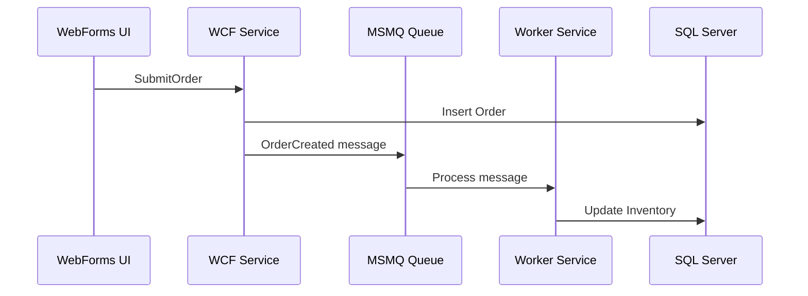
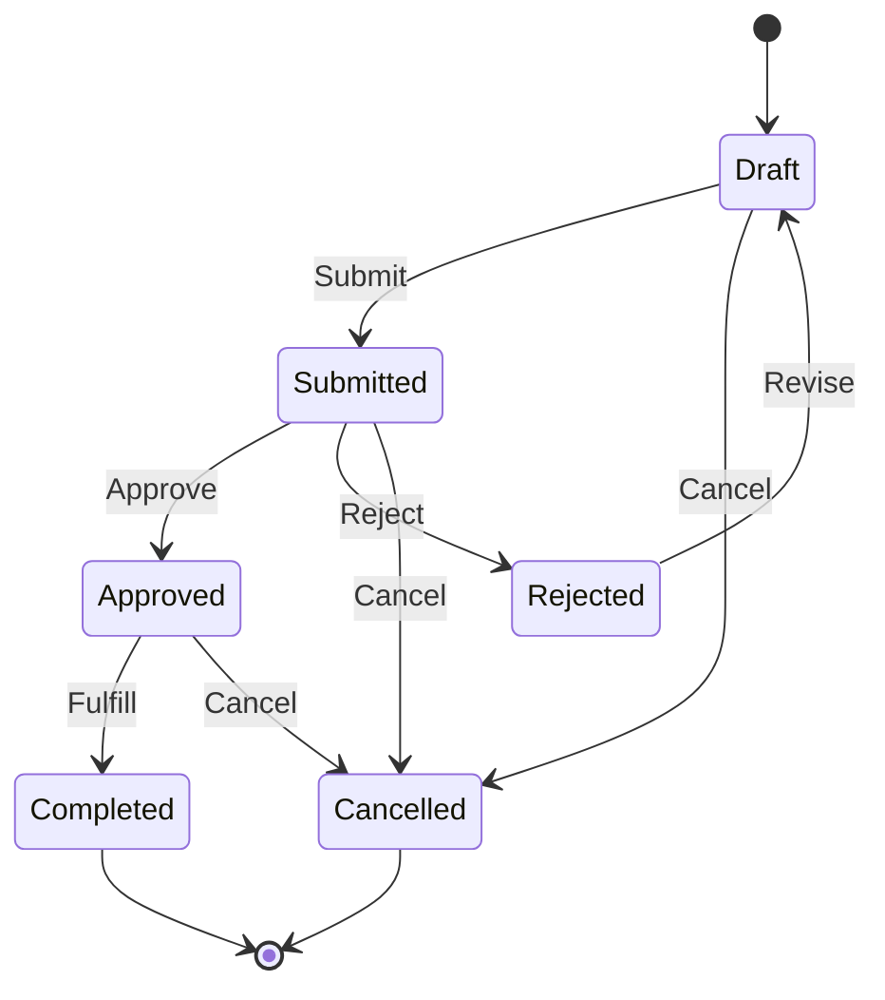
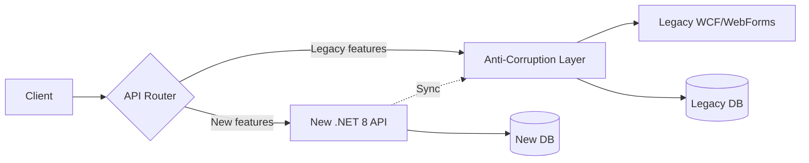

# Phase 6 (P6): Domain Discovery — Legacy Deep Extraction

> Deep extraction prompts for use cases, DB schema semantics, event flows, integrations,
> config/secrets, UI behaviors, shared libraries, middleware, error handling, state machines,
> 3rd-party customizations, and anti-corruption layer identification.

**⚠️ AI GUARDRAILS APPLY**: All prompts in this phase MUST follow the AI Guardrails defined in [ORCHESTRATION-PROMPT.md](ORCHESTRATION-PROMPT.md#ai-guardrails-anti-hallucination-rules). Apply the Confidence Level Framework to every extracted rule.

---

## Document Information

| Property | Value |
|----------|-------|
| **Document Version** | 4.0.0 |
| **Last Updated** | March 2026 |
| **Status** | Active |
| **Part Of** | Comprehensive Prompt Library |

### Related Documents

| Document | Description |
|----------|-------------|
| [PROMPT-INDEX.md](PROMPT-INDEX.md) | Quick reference catalog |
| [phase4-discovery-core.md](phase4-discovery-core.md) | Core domain discovery (P4.1–P4.7) |
| [phase5-discovery-tech.md](phase5-discovery-tech.md) | Technology-specific extraction (P5.1–P5.10) |
| [phase3-architecture-scoring.md](phase3-architecture-scoring.md) | Feeds into: Scoring & triangulation |
| [ORCHESTRATION-PROMPT.md](ORCHESTRATION-PROMPT.md) | Execution workflow & guardrails |

---

## Table of Contents

- [P6.1 Build Use-Case Catalog from Code](#p61-build-use-case-catalog-from-code)
- [P6.2 Database Schema → Domain Semantics](#p62-database-schema--domain-semantics)
- [P6.3 Event / Message Flow Extraction](#p63-event--message-flow-extraction)
- [P6.4 Integration Point Extraction](#p64-integration-point-extraction)
- [P6.5 Configuration / Secret Extraction](#p65-configuration--secret-extraction)
- [P6.6 UI Behavior Extraction](#p66-ui-behavior-extraction)
- [P6.7 Shared Library Analysis](#p67-shared-library-analysis)
- [P6.8 Middleware / Interceptor Chain Analysis](#p68-middleware--interceptor-chain-analysis)
- [P6.9 Error Handling & Recovery Patterns](#p69-error-handling--recovery-patterns)
- [P6.10 State Machine Extraction](#p610-state-machine-extraction)
- [P6.11 3rd-Party / Vendor Customization Extraction](#p611-3rd-party--vendor-customization-extraction)
- [P6.12 Anti-Corruption Layer Identification](#p612-anti-corruption-layer-identification)

---

## P6.1 Build Use-Case Catalog from Code

```
**Goal**: Reverse-engineer use cases from code entry points

**Scan Sources**:
- HTTP endpoints (controllers, handlers)
- Message/event handlers
- Scheduled jobs
- UI actions (button clicks, form submits)
- SP entry points

**Per Use Case**:

| Use Case | Entry Point | Actor | Preconditions | Business Rules | Happy Path | Error Paths |
|----------|-------------|-------|---------------|----------------|------------|-------------|

**Detailed Format**:

### UC-{number}: {Use Case Name}

**Actor**: {User role or system}
**Entry Point**: {Controller, Handler, SP, etc.}
**Trigger**: {HTTP request, Event, Schedule, User action}

**Preconditions**:
1. {condition}

**Business Rules Applied** (from Prompts P4.1–P5.10):
| Rule ID | Description | Source | Confidence |
|---------|-------------|--------|------------|

**Happy Path**:
1. {step} → {component}
2. {step} → {component}

**Alternative Paths**:
- {condition} → {different path}

**Error Paths**:
- {error condition} → {handling}

**Data Flow**:
- Input: {entities/DTOs}
- Output: {entities/DTOs}
- Side Effects: {events, notifications, audit entries}

**Output**: /docs/domain/use-case-catalog.md

**Feeds Into**:
- P1.4 Domain Model (entities used per use case)
- P1.5 Bounded Contexts (use cases help define context boundaries)
- P3.3 Triangulation (use cases cross-validate domain concepts)
```

---

## P6.2 Database Schema → Domain Semantics

```
**Goal**: Map database schema to domain concepts

**Scan**:
- Table definitions (CREATE TABLE)
- Foreign key relationships
- Check constraints (business rules in DDL)
- Computed columns
- Default values with business meaning
- Indexed columns (business query patterns)
- Partitioning strategies (business data lifecycle)

**Extract**:

1. **Table → Entity Mapping**:

| Table | Entity Candidate | Aggregate? | Bounded Context |
|-------|-----------------|:----------:|-----------------|
| Orders | Order | Root | OrderManagement |
| OrderLines | OrderItem | Child of Order | OrderManagement |
| Customers | Customer | Root | CustomerManagement |

2. **Constraint → Business Rule**:

| Table | Constraint | Type | Business Rule | Confidence |
|-------|-----------|------|---------------|------------|
| Orders | CK_Status | CHECK | Status must be in (D,S,A,R) | HIGH |
| Orders | DF_CreatedDate | DEFAULT | Auto-set to GETDATE() | HIGH |
| OrderLines | CK_Qty | CHECK | Qty must be > 0 | HIGH |

3. **Relationship → Domain Relationship**:

| From Table | To Table | FK | Cardinality | Aggregate Boundary? |
|-----------|----------|-----|-------------|:-------------------:|
| OrderLines | Orders | FK_OL_Order | Many-to-1 | Yes (same aggregate) |
| Orders | Customers | FK_O_Cust | Many-to-1 | No (cross-aggregate) |

4. **Schema Anomalies**:

| Issue | Table(s) | Description | Recommendation |
|-------|----------|-------------|----------------|
| God Table | dbo.Master | 80+ columns | Split into bounded contexts |
| No FK | OrderLines | Missing FK to Products | Add or document why |
| Denormalized | Orders.CustomerName | Duplicated from Customers | Remove after migration |

**Output**: /docs/data/schema-domain-mapping.md

**Cross-Reference with P3.3 Triangulation**:
Compare schema entities vs service entities vs event entities to find misalignments.
```

---

## P6.3 Event / Message Flow Extraction

```
**Goal**: Map all asynchronous communication (events, messages, signals)

**Scan**:
- Message queue configurations (RabbitMQ, Azure Service Bus, MSMQ, MassTransit)
- Event publishers/subscribers (MediatR, NServiceBus, custom)
- SignalR hubs
- Webhooks (outbound and inbound)
- Database-level events (triggers, change tracking, CDC)
- File-based integration (file drops, FTP watchers)

**Extract**:

1. **Event Catalog**:

| Event Name | Publisher | Subscriber(s) | Payload | Confidence |
|-----------|-----------|----------------|---------|------------|
| OrderCreated | OrderService | InventoryService, NotificationService | {orderId, items[]} | HIGH |
| PaymentReceived | PaymentGateway | OrderService | {orderId, amount} | MEDIUM |

2. **Message Flow Diagram** (Mermaid):



3. **Event Maturity Assessment** (link to Prompt P3.2):

| Aspect | Current | Target | Gap |
|--------|---------|--------|-----|
| Naming | Technical (tbl_OrderInserted) | Domain (OrderPlaced) | Rename |
| Payload | Full entity | Minimal + ID | Refactor |
| Ordering | Unordered | Ordered per aggregate | Add sequence |
| Idempotency | None | Idempotent handlers | Add dedup |

**Output**: /docs/domain/event-message-catalog.md

**Feeds Into**:
- P3.2 Event Maturity Assessment
- P3.3 Service-Event-Domain Triangulation
```

---

## P6.4 Integration Point Extraction

```
**Goal**: Catalog all external system integrations

**Scan**:
- HTTP clients (HttpClient, RestSharp, WebClient, HttpWebRequest)
- SOAP clients (WCF client proxies, wsdl.exe generated code)
- Database connections to external DBs
- File integrations (FTP, SFTP, file shares)
- Email (SMTP, SendGrid, etc.)
- SMS/Notification services
- Payment gateways
- Identity providers (LDAP, AD, OAuth)
- Cloud services (Azure, AWS, GCP SDKs)

**Extract Per Integration**:

| System | Protocol | Direction | Data | Auth | SLA | Fallback |
|--------|----------|-----------|------|------|-----|----------|
| SAP | SOAP | Outbound | Orders | Cert | 99.9% | Queue retry |
| Stripe | REST | Both | Payments | API Key | 99.95% | Manual |
| AD | LDAP | Inbound | Users | Service acct | Internal | Cache |

**Detailed Integration Card**:

### INT-{number}: {System Name}

**Protocol**: {REST/SOAP/gRPC/File/DB/Custom}
**Direction**: {Inbound/Outbound/Bidirectional}
**Authentication**: {API Key/OAuth/Cert/Basic/None}

**Endpoints Called**:
| Endpoint | Method | Request | Response | Rate Limit |
|----------|--------|---------|----------|------------|

**Error Handling**:
- Retry policy: {describe}
- Circuit breaker: {yes/no}
- Fallback: {describe}
- Timeout: {value}

**Data Mapping**:
| Internal Entity | External Entity | Transform |
|-----------------|-----------------|-----------|
| Order | SAPSalesOrder | Custom mapper |

**Migration Impact**:
- [ ] SDK version compatible with target framework?
- [ ] Auth method supported in target environment?
- [ ] Network access from target environment?

**Output**: /docs/architecture/integration-catalog.md
```

---

## P6.5 Configuration / Secret Extraction

```
**Goal**: Catalog all configuration and secrets requiring migration

**Scan**:
- web.config / app.config (appSettings, connectionStrings, custom sections)
- appsettings.json / appsettings.{Environment}.json
- .env files
- Windows Registry reads
- Machine.config references
- Custom config files (*.config, *.xml, *.ini)
- Hardcoded values (constants with business meaning)
- Environment variable reads
- Database-stored configuration

**Extract**:

1. **Configuration Catalog**:

| Key | Source | Type | Business? | Sensitive? | Environment-Specific? |
|-----|--------|------|:---------:|:----------:|:---------------------:|
| ConnectionString | web.config | String | No | Yes | Yes |
| MaxOrderAmount | appSettings | decimal | Yes | No | No |
| ApiKey | env var | String | No | Yes | Yes |
| TaxRate | DB table | decimal | Yes | No | No |

2. **Business Configuration** (rules in config):

| Key | Value | Business Meaning | Where Used | Impact if Changed |
|-----|-------|-----------------|------------|-------------------|
| MaxOrderAmount | 50000 | Order approval threshold | OrderService | Orders > this need approval |
| TaxRate | 0.08 | State tax rate | InvoiceCalc | Changes all invoices |

3. **Secret Inventory** (NEVER log actual values):

| Secret | Current Storage | Target Storage | Rotation? |
|--------|----------------|----------------|:---------:|
| DB Conn String | web.config | Azure Key Vault | No → Yes |
| API Key | .env | Azure Key Vault | No → Yes |
| SMTP Password | appSettings | Azure Key Vault | No → Yes |

4. **Migration Mapping**:

| Current | Target |
|---------|--------|
| web.config appSettings | appsettings.json + IOptions<T> |
| connectionStrings | Azure Key Vault + connection string |
| Registry reads | Environment variables or config |
| Machine.config | Container environment variables |

**Output**: /docs/architecture/configuration-catalog.md
```

---

## P6.6 UI Behavior Extraction

```
**Goal**: Extract business-meaningful UI behaviors for migration

**Scan**:
- Page/form load behaviors (conditional visibility, default values)
- Conditional field visibility based on business state
- Cascading dropdowns with business logic
- Client-side calculations that must match server-side
- Dialog/modal workflows
- Print layouts with business formatting
- Export templates (Excel, PDF) with business structure

**Extract**:

1. **UI Business Rules**:

| Page | Element | Behavior | Business Rule | Confidence |
|------|---------|----------|---------------|------------|
| Order.aspx | pnlApproval | Visible only for Managers | Role-based access | HIGH |
| Order.aspx | txtDiscount | Max 20% for non-admins | Authorization rule | MEDIUM |
| Invoice.aspx | lblTotal | Auto-calculate on item change | Calculation must match server | HIGH |

2. **Workflow Sequences** (multi-step UI processes):

| Workflow | Steps | State Tracking | Validation Per Step |
|----------|-------|----------------|---------------------|
| Order Wizard | 3 steps | Session state | Step 1: items, Step 2: shipping, Step 3: payment |

3. **Client-Side Validation** (business rules in JS):

| Rule | Client Implementation | Server Implementation | Match? |
|------|----------------------|----------------------|:------:|
| Email format | regex in JS | regex in C# | ✅ |
| Credit check | none (server only) | SP call | N/A |
| Date range | jQuery datepicker min/max | Manual check | ⚠️ Different |

**Output**: /docs/domain/ui-behavior-catalog.md
```

---

## P6.7 Shared Library Analysis

```
**Goal**: Identify shared libraries/packages and their business logic content

**Scan**:
- Internal NuGet packages referenced by multiple projects
- Shared class libraries (*.dll projects in solution)
- Common/Shared/Core/Framework project folders
- App_Code folder (WebForms shared code)
- Shared stored procedures/functions called by multiple apps

**Extract**:

1. **Library Catalog**:

| Library | Type | Consumers | Business Logic? | Version | Migration Impact |
|---------|------|-----------|:--------------:|---------|-----------------|
| Company.Common | Class Lib | 5 projects | Yes | 2.3.1 | Must migrate first |
| Company.Data | Class Lib | 3 projects | Yes (SP wrappers) | 1.8.0 | Replace with EF |
| Newtonsoft.Json | NuGet | All | No | 12.0.3 | Update to System.Text.Json |

2. **Shared Business Logic** (code that multiple projects depend on):

| Library | Class | Method | Business Rule | Consumers |
|---------|-------|--------|---------------|-----------|
| Company.Common | TaxCalculator | Calculate | Tax computation | OrderService, InvoiceService |
| Company.Common | Validator | IsValidSSN | SSN format check | CustomerApp, HRApp |

3. **Migration Strategy Per Library**:

| Library | Strategy | Reason |
|---------|----------|--------|
| Company.Common | Extract to domain services | Contains business logic |
| Company.Data | Replace with Repository pattern | DAL abstraction |
| Company.Logging | Replace with ILogger | Cross-cutting concern |

**Output**: /docs/architecture/shared-library-analysis.md
```

---

## P6.8 Middleware / Interceptor Chain Analysis

```
**Goal**: Extract business logic from middleware and interceptor chains

**Scan**:
- ASP.NET HTTP Modules (web.config <httpModules>)
- ASP.NET HTTP Handlers (*.ashx)
- OWIN/Katana middleware
- ASP.NET Core middleware pipeline
- WCF message inspectors (IDispatchMessageInspector)
- WCF behaviors (IEndpointBehavior, IServiceBehavior)
- Action filters / Authorization filters
- DelegatingHandlers
- AOP interceptors (Unity, Castle Windsor, PostSharp)

**Extract**:

1. **Pipeline Catalog**:

| Component | Type | Order | Business Logic? | Purpose |
|-----------|------|:-----:|:--------------:|---------|
| AuthModule | HTTP Module | 1 | Yes | Role-based access |
| LogModule | HTTP Module | 2 | No | Request logging |
| ValidationFilter | Action Filter | 1 | Yes | Input validation |
| AuditInterceptor | AOP | N/A | Yes | Business event audit |

2. **Business Rules in Pipeline**:

| Component | Rule | Description | Confidence |
|-----------|------|-------------|------------|
| AuthModule | Role check | Admins can access /admin/* | HIGH |
| ValidationFilter | Input size | Request body < 10MB | MEDIUM — might be business |
| AuditInterceptor | Audit events | Log all write operations | HIGH |

3. **Execution Order** (critical for migration):

```
Request → AuthModule → TenantModule → LogModule → [Controller] → AuditFilter → Response
```

**Output**: /docs/architecture/middleware-analysis.md

**Migration Consideration**:
Pipeline order matters. Document the exact execution sequence and any dependencies
between middleware components. In the target architecture, this becomes ASP.NET Core
middleware pipeline or decorator pattern.
```

---

## P6.9 Error Handling & Recovery Patterns

```
**Goal**: Extract error handling patterns, especially those with business significance

**Scan**:
- try/catch blocks with business-specific handling
- Global error handlers (Application_Error, ExceptionFilter)
- Custom exception classes (especially those encoding business rules)
- Retry policies (Polly, custom retry loops)
- Transaction rollback logic
- Compensation actions (undo operations on failure)
- Dead letter queues / poison message handling
- Error logging that reveals business rules

**Extract**:

1. **Custom Exception Hierarchy**:

| Exception | Base Class | Business Rule | Thrown By |
|-----------|-----------|---------------|-----------|
| CreditLimitExceededException | BusinessException | Order exceeds credit | OrderService |
| ItemOutOfStockException | BusinessException | Inventory insufficient | InventoryService |
| DuplicateOrderException | BusinessException | Duplicate in 24hrs | OrderValidator |

2. **Recovery Patterns**:

| Error Scenario | Current Handling | Business Impact | Target Pattern |
|---------------|------------------|-----------------|----------------|
| Payment timeout | Retry 3x, then fail | Order stuck | Circuit breaker + compensation |
| DB deadlock | Retry once | Silent retry | Polly retry with exponential backoff |
| External API down | Log and continue | Partial processing | Queue + retry later |

3. **Transaction Boundaries**:

| Operation | Scope | Rollback Logic | Compensation |
|-----------|-------|----------------|-------------|
| CreateOrder | DB + MSMQ | Rollback DB | Remove from queue |
| ProcessPayment | API call + DB | Mark as failed | Refund API call |

**Output**: /docs/architecture/error-handling-catalog.md
```

---

## P6.10 State Machine Extraction

```
**Goal**: Extract implicit and explicit state machines from legacy code

**Scan**:
- Status/State columns in database tables
- Enum types representing states
- Switch/case statements on status
- If-else chains checking status
- Workflow engines (WF, custom)
- SP logic that enforces state transitions

**Extract**:

1. **State Machine Definition**:

### Entity: {name}

**States**:
| State | Code/Value | Meaning | Terminal? |
|-------|-----------|---------|:---------:|
| Draft | D | Initial state | No |
| Submitted | S | Awaiting approval | No |
| Approved | A | Ready for processing | No |
| Rejected | R | Sent back | No |
| Completed | C | Fulfilled | Yes |
| Cancelled | X | Cancelled | Yes |

**Transitions**:
| From | To | Trigger | Guard Condition | Side Effects |
|------|-----|---------|-----------------|-------------|
| Draft | Submitted | User submits | All required fields filled | Email to approver |
| Submitted | Approved | Manager approves | Manager role + amount < limit | Email to warehouse |
| Submitted | Rejected | Manager rejects | Manager role | Email to submitter |
| Approved | Completed | System | All items shipped | Invoice generated |
| * (any) | Cancelled | Admin | Admin role, not Completed | Refund if paid |

2. **State Diagram** (Mermaid):



3. **Business Rules per Transition**:

| Transition | Rules | Source | Confidence |
|-----------|-------|--------|------------|
| Draft→Submitted | Required fields check | OrderValidator.cs:45 | HIGH |
| Submitted→Approved | Amount < $10k auto-approve | SP usp_ApproveOrder:23 | MEDIUM |

**Output**: /docs/domain/state-machine-catalog.md

**Feeds Into**:
- P3.2 Event Maturity Assessment (state transitions produce domain events)
- P3.3 Triangulation (state machines are a key domain concept indicator)
```

---

## P6.11 3rd-Party / Vendor Customization Extraction

```
**Goal**: Identify customizations made to third-party products that contain business rules

**Scan**:
- CRM customizations (Salesforce, Dynamics)
- ERP customizations (SAP, Oracle)
- SharePoint customizations (web parts, workflows, event receivers)
- BizTalk orchestrations
- SSRS reports with business logic in expressions
- Crystal Reports formulas
- Custom connectors for iPaaS (Logic Apps, MuleSoft)
- Excel macros (VBA) used as business tools

**Extract Per Vendor Product**:

| Product | Customization | Type | Business Rule | Migration Strategy |
|---------|--------------|------|---------------|-------------------|
| SharePoint | Custom web part | C# | Approval workflow | Azure Logic Apps |
| SSRS | Report formula | Expression | Commission calc | Report Service + formula |
| Excel VBA | Pricing tool | Macro | Discount matrix | Web app |

**Detailed Card**:

### VENDOR-{number}: {Product} - {Customization}

**Product**: {name and version}
**Customization Type**: {code, config, workflow, formula}
**Business Logic**: {description}

**Dependencies**:
- Internal: {what internal systems does it connect to}
- External: {vendor APIs, licenses}

**Migration Options**:
1. {option 1}: {description, effort, risk}
2. {option 2}: {description, effort, risk}

**License Considerations**:
- Current license: {type}
- Migration impact: {any licensing changes needed}

**Output**: /docs/architecture/vendor-customization-catalog.md
```

---

## P6.12 Anti-Corruption Layer Identification

> **NEW** — Synthesized from strategic framework analysis. This prompt identifies where
> anti-corruption layers (ACLs) exist or are needed to protect domain integrity during
> and after migration.

```
**Goal**: Identify existing, implicit, and needed Anti-Corruption Layers between
bounded contexts, external systems, and legacy components

**Context**: In DDD, an Anti-Corruption Layer (ACL) is a translation layer that prevents
one context's model from bleeding into another. During legacy modernization, ACLs are
critical for:
- Incremental migration (strangler fig pattern)
- Protecting new domain models from legacy data structures
- Managing external system integration without polluting the domain

**Scan For Existing ACLs**:

1. **Explicit ACLs** (code that translates between models):
   - Mapper classes (AutoMapper profiles, manual mappers)
   - Adapter/Facade patterns
   - Gateway classes for external systems
   - DTO/ViewModel layers that transform data

2. **Implicit ACLs** (translation happening without formal pattern):
   - Controllers that reshape data between layers
   - Repository methods that map DB → domain differently
   - Service methods that translate between contexts

3. **Missing ACLs** (where contexts bleed into each other):
   - Shared database tables across bounded contexts
   - Direct entity references across context boundaries
   - God objects used by multiple contexts
   - External system DTOs used as domain entities

**Extract**:

1. **ACL Inventory**:

| Location | Type | From Context | To Context | Explicit? | Quality |
|----------|------|-------------|-----------|:---------:|---------|
| OrderMapper.cs | Mapper | Legacy DB | Order Domain | Yes | Good |
| OrderController | Reshape | Order Domain | API | Implicit | Needs ACL |
| SharedCustomer | Shared entity | Customer, Order, Invoice | All | Missing | Critical gap |

2. **ACL Gap Analysis**:

| Gap | From | To | Risk | Recommendation |
|-----|------|-----|------|----------------|
| Shared Customer table | CustomerContext | OrderContext | High — changes break both | Create Customer ACL + separate read models |
| SAP DTOs used as domain | SAP Integration | OrderDomain | High — vendor lock | Create integration ACL |
| No translation layer | Legacy DB | New API | Medium — schema coupling | Add repository with mapping |

3. **ACL Design Recommendations**:

For each identified gap, provide:

| Gap | ACL Pattern | Implementation | Priority |
|-----|-------------|----------------|:--------:|
| Shared Customer | Context Map + ACL | Separate read models per context | P1 |
| SAP Integration | Gateway + Adapter | SAPGateway translating to domain events | P1 |
| Legacy DB coupling | Repository + Mapper | Repository returns domain entities, not EF entities | P2 |

4. **Strangler Fig ACL Plan** (for incremental migration):



| Migration Wave | Routes to New | Routes to Legacy | ACL Responsibilities |
|:--------------:|:----------:|:-------------:|---------------------|
| Wave 1 | Orders (CRUD) | Reports, Admin | Translate Order format |
| Wave 2 | + Reports | Admin | + Translate Report queries |
| Wave 3 | Everything | None | Remove ACL |

**Output**: /docs/architecture/anti-corruption-layer-analysis.md

**Feeds Into**:
- P1.5 Bounded Contexts (ACLs define context relationships)
- P3.1 Multi-Layer Assessment (ACL quality = architecture maturity indicator)
- P3.5 Migration Readiness (ACL plan = migration prerequisite)
```
