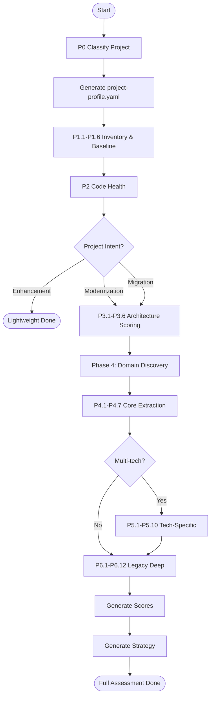

# AI Workflows

> Workflow definitions for automating the assessment pipeline using GenAI.

---

## 1. Assessment Pipeline Workflow

---

## 2. Workflow Steps

| Step | Input | AI Prompt | Output | Human Review? |
|:----:|-------|-----------|--------|:------------:|
| 1 | Repo URL | P0.1–P0.5 | project-profile.yaml | ✅ Validate classification |
| 2 | Source code | P1.1–P1.6 | application-inventory.md | Optional |
| 3 | Source code | P2 | code-layer.md | Optional |
| 4 | Assessment data | P3.1–P3.6 | Scoring files | ✅ Validate scores |
| 5 | Source code | P4.1–P6.12 | domain-mapping.md | ✅ Validate UNCERTAIN rules |
| 6 | All outputs | Decision matrix | strategy.md | ✅ Approve strategy |

---

## 3. Integration Points

| Platform | Integration Method | Notes |
|---------|-------------------|-------|
| Azure OpenAI | REST API / SDK | For prompt execution |
| AWS Bedrock | Bedrock API | Alternative AI backend |
| GitHub Actions | CI workflow | Automated on PR |
| CLI Tool | `dotnet legacy-analyzer` | Local development |

---

## 4. Automation Levels

| Level | Description | Human Involvement |
|:-----:|------------|-------------------|
| **L1** | Manual prompt execution | Copy-paste prompts, review all outputs |
| **L2** | Semi-automated pipeline | AI generates, human reviews |
| **L3** | Fully automated with checkpoints | AI generates + validates, human approves strategy |
| **L4** | Continuous assessment | Runs on every commit, alerts on regression |
