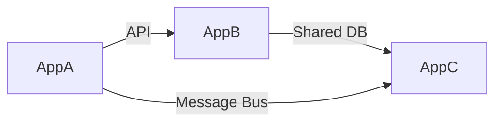

# Portfolio Dashboard — Multi-Project View

> **AI Prompt**: [P3.6 — Portfolio-Level Consolidation](../09-ai/prompts/phase3-architecture-scoring.md)
> **Purpose**: Aggregate scoring and readiness data across multiple applications for executive decision-making.

---

## Portfolio Summary

| Application | Type | MI Score | Architecture Fitness | Migration Readiness | Combined Score | Recommended Strategy |
|-------------|------|---------|---------------------|--------------------|--------------|--------------------|
| *App-1*     | BF-MOD | —/5 | —/5 | —/5 | —/5 | — |
| *App-2*     | MIG-RP | —/5 | —/5 | —/5 | —/5 | — |
| *App-3*     | MIG-RA | —/5 | —/5 | —/5 | —/5 | — |

> Combined Decision Score = `(CodeHealth × 0.35) + (ArchFitness × 0.35) + (MigrationReadiness × 0.30)`

---

## Strategy Distribution

| Strategy | Count | % of Portfolio | Avg Combined Score |
|----------|-------|---------------|-------------------|
| Rehost   | — | — | — |
| Replatform | — | — | — |
| Refactor | — | — | — |
| Re-architect | — | — | — |

---

## Risk Heat Map

| Application | Technical Debt | Dependency Risk | Data Complexity | Integration Risk | Overall Risk |
|-------------|---------------|----------------|----------------|-----------------|-------------|
| *App-1*     | 🟢/🟡/🔴 | 🟢/🟡/🔴 | 🟢/🟡/🔴 | 🟢/🟡/🔴 | — |
| *App-2*     | 🟢/🟡/🔴 | 🟢/🟡/🔴 | 🟢/🟡/🔴 | 🟢/🟡/🔴 | — |

---

## Migration Sequencing

> Recommended order based on dependency analysis, risk, and business value.

```mermaid
gantt
    title Migration Portfolio Sequence
    dateFormat YYYY-Q
    section Wave 1
    App-X (Rehost)      :2025-Q1, 1q
    section Wave 2
    App-Y (Replatform)  :2025-Q2, 2q
    section Wave 3
    App-Z (Re-architect):2025-Q3, 3q
```

### Sequencing Criteria

| Factor | Weight | Notes |
|--------|--------|-------|
| Dependency coupling | 30% | Apps with fewer upstream deps migrate first |
| Business criticality | 25% | Lower-risk apps prove the path |
| Technical readiness | 25% | Higher MI scores → easier early wins |
| Shared infrastructure | 20% | Shared DB/auth must coordinate |

---

## Cross-Application Dependencies



> Identify shared databases, message buses, auth providers, and APIs that create migration coordination constraints.

---

## Executive Summary Template

**Portfolio Health**: —/5 (weighted average of Combined Scores)
**Recommended Waves**: — (number of migration waves)
**Estimated Complexity**: — (Low / Medium / High / Critical)

### Key Findings
1. *[Top insight about portfolio-level patterns]*
2. *[Shared infrastructure constraint]*
3. *[Quick-win opportunity]*

### Recommended Actions
1. *[Immediate action]*
2. *[Short-term action]*
3. *[Long-term strategic action]*

---

## Confidence Level

| Section | Confidence | Evidence |
|---------|-----------|---------|
| Scoring | — | — |
| Sequencing | — | — |
| Dependencies | — | — |

> See [ORCHESTRATION-PROMPT.md](../09-ai/prompts/ORCHESTRATION-PROMPT.md) for confidence level definitions (HIGH/MEDIUM/LOW/UNCERTAIN).
