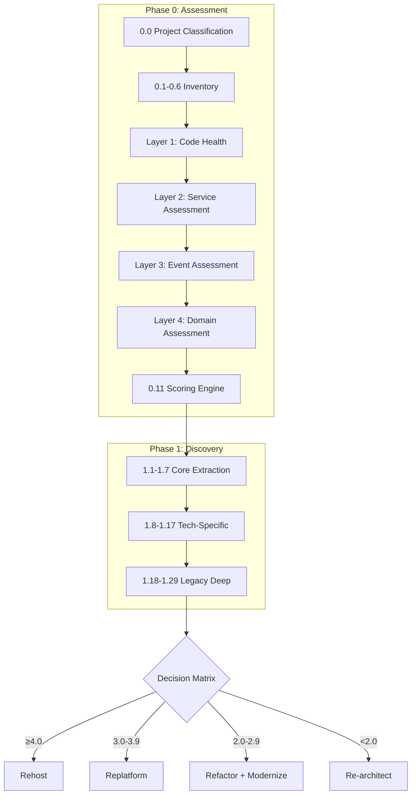
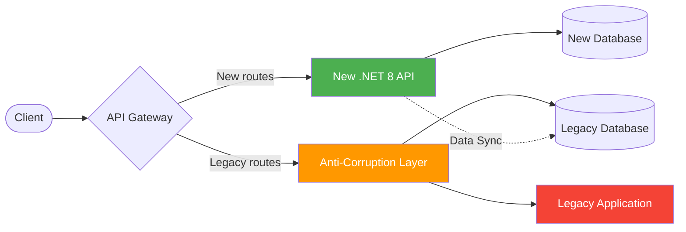
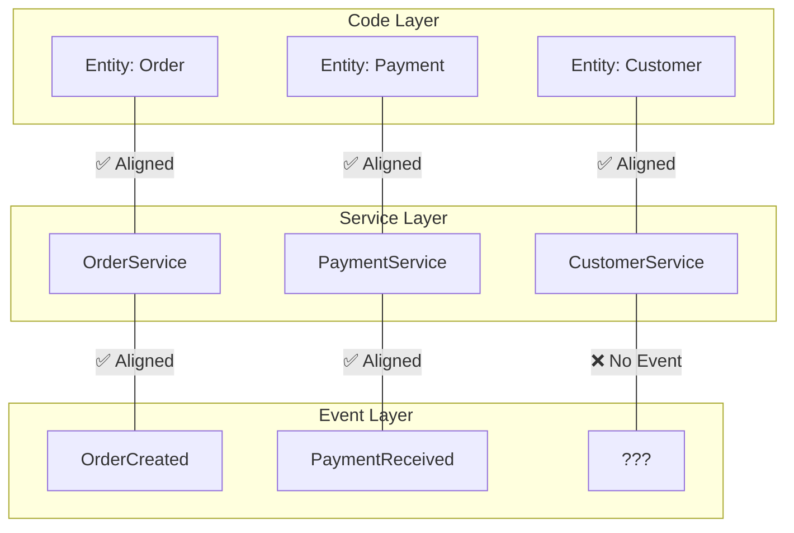
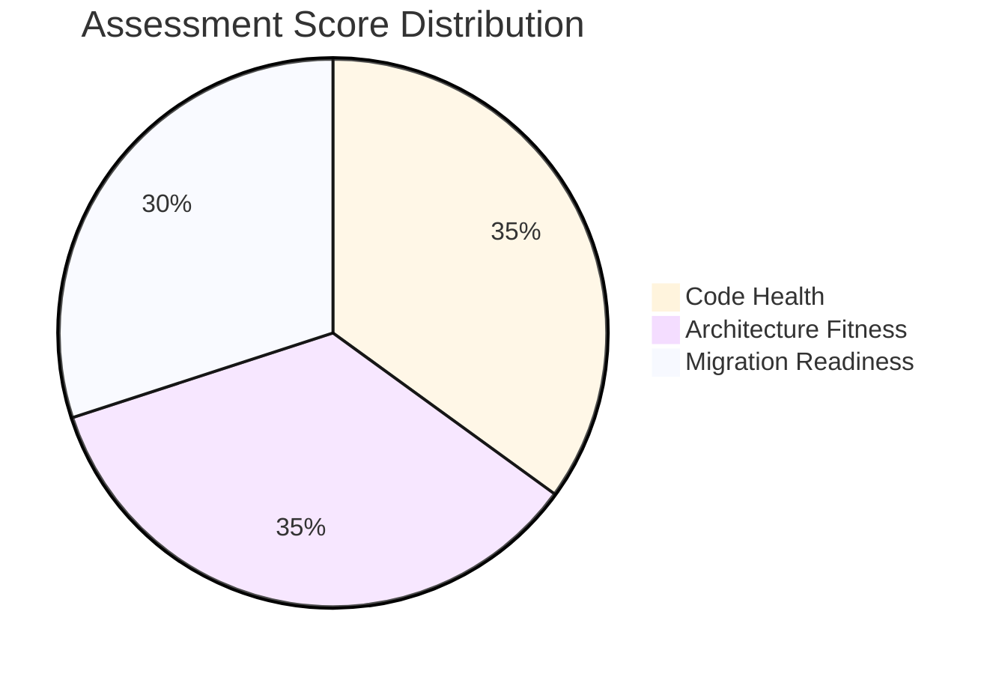
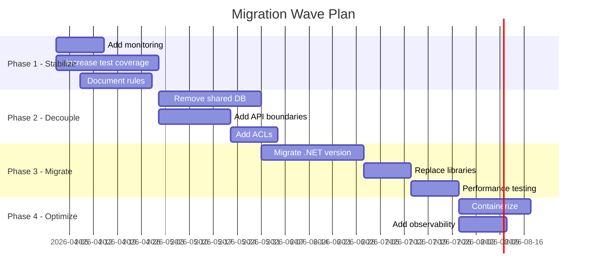
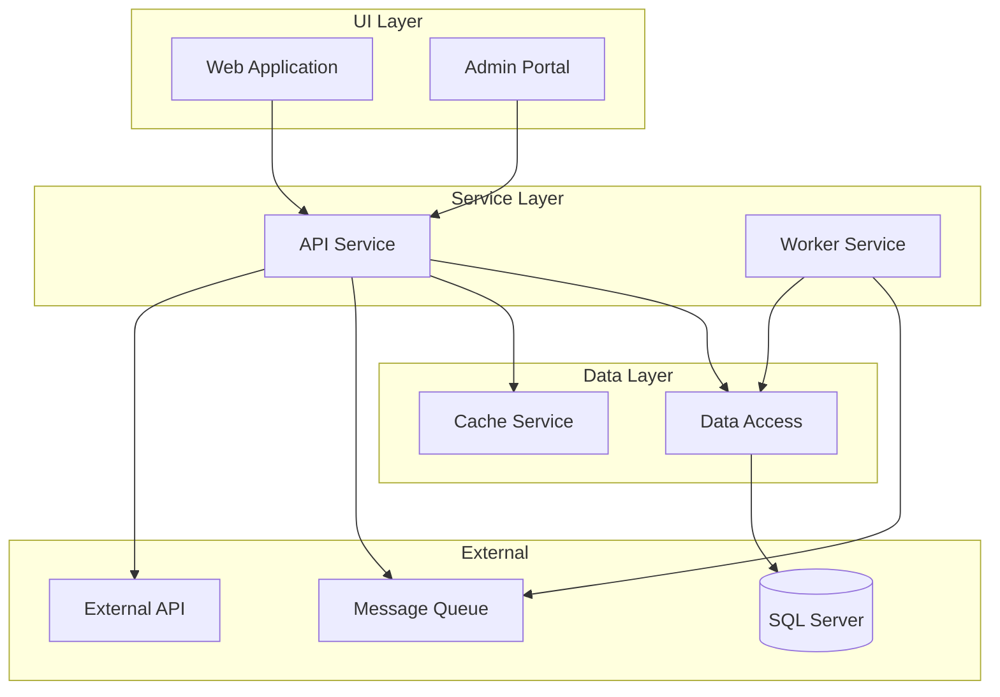

# Workflow Diagrams

> Visual diagrams for the legacy modernization assessment and migration process.

---

## 1. Assessment Flow (4-Layer Model)

---

## 2. Migration Pattern: Strangler Fig

---

## 3. Domain-Service-Event Triangulation

---

## 4. Scoring Radar Template

---

## 5. Migration Wave Timeline

---

## 6. Dependency Graph Template

> Replace with actual dependency graph generated from code analysis.
> Export as PNG to `dependency-graph.png` in this folder.

